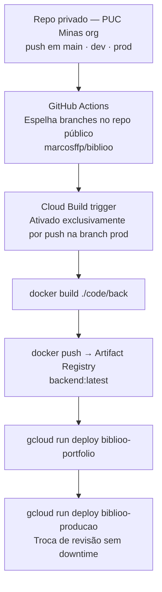

# Biblioo

> Rede social de leitura com estantes virtuais, feed social, comunidades com chat em tempo real, seis algoritmos independentes de recomendação personalizada e assistente de IA conversacional.

---

## 🛠️ Stack

### Backend


### Frontend


### Mobile


### Infra e Deploy


---

## 📑 Sumário

- [Sobre o projeto](#-sobre-o-projeto)
- [Funcionalidades](#-funcionalidades)
- [Sistema de recomendação](#-sistema-de-recomendação)
- [Arquitetura geral](#-arquitetura-geral)
- [Ambientes em produção](#-ambientes-em-produção)
- [Performance](#-performance)
- [Estrutura do repositório](#-estrutura-do-repositório)
- [Integrantes](#-integrantes)
- [Orientadores](#-orientadores)
- [Como executar](#-como-executar)

---

## 📖 Sobre o projeto

O **Biblioo** é uma plataforma digital de comunidade literária desenvolvida para leitores ativos brasileiros. O projeto parte de um problema real — 53% dos brasileiros não leram um livro nos últimos três meses (Retratos da Leitura, 2024) — e propõe uma solução que reúne em um único ambiente tudo que um leitor precisa: organização de leitura, descoberta inteligente de novos títulos, interação social e identidade literária.

O sistema foi construído em três frentes complementares:

- **Backend** em Spring Boot 4 (Java 25) com arquitetura Hexagonal em monólito modular de 11 domínios, implantado em Google Cloud Run
- **Frontend web** em Next.js 16 (React 19 + TypeScript), com notificações SSE e chat WebSocket em tempo real
- **App mobile** em Flutter 3.11, offline-first para Android e iOS, com BLoC e persistência local via Drift/SQLite

O assistente **Bibo**, alimentado pelo Google Gemini via Spring AI, vai além de responder perguntas: ele entende linguagem natural e executa ações diretamente na plataforma — cria comunidades, organiza estantes, monta coleções e orienta o leitor dentro do ecossistema Biblioo.

---

## ✨ Funcionalidades

| Área | O que o leitor pode fazer |
|---|---|
| **Autenticação** | Cadastro com e-mail/senha ou Google OAuth; redefinição de senha por e-mail; criação de senha para contas Google |
| **Estantes e biblioteca** | Criar estantes e coleções personalizadas; registrar status de leitura (Quero Ler, Lendo, Lido, Abandonei); atualizar progresso por páginas; visualizar streak de dias ativos; importar biblioteca do Goodreads via CSV |
| **Feed social** | Publicar posts com texto, imagens e GIFs; escrever reviews com nota de 1–5 estrelas; curtir, comentar e responder; visualizar feed personalizado de quem segue |
| **Comunidades** | Criar comunidades públicas ou privadas; chat em tempo real via WebSocket; votação democrática de livros; convites por link ou diretos; solicitações de entrada com aprovação; gestão de roles (owner, moderador, membro) |
| **Recomendações** | 6 trilhas algorítmicas independentes com critérios distintos + Roll Dice universal |
| **DNA Literário** | Perfil analítico automático com arquétipo dominante, temas preferidos, velocidade de leitura e distribuição de gêneros; snapshots anuais |
| **Assistente Bibo** | Chat em linguagem natural com execução de ações na plataforma; histórico de conversas persistido |
| **Notificações** | In-app via SSE (web, tempo real) e push via Firebase FCM (mobile); badge de não lidas |
| **Perfil e social** | Seguir/ser seguido; perfis públicos e privados com aprovação de seguidores; busca de usuários; upload de avatar e banner |
| **Descoberta** | Top 10 livros e comunidades em tendência (atualizado a cada 15 minutos); busca full-text por título, autor ou ISBN |
| **Compartilhamento** | Cápsulas visuais de estatísticas de leitura geradas pelo backend e compartilháveis em redes sociais |

---

## 🤖 Sistema de Recomendação

O sistema de recomendação é o **diferencial central do Biblioo**. São seis trilhas algorítmicas totalmente independentes, cada uma cobrindo um ângulo diferente de descoberta de leitura. Nenhuma usa IA generativa: os resultados são gerados por algoritmos determinísticos e estatísticos, acionados por eventos de domínio via RabbitMQ e cacheados no Redis por usuário.

| Trilha | Estratégia | Algoritmo |
|---|---|---|
| 🔗 **T1 — BecauseYouRead** | *"Quem leu o mesmo livro também leu estes..."* | Grafo Neo4j — co-leitura com mínimo de 2 leitores em comum; jitter ±3% para diversificação |
| 🎯 **T2 — FavoriteGenreNow** | *"Você está numa fase de ficção científica..."* | Detecção dos 3 gêneros dominantes atuais do leitor; prioriza títulos com avaliações suficientes |
| 📈 **T3 — TrendingInCommunities** | *"Este livro está em alta nas comunidades agora..."* | Score de engajamento com decay exponencial de 10%/hora; deduplica por janela de 24h |
| 🎲 **T4 — CatalogSurprise** | *"Saia da zona de conforto..."* | Thompson Sampling — parâmetros Beta(α, β) por (usuário, livro) persistidos no Redis; aprende com cada interação |
| 👥 **T5 — SimilarAuthors** | *"Leitores com gosto parecido adoraram estes..."* | Filtragem colaborativa em 2 níveis via Neo4j; leitores similares até 2 saltos no grafo |
| 🔄 **T6 — RereadWorthIt** | *"Faz um tempo — pode ser o momento certo para reler..."* | Repetição espaçada: `intervalo = nota × 30 dias × 1,5^n_releituras`; mínimo 90 dias desde a última leitura |
| 🎰 **Roll Dice** | *"Surpreenda-me"* | Seleção aleatória entre os resultados das 6 trilhas combinadas |

---

## 🏛️ Arquitetura geral

A aplicação segue o estilo **Hexagonal (Ports & Adapters)** em uma arquitetura de **monólito modular**, com 11 domínios de negócio independentes que se comunicam exclusivamente via eventos RabbitMQ — sem chamadas diretas entre módulos.


**Padrões de destaque:**

| Padrão | Onde se aplica |
|---|---|
| Outbox | Publicação assíncrona garantida no RabbitMQ dentro de `@Transactional` |
| Fanout-on-write | Feed com threshold de 10.000 seguidores |
| Thompson Sampling | Recomendação T4 — aprendizado bayesiano por interação |
| Spaced Repetition | Recomendação T6 — intervalo ótimo de releitura |
| Collaborative Filtering | Recomendação T5 — grafo Neo4j 2 níveis |
| Sliding Window Cache | Feed Redis com warm-size de 200 itens |
| Offline-first (mobile) | Drift/SQLite local + sync remoto ao reconectar |
| Idempotência por event_id | Todos os consumers RabbitMQ |
| Session affinity + FanoutExchange | Chat WebSocket com múltiplas instâncias Cloud Run |

---

## 🌐 Ambientes em produção

O backend está implantado em dois ambientes independentes no **Google Cloud Run** (us-central1), com pipeline de CI/CD automatizado (~12 min do commit ao deploy).

| | Portfolio | Produção |
|---|---|---|
| URL | [`biblioo-portfolio-595140312227.us-central1.run.app`](https://biblioo-portfolio-595140312227.us-central1.run.app) | [`biblioo-producao-595140312227.us-central1.run.app`](https://biblioo-producao-595140312227.us-central1.run.app) |
| Instâncias | 0–2 (hiberna sem tráfego) | 1–10 (sempre ativa) |
| Recursos | 1 Gi RAM · 1 vCPU | 2 Gi RAM · 2 vCPU |
| Banco | TiDB Cloud Serverless | TiDB Cloud Serverless |
| Cache | Upstash (Redis) | Upstash (Redis) |
| Mensageria | CloudAMQP Little Lemur | CloudAMQP Little Lemur |
| Grafo | Neo4j Aura Free | Neo4j Aura Free |
| Busca | Bonsai.io Hobby (HTTPS) | GCE VM e2-small via VPC interna |
| Swagger UI | [/swagger-ui.html](https://biblioo-portfolio-595140312227.us-central1.run.app/swagger-ui.html) | [/swagger-ui.html](https://biblioo-producao-595140312227.us-central1.run.app/swagger-ui.html) |

**Pipeline CI/CD:**


### Frontend Web

O frontend web está implantado na **Vercel**, com integração direta ao repositório GitHub: cada push na branch `main` aciona um deploy automático.

| | URL |
|---|---|
| Frontend Web | [`biblioo-rust.vercel.app`](https://biblioo-rust.vercel.app) |

> A variável `NEXT_PUBLIC_API_URL` está configurada na Vercel apontando para o backend de **Produção** (`biblioo-producao-595140312227.us-central1.run.app`).

---

## 📊 Performance

A suíte de testes de performance foi desenvolvida em **K6** com 72 testes cobrindo 8 domínios funcionais, cada um com três perfis obrigatórios: `load` (carga normal sustentada), `spike` (pico abrupto) e `stress` (degradação progressiva).

**Resultado final: 72/72 testes aprovados · 0 falhas funcionais (5xx)**

| Destaque | Resultado |
|---|---|
| Maior throughput | **1 538 req/s** — user-stress com 600 VUs simultâneos |
| Menor latência p95 | **8,42 ms** — book-spike com 300 VUs |
| Chat WebSocket (spike) | **11 ms** de entrega p95 · 100% de integridade · zero duplicatas |
| Trending e ShareCard | **< 40 ms** p95 mesmo a 600 VUs — cache Redis efetivo |
| Recomendações (6 trilhas) | **728 ms** p95 no load com 500 VUs — aceitável dado que percorre Neo4j + Redis + MySQL em paralelo |
| Roll Dice | **21 ms** p95 no load com 600 VUs |
| DNA Literário | **34 ms** p95 no load · **0% de falhas** até 500 VUs |

> Todos os valores acima foram medidos em ambiente local (localhost). Em produção, aplica-se fator conservador de 4× para refletir os recursos restritos do Cloud Run. Os RNFs foram definidos com esse fator incorporado e todos são atendidos com margem.

---

## 📁 Estrutura do repositório

```
biblioo/
├── code/
│   ├── back/          # Backend — Spring Boot 4 · Java 25
│   ├── front/         # Frontend — Next.js 16 · React 19
│   └── mobile/        # App mobile — Flutter 3.11
├── docs/              # Documentação arquitetural do projeto
│   ├── 1.apresentacao.md
│   ├── 2.nosso_produto.md
│   ├── 3.requisitos.md      # RF-01 a RF-40 · RNF-01 a RNF-22
│   ├── 4.modelagem.md
│   ├── 5.wireframe.md
│   ├── 6.solucao.md
│   ├── 7.avaliacao.md       # ATAM com dados reais de performance
│   ├── imagens/
│   ├── schema/              # biblioo.dbml · biblioo.components.puml
│   ├── wireframe/           # web/ · mobile/
│   └── weekly-report/
├── assets/
│   └── atas/                # Atas de reunião (Sprint 2 → Sprint 5)
└── divulge/                 # Materiais de divulgação e apresentações
```

**READMEs detalhados por subprojeto:**

| Subprojeto | README |
|---|---|
| Backend | [`code/back/README.md`](code/back/README.md) — arquitetura, endpoints, algoritmos, testes K6, deploy |
| Frontend | [`code/front/README.md`](code/front/README.md) — páginas, componentes, hooks, serviços, WebSocket |
| Mobile | [`code/mobile/README.md`](code/mobile/README.md) — features BLoC, rotas, offline-first, screens |
| Código (visão geral) | [`code/README.md`](code/README.md) — índice rápido dos três subprojetos |

---

## 👥 Integrantes

| Nome | E-mail institucional |
|---|---|
| Bernardo Souza Alvim | bernardo.alvim@sga.pucminas.br |
| Carlos José Gomes Batista Figueiredo | carlos.figueiredo.1507022@sga.pucminas.br |
| Gabriela Alvarenga Cardoso | gabriela.cardoso.1026227@sga.pucminas.br |
| Marcos Alberto Ferreira Pinto | mafpinto@sga.pucminas.br |
| Mateus Araújo Santos | mateus.santos.1487920@sga.pucminas.br |
| Rafael Ganascini de Moura | rafael.ganascini@sga.pucminas.br |

---

## 🎓 Orientadores

| Nome |
|---|
| Cleiton Silva Tavares |
| Cristiano de Macêdo Neto |
| João Paulo Carneiro Aramuni |

_Curso de Engenharia de Software — Campus Lourdes_
_Instituto de Informática e Ciências Exatas — Pontifícia Universidade Católica de Minas Gerais (PUC MINAS)_

---

## 🚀 Como executar

### Pré-requisitos

- Git
- Docker + Docker Compose
- Java 25+ e Maven 3.9+
- Node.js 20+ e npm 10+
- Flutter SDK 3.11+

### 1. Clone o repositório

```bash
git clone https://github.com/ICEI-PUC-Minas-PPLES-TI/plf-es-2026-1-ti5-0492100-biblioo.git
cd plf-es-2026-1-ti5-0492100-biblioo
```

### 2. Backend

```bash
cd code/back
cp .env.example .env           # preencha com suas credenciais
docker-compose up -d           # MySQL · Redis · RabbitMQ · Neo4j · OpenSearch
./mvnw spring-boot:run         # API em http://localhost:8080
```

Swagger UI disponível em `http://localhost:8080/swagger-ui.html`

### 3. Frontend web

```bash
cd code/front
npm install
cp .env.example .env.local     # NEXT_PUBLIC_API_URL + NEXT_PUBLIC_GOOGLE_CLIENT_ID
npm run dev                    # http://localhost:3000
```

### 4. App mobile

```bash
cd code/mobile
flutter pub get
cp .env.example .env           # API_URL + GOOGLE_WEB_CLIENT_ID
dart run build_runner build --delete-conflicting-outputs
flutter run
```

> Consulte os READMEs individuais de cada subprojeto para configuração completa de variáveis de ambiente, testes de performance (K6) e instruções de deploy em nuvem.

---

<div align="center">
  
</div>
<p align="center">Fonte do banner: <a href="https://github.com/joaopauloaramuni">João Paulo Carneiro Aramuni</a></p>

---
