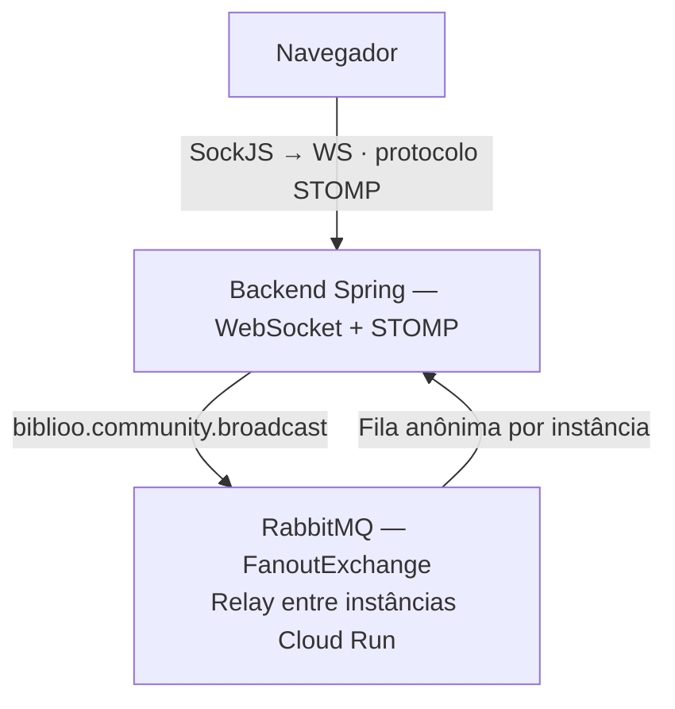

# Frontend

> Interface web do Biblioo — rede social de leitura com estantes, feed social, comunidades com chat em tempo real, recomendações personalizadas, DNA Literário e assistente de IA conversacional.

**Deploy em produção:** [biblioo-rust.vercel.app](https://biblioo-rust.vercel.app/)

---

## Stack Principal


---

## Sumário

- [Sobre o projeto](#sobre-o-projeto)
- [Páginas e rotas](#páginas-e-rotas)
- [Estrutura de pastas](#estrutura-de-pastas)
- [Fluxo de autenticação](#fluxo-de-autenticação)
- [Componentes](#componentes)
- [Hooks](#hooks)
- [Serviços e camada de API](#serviços-e-camada-de-api)
- [Tipagens](#tipagens)
- [WebSocket e tempo real](#websocket-e-tempo-real)
- [Utilitários e biblioteca](#utilitários-e-biblioteca)
- [Variáveis de ambiente](#variáveis-de-ambiente)
- [Deploy](#deploy)
- [Instalação e execução](#instalação-e-execução)
- [Testes](#testes)
- [Padrão de código](#padrão-de-código)
- [Regras de arquitetura](#regras-de-arquitetura)
- [Tecnologias e dependências](#tecnologias-e-dependências)

---

## Sobre o projeto

O frontend do **Biblioo** é uma SPA construída com **Next.js 16 (App Router)** e **React 19**. A interface cobre todo o ecossistema da plataforma: autenticação com e-mail/senha ou Google OAuth, organização de livros em estantes e coleções com rastreamento de progresso página a página, feed social com posts e reviews com imagens e GIFs, comunidades com chat em tempo real via WebSocket/STOMP, seis trilhas de recomendação carregadas em paralelo, DNA Literário, metas de leitura, importação de biblioteca do Goodreads e o assistente conversacional **Bibo** com streaming de respostas via SSE.

O estado de cada feature é isolado em custom hooks de domínio — sem Redux, sem Context API para estado global. Cada página recebe seus dados por hook próprio, o que mantém o grafo de dependências linear e previsível. A camada de serviços centraliza toda comunicação HTTP, garantindo que autenticação, tratamento de erros e tipagem dos contratos de API fiquem em um único lugar.

---

## Páginas e rotas

| Rota | Arquivo | Descrição |
|---|---|---|
| `/` | `app/page.tsx` | Redireciona para `/login` |
| `/login` | `app/login/page.tsx` | Login com e-mail/senha ou Google OAuth. Exibe o `WelcomeTutorialModal` no primeiro acesso |
| `/register` | `app/register/page.tsx` | Cadastro com validação de força de senha em tempo real via `PasswordStrengthChecklist` |
| `/forgot-password` | `app/forgot-password/page.tsx` | Solicita link de redefinição de senha por e-mail |
| `/reset-password` | `app/reset-password/page.tsx` | Recebe token via query param e define nova senha |
| `/onboarding` | `app/onboarding/page.tsx` | Fluxo pós-cadastro em 2 etapas: seleção de gêneros (mín. 3) + busca de livros iniciais (máx. 50) |
| `/feed` | `app/feed/page.tsx` | Feed social com posts e reviews de quem o usuário segue. Sidebar com livros em alta dinâmico (Top 10 por atividade recente via `/trending/books`) |
| `/for-you` | `app/for-you/page.tsx` | Seis trilhas de recomendação carregadas em paralelo + Roll Dice + seção "Em Alta nas Comunidades" |
| `/bookcase` | `app/bookcase/page.tsx` | Biblioteca pessoal — estantes, itens, coleções, busca de livros e painel de detalhes deslizante |
| `/community` | `app/community/page.tsx` | Descoberta de comunidades, criação, entrada por código e chat em tempo real |
| `/profile` | `app/profile/page.tsx` | Perfil próprio com estantes, atividade recente, DNA Literário e meta de leitura |
| `/profile/edit` | `app/profile/edit/page.tsx` | Edição de username, bio, avatar e banner |
| `/profile/followers` | `app/profile/followers/page.tsx` | Lista paginada de seguidores com opção de seguir de volta |
| `/profile/following` | `app/profile/following/page.tsx` | Lista paginada de seguidos |
| `/profile/[username]` | `app/profile/[username]/page.tsx` | Perfil público de qualquer usuário — mesmo layout, botão de seguir no lugar de editar |
| `/settings` | `app/settings/page.tsx` | Configurações de conta — e-mail, senha, criação de senha Google, importação Goodreads |

---

## Estrutura de pastas

```
front/
├── public/                         # Assets estáticos (logos, ícones SVG)
└── src/
    ├── app/                        # App Router — rotas e layouts
    │   ├── layout.tsx              # Layout raiz com providers globais
    │   ├── globals.css             # Estilos globais e variáveis CSS
    │   ├── feed/
    │   ├── for-you/
    │   ├── bookcase/
    │   ├── community/
    │   ├── profile/
    │   │   ├── [username]/         # Rota dinâmica — perfil público
    │   │   ├── edit/
    │   │   ├── followers/
    │   │   └── following/
    │   ├── onboarding/
    │   ├── login/
    │   ├── register/
    │   ├── forgot-password/
    │   ├── reset-password/
    │   └── settings/
    ├── components/                 # Componentes React organizados por domínio
    ├── hooks/                      # Custom hooks de domínio
    ├── lib/                        # Configuração base da API e helpers de headers
    ├── services/                   # Camada de acesso à API REST
    ├── types/                      # Tipagens TypeScript
    ├── utils/                      # Funções utilitárias puras
    └── test/                       # Setup global de testes
```

---

## Fluxo de autenticação

O Biblioo usa JWT armazenado no `localStorage` — uma decisão de frontend-only; o backend valida o token em cada request. Não há cookie HTTP-only porque a API pode ser consumida por clientes mobile nativos sem suporte a cookies do browser.

### Login e armazenamento de sessão

```
POST /auth/login → { accessToken, refreshToken, user }
         ↓
saveAuthSession() grava no localStorage:
  - "biblioo_access_token"
  - "biblioo_refresh_token"
  - "biblioo_user"
```

### Token expirado e renovação automática

Antes de cada request sensível, `isTokenExpired()` verifica o payload JWT sem chamada ao servidor. Se expirado, a aplicação chama `POST /auth/refresh` automaticamente. Essa verificação acontece dentro de cada serviço — não há interceptor global de axios/fetch — o que torna o fluxo explícito e rastreável.

### Headers de autenticação

Toda a criação de headers está centralizada em `src/lib/api-headers.ts`:

| Função | Uso |
|---|---|
| `requiredBearerHeaders()` | Endpoints que exigem autenticação — lança erro se token ausente |
| `optionalBearerHeaders()` | Endpoints públicos que se comportam diferente com token (feed público vs. personalizado) |
| `jsonBearerHeaders()` | Mesmo que `requiredBearerHeaders` + `Content-Type: application/json` |

### Google OAuth

O `GoogleSignInButton` usa `@react-oauth/google`. Após consentimento, o `credential` (ID token do Google) é enviado para `POST /auth/google`, que valida com a API do Google e retorna um JWT do Biblioo. Contas Google-only podem criar uma senha adicional via `POST /auth/create-password` para ter acesso com e-mail/senha também.

### AuthGuard

O componente `AuthGuard` envolve todas as rotas protegidas. Verifica o token no `localStorage` e redireciona para `/login` se ausente ou inválido. O onboarding também é verificado — usuários sem preferências cadastradas são redirecionados para `/onboarding`.

---

## Componentes

### Layout e autenticação

| Componente | Descrição |
|---|---|
| `AppShell` | Layout principal com sidebar de navegação, header com busca e notificações, e widget flutuante do assistente Bibo |
| `TopHeader` | Cabeçalho com busca global com sugestões em tempo real, sino de notificações e menu de usuário |
| `Sidebar` | Navegação lateral com links para feed, for-you, bookcase, comunidades e perfil |
| `AuthGuard` | Proteção de rotas — verifica token e onboarding, redireciona conforme o estado |
| `AuthLayout` | Template visual para telas de autenticação (login, registro, reset de senha) |

### Primitivos e compostos globais

| Componente | Descrição |
|---|---|
| `Button` | Botão reutilizável com variantes (primary, secondary, ghost, destructive) e estado de loading |
| `TextInput` / `PasswordInput` | Inputs controlados com label, mensagem de erro e toggle de visibilidade de senha |
| `PasswordStrengthChecklist` | Checklist visual de requisitos de senha em tempo real (tamanho, maiúscula, número, especial) |
| `ChipToggle` | Botão de alternância para filtros e seleção múltipla (gêneros, status de leitura) |
| `RatingStars` | Avaliação interativa de 1–5 estrelas com meia estrela |
| `ProgressBar` | Barra de progresso genérica com label opcional (metas de leitura, progresso de páginas) |
| `SkeletonBlock` | Placeholder animado de carregamento para qualquer conteúdo |
| `EmptyState` | Estado vazio padronizado com ícone, título e descrição |
| `Avatar` | Avatar de usuário com fallback de iniciais e suporte a tamanhos (sm, md, lg) |
| `BookCard` | Card de livro em grid com capa, título, autor e avaliação média |
| `BookDetailsCard` | Modal com informações completas do livro: sinopse, avaliações, e ação de adicionar à estante |
| `PostCard` | Card de post com texto, imagens, livro associado, curtidas, comentários e ações do autor |
| `ReviewFeedCard` | Card de review com nota em estrelas, texto, imagens, curtidas e seção de comentários expansível |
| `CommentsSection` | Seção de comentários com curtidas individuais, paginação e composição de novo comentário |
| `PageHeader` | Cabeçalho de página com título, subtítulo e slot de ação opcional |
| `WelcomeTutorialModal` | Modal de boas-vindas exibido no primeiro acesso — explica as principais funcionalidades |

### Bookcase

| Componente | Descrição |
|---|---|
| `BookcaseResults` | Grid de livros, estantes ou coleções com paginação e filtros aplicados |
| `ShelfBooksGrid` | Grid dos livros de uma estante específica com status visual por item |
| `ShelfBookDetailsPanel` | Painel deslizante que abre ao clicar num livro da estante — permite editar status, progresso de página e escrever review sem sair da página |
| `BookcaseModals` | Gerenciador centralizado de todos os modais da bookcase (criar/editar estante, adicionar livro, criar coleção) |

### Community

| Componente | Descrição |
|---|---|
| `CommunityChatView` | Interface de chat com scroll automático para a última mensagem, indicador de digitação e envio via Enter |
| `CommunityChatPanel` | Container de mensagens com paginação reversa (carrega histórico ao scrollar para cima) |
| `CommunityInfoPanel` | Sidebar com informações da comunidade, lista de membros e ações de moderação (alterar role, remover membro) |
| `CommunityCard` | Card de comunidade para listagem com preview de membros e descrição |
| `CreateVotingModal` | Formulário de criação de votação de livro — busca livros, define título e prazo |
| `VotingPanel` | Exibe votações ativas e encerradas com contagem de votos e ações por role |
| `CommunityJoinRequestsModal` | Interface de moderação para aprovar ou rejeitar solicitações de entrada em comunidades privadas |

### Feed

| Componente | Descrição |
|---|---|
| `FeedComposeCard` | Card de composição no topo do feed — botões para abrir o modal de post ou de review |
| `CreatePostModal` | Criar post com texto, até 5 imagens, 1 GIF, tags, flag de spoiler e livro associado |
| `CreateReviewModal` | Criar review com slider de nota (1–5) e área de texto |
| `EditReviewModal` | Editar review existente com os mesmos campos da criação |

### Profile

| Componente | Descrição |
|---|---|
| `ProfileHeaderCard` | Cabeçalho com avatar, banner, bio, contadores de seguidores/seguindo, botão de seguir e botão de editar |
| `ProfileStatsGrid` | Grid com livros lidos, páginas lidas e streak de leitura (dias consecutivos com progresso) |
| `ProfileTabs` | Tabs navegáveis: Biblioteca · Atividade · Comunidades |
| `LiteraryDnaSection` | Exibe o arquétipo literário, temas dominantes e gráficos do DNA Literário |
| `ReadingGoalSection` | Progresso visual da meta de leitura anual com barra e percentual |
| `ShareCapsuleModal` | Gera e exibe um card de estatísticas de leitura como imagem para compartilhamento |
| `UserActivityFeed` | Timeline de reviews e posts recentes do usuário com data relativa |

### Header

| Componente | Descrição |
|---|---|
| `SearchBar` | Busca global com debounce de 300ms, sugestões de livros e usuários em tempo real |
| `NotificationsDropdown` | Sino com badge de não lidas, lista de notificações recentes e ação de marcar todas como lidas |
| `ProfileMenu` | Menu do usuário com atalhos para perfil, configurações, toggle de tema e logout |

### Chat (Assistente Bibo)

| Componente | Descrição |
|---|---|
| `BiblioChatWidget` | Widget flutuante do assistente Bibo. Streaming de respostas via SSE com animação token a token. Histórico persistido na sessão. Chips de sugestões de perguntas. |

---

## Hooks

Custom hooks em `src/hooks/` encapsulam toda a lógica de negócio das páginas, deixando os componentes responsáveis apenas pela composição visual.

| Hook | Responsabilidade |
|---|---|
| `useBookcasePage` | Estado completo da bookcase — estantes, itens, coleções, filtros de status e busca, abertura de todos os modais. Ponto central de toda a página `/bookcase`. |
| `useShelfForm` | Criar, editar e excluir estantes com validação de nome e feedback de erro |
| `useCollectionForm` | Criar, editar e excluir coleções, incluindo associação de estantes existentes |
| `useAddBook` | Fluxo de busca de livros e adição a uma estante com deduplicação — impede adicionar o mesmo livro duas vezes na mesma estante |
| `useShelfBookDetails` | Gerencia o painel lateral de detalhes de um livro: atualizar status, progresso de página e escrever/editar review |
| `useCommunityPage` | Descoberta de comunidades, criação, entrada por código, lista de convites pendentes e solicitações de ingresso |
| `useCommunity` | Dados de uma comunidade específica — membros, role do usuário atual, ações de moderação |
| `useCommunityMessages` | Conexão WebSocket/STOMP, envio de mensagens, recebimento em tempo real e histórico paginado |
| `useVoting` | Criar, publicar, votar e administrar o ciclo de votação de livros em comunidades |
| `useFollowToggle` | Seguir/deixar de seguir com atualização otimista do contador — a UI responde imediatamente sem aguardar a resposta da API |
| `useNotifications` | Buscar notificações paginadas, marcar como lida, marcar todas como lidas e deletar |
| `useNotificationsPanel` | Estado de abertura do dropdown de notificações com click-outside para fechar |

---

## Serviços e camada de API

Toda comunicação HTTP com o backend passa por `src/services/`. A URL base vem de `src/lib/api-config.ts` (`NEXT_PUBLIC_API_URL`). Headers de autenticação vêm de `src/lib/api-headers.ts`.

### `auth.ts`

Autenticação e gestão de sessão JWT.

| Função | Descrição |
|---|---|
| `loginWithEmailPassword(email, password)` | POST /auth/login — retorna e salva a sessão |
| `registerWithEmailPassword(data)` | POST /auth/register |
| `loginWithGoogle(credential)` | POST /auth/google com ID token do Google |
| `forgotPassword(email)` | POST /auth/forgot-password |
| `resetPassword(token, newPassword)` | POST /auth/reset-password |
| `getAccessToken()` | Lê o access token do localStorage |
| `saveAuthSession(session)` | Grava access token, refresh token e dados do usuário |
| `clearAuthSession()` | Remove todos os dados de sessão do localStorage |
| `isTokenExpired(token)` | Verifica expiração pelo campo `exp` no payload JWT — sem chamada ao servidor |

### `bookcase.ts`

Estantes, itens, coleções e reviews.

| Função | Descrição |
|---|---|
| `searchBooks(query)` / `suggestBooks(query)` / `getBookById(id)` | Busca e detalhes |
| `listShelves()` / `createShelf(data)` / `updateShelf(id, data)` / `deleteShelf(id)` | CRUD de estantes |
| `listShelfItems(shelfId)` / `addBookToShelf(shelfId, bookId)` / `removeBookFromShelf(shelfId, itemId)` | Gestão de itens |
| `changeShelfItemStatus(shelfId, itemId, status)` | Muda o status de leitura (WANT_TO_READ → READING → COMPLETED) |
| `updateShelfItemProgress(shelfId, itemId, currentPage)` | Atualiza página atual — dispara atualização do streak de leitura |
| `listCollections()` / `createCollection(data)` / `updateCollection(id, data)` / `deleteCollection(id)` | CRUD de coleções |
| `getCollectionStats(id)` | Estatísticas agregadas (livros, páginas, distribuição de status) |
| `createBookReview(data)` / `updateBookReview(id, data)` / `deleteBookReview(id)` | Reviews de livros |
| `getActiveReadingDays()` | Streak de leitura — retorna número de dias distintos com progresso |

### `feed.ts`

Feed social com posts, reviews, curtidas e comentários.

| Função | Descrição |
|---|---|
| `getFeed(cursor?)` | Feed paginado por cursor — retorna até 50 itens e o próximo cursor |
| `createPost(data)` / `deletePost(id)` | Criar e excluir posts (texto + imagens + GIF) |
| `createReview(data)` / `updateReview(id, data)` / `deleteReview(id)` | Reviews no feed |
| `likeContent(contentId)` / `unlikeContent(contentId)` | Curtir/descurtir posts, reviews e comentários |
| `getComments(contentId)` / `createComment(contentId, data)` / `deleteComment(contentId, commentId)` | Comentários |

### `trending.ts`

Livros em destaque calculados dinamicamente pelo backend.

| Função | Descrição |
|---|---|
| `getTrendingBooks()` | GET /trending/books — retorna top 10 livros por atividade nas últimas 48h. Inclui título, autores, contagens de interação recente (adições à estante, progresso, avaliações, curtidas) e score. Requer autenticação. |

O endpoint é cacheado no Redis e renovado a cada 15 minutos pelo `TrendingScheduler` do backend. A seção "Em Alta" do feed exibe os 5 primeiros resultados com `shelfAdditions + progressUpdates` como indicador de leituras recentes.

### `recommendations.ts`

Seis trilhas de recomendação personalizada.

| Função | Trilha |
|---|---|
| `getBecauseYouRead()` | T1 — co-leitura via grafo Neo4j |
| `getFavoriteGenreNow()` | T2 — 3 gêneros dominantes do momento |
| `getTrendingInCommunities()` | T3 — decay exponencial de engajamento em comunidades |
| `getCatalogSurprise()` | T4 — Thompson Sampling (exploração bayesiana) |
| `getSimilarAuthors()` | T5 — filtragem colaborativa 2 saltos |
| `getRereadWorthIt()` | T6 — repetição espaçada para releituras |
| `rollDice()` | Roll Dice — seleção aleatória e embaralhada das 6 trilhas |

Na página `/for-you`, as 7 chamadas (6 trilhas + Roll Dice) são disparadas em paralelo via `Promise.all`. A UI atualiza incrementalmente conforme cada trilha resolve — seções carregadas aparecem antes das outras terminarem.

### `community.ts`

Comunidades, membros, chat e convites.

| Função | Descrição |
|---|---|
| `listCommunities(query?)` / `getCommunityById(id)` | Listar e buscar |
| `createCommunity(data)` / `joinCommunity(id)` / `leaveCommunity(id)` | Criação e participação |
| `generateInviteLink(id)` / `joinByToken(token)` | Convite por link |
| `inviteUser(id, username)` / `acceptInvite(inviteId)` | Convites diretos |
| `requestJoin(id)` / `approveRequest(requestId)` / `rejectRequest(requestId)` | Comunidades privadas |
| `sendCommunityMessage(id, text)` / `editMessage(id, messageId, text)` / `deleteMessage(id, messageId)` | Chat REST (histórico) |
| `getCommunityMessages(id, cursor?)` | Histórico paginado de mensagens |

### `community-messages.ts`

Gerencia a conexão WebSocket/STOMP para o chat em tempo real (ver [WebSocket e tempo real](#websocket-e-tempo-real)).

### `profile.ts`

| Função | Descrição |
|---|---|
| `getMyProfile()` / `getProfileByUsername(username)` | Perfil próprio e público |
| `updateMyProfile(data)` / `uploadMyAvatar(file)` / `uploadMyBanner(file)` | Atualização de perfil |
| `updateMyVisibility(isPrivate)` | Toggle público/privado |
| `followUser(username)` / `unfollowUser(username)` | Follow com suporte a contas privadas |
| `listMyShelves()` / `listShelfItems(shelfId)` | Estantes e livros para exibição no perfil |
| `getMyDna()` | DNA Literário — temas, arquétipo e estatísticas de leitura |

### `notifications.ts`

| Função | Descrição |
|---|---|
| `getNotifications(cursor?)` | Notificações paginadas com cursor |
| `markAsRead(id)` / `markAllAsRead()` | Marcação individual ou em massa |
| `deleteNotification(id)` | Remover notificação do histórico |

### `voting.ts`

Votação de livros nas comunidades.

| Função | Descrição |
|---|---|
| `getVotings(communityId)` | Listar votações da comunidade |
| `createVoting(communityId, data)` | Criar votação em estado draft |
| `publishVoting(communityId, votingId)` | Tornar a votação visível aos membros |
| `castVote(communityId, votingId, bookId)` | Votar ou desfazer voto |
| `closeVoting(communityId, votingId)` | Encerrar antecipadamente |
| `approveVoting(communityId, votingId)` / `rejectVoting(communityId, votingId)` | Resultado final |

### `activity.ts`

Timeline de atividade do usuário no perfil.

| Função | Descrição |
|---|---|
| `getUserActivityPosts(userId)` | Posts recentes para a aba Atividade do perfil |
| `getUserActivityReviews(userId)` | Reviews recentes com nota e texto |

### `assistant.ts`

Assistente Bibo com streaming.

| Função | Descrição |
|---|---|
| `sendAssistantMessage(message, onToken)` | Envia mensagem e recebe resposta token a token via SSE. O callback `onToken` é chamado a cada fragmento recebido, construindo a resposta progressivamente na UI. |
| `listAssistantConversations()` | Histórico de conversas anteriores |

### `preferences.ts`

| Função | Descrição |
|---|---|
| `getGenres()` | Todos os gêneros com nome em pt-BR e emoji |
| `saveUserPreferences(genres, books)` | Salva preferências do onboarding. POST único combina gêneros e livros. Trata 422 graciosamente (preferências já cadastradas). |

### `search.ts`

Busca global unificada de livros (OpenSearch + Google Books) e usuários (OpenSearch) — usada pela `SearchBar` do header.

---

## Tipagens

| Arquivo | Conteúdo |
|---|---|
| `types/api.ts` | Contratos de resposta do backend: `BackendBookResponse`, `FeedItem`, `FeedContent`, `CommunityResponse`, `RecommendedBook`, `DnaSnapshot`, `TrendingBook`, e todos os demais tipos de API |
| `types/auth.ts` | `AuthSession`, `LoginRequest`, `RegisterRequest` |
| `types/profile.ts` | `DisplayShelfBook` (livro com dados de estante para exibição), `ShelfItemWithShelfId` |
| `types/ui.ts` | Variantes de componentes, estados de modal, tipos de filtro |
| `types/index.ts` | Re-exportações centralizadas |

Todos os tipos de API refletem exatamente o contrato do backend. Qualquer mudança na resposta do backend deve ter o tipo correspondente atualizado aqui.

---

## WebSocket e tempo real

### Chat das comunidades — WebSocket / STOMP

O chat usa **WebSocket com protocolo STOMP** via `@stomp/stompjs` + `sockjs-client`, conectando ao broker do backend que usa RabbitMQ como relay entre instâncias Cloud Run.



O hook `useCommunityMessages` gerencia todo o ciclo de vida da conexão:

1. Ao entrar em uma comunidade, conecta ao endpoint `/ws` do backend via SockJS
2. Subscribe no tópico `/topic/community/{id}`
3. Mensagens enviadas para `/app/community/{id}/send`
4. Ao sair da comunidade, desconecta via cleanup do `useEffect`
5. Histórico carregado via REST (`GET /communities/{id}/messages`) com paginação reversa

Por que SockJS e não WebSocket nativo? SockJS tem fallback automático para long-polling em redes corporativas que bloqueiam WebSocket — garantindo que o chat funcione mesmo em ambientes restritivos.

### Assistente Bibo — SSE (Server-Sent Events)

O `BiblioChatWidget` usa **`@microsoft/fetch-event-source`** para streaming das respostas do Gemini. O SSE mantém uma conexão HTTP unidirecional aberta enquanto o modelo gera a resposta, e cada token recebido é acrescentado ao texto exibido — criando o efeito de digitação progressiva.

Por que SSE e não WebSocket para o assistente? O assistente é um fluxo unidirecional (servidor → cliente), então SSE é tecnicamente mais simples e compatível com proxies que bloqueiam WebSocket. O streaming funciona mesmo atrás de balanceadores de carga sem configuração adicional.

### Notificações — SSE unidirecional

Além do assistente, notificações em tempo real chegam via SSE em `/notifications/stream`. A conexão é mantida aberta enquanto o usuário está com a aba aberta. O badge de não lidas atualiza sem polling.

---

## Utilitários e biblioteca

### `src/utils/`

| Arquivo | Funções principais |
|---|---|
| `cn.ts` | `cn()` — mescla classes Tailwind com `clsx + tailwind-merge`. Resolve conflitos de classes (ex: `p-4 p-2` → `p-2`) |
| `date.ts` | `formatFeedTime()` (relativo: "há 3 min"), `formatMessageTime()` (HH:mm), `formatDateLabel()` (para separadores de chat), `isSameDay()`, `formatMonthYear()` |
| `jwt.ts` | `getJwtUserId()`, `getJwtExpiry()` — parse do payload JWT sem dependência externa, sem validação de assinatura (confiar no backend para isso) |
| `bookcase-filters.ts` | `mapBackendReadingStatus()` (converte status do backend para labels pt-BR), `filterBooksByStatusAndSearch()`, `filterCollectionsBySearch()`, `addBookToShelfWithoutDuplicate()` |
| `book-utils.ts` | Normalização de dados de livro, fallbacks de capa para URLs inválidas ou ausentes |
| `notifications.ts` | Helpers para formatar texto e ícone de notificação por tipo de evento |

### `src/lib/`

| Arquivo | Função |
|---|---|
| `api-config.ts` | Lê `NEXT_PUBLIC_API_URL` e exporta `API_BASE_URL`. Remove barras finais. Fallback para `http://localhost:8080` |
| `api-headers.ts` | `requiredBearerHeaders()`, `optionalBearerHeaders()`, `jsonBearerHeaders()` — ponto único de montagem de headers HTTP |

---

## Variáveis de ambiente

Crie um arquivo `.env.local` na raiz de `front/`. **Nunca versionar** — o `.gitignore` já exclui `.env*.local`.

```dotenv
# URL base do backend (sem barra final)
NEXT_PUBLIC_API_URL=http://localhost:8080

# Client ID do Google OAuth (mesmo configurado no backend)
NEXT_PUBLIC_GOOGLE_CLIENT_ID=seu_client_id_google
```

> `NEXT_PUBLIC_` expõe a variável ao bundle do cliente. Nunca colocar secrets com esse prefixo.

---

## Deploy

O frontend está implantado na **Vercel** com integração contínua via GitHub — cada push na branch `main` aciona um novo deploy automaticamente.

**URL de produção:** [biblioo-rust.vercel.app](https://biblioo-rust.vercel.app/)

| Variável | Valor configurado na Vercel |
|---|---|
| `NEXT_PUBLIC_API_URL` | URL do backend de produção no Cloud Run |
| `NEXT_PUBLIC_GOOGLE_CLIENT_ID` | Client ID do Google OAuth |

As variáveis são definidas em **Project Settings → Environment Variables** no painel da Vercel.

---

## Instalação e execução

### Pré-requisitos

- Node.js 20+
- npm 10+
- Backend Biblioo rodando (ver [README do backend](../back/README.md))

### Passo a passo

```bash
cd code/front

# Instalar dependências
npm install

# Criar arquivo de variáveis de ambiente
cp .env.example .env.local
# preencher NEXT_PUBLIC_API_URL e NEXT_PUBLIC_GOOGLE_CLIENT_ID

# Subir o servidor de desenvolvimento
npm run dev
```

A aplicação estará disponível em `http://localhost:3000`.

### Scripts disponíveis

| Script | Comando | Descrição |
|---|---|---|
| Desenvolvimento | `npm run dev` | Servidor Next.js com hot-reload |
| Build | `npm run build` | Bundle de produção otimizado |
| Produção | `npm run start` | Serve o build de produção localmente |
| Lint | `npm run lint` | Verificação ESLint |
| Type check | `npm run typecheck` | TypeScript sem emitir arquivos |
| Testes | `npm run test` | Vitest (once) |
| Testes watch | `npm run test:watch` | Vitest em modo interativo |
| Cobertura | `npm run test:coverage` | Relatório HTML de cobertura |

---

## Testes

Os testes usam **Vitest** + **Testing Library** com jsdom. O setup global está em `src/test/setup.ts`.

```
src/
├── test/
│   └── setup.ts                    # Configuração global (jest-dom matchers)
└── utils/
    ├── cn.test.ts                  # Composição de classes Tailwind
    └── bookcase-filters.test.ts    # Filtros de status, busca e deduplicação de livros
```

Os testes cobrem lógica pura — filtragem, mapeamento de status, merge de classes. Componentes visuais são verificados via `npm run typecheck`. Testes de integração com o backend são cobertos pela suíte K6 no repositório do backend.

```bash
npm run test           # executa todos
npm run test:watch     # modo watch
npm run test:coverage  # relatório de cobertura
```

---

## Padrão de código

- **TypeScript estrito** — sem `any` implícito, sem `as unknown as X` desnecessário
- **Tailwind CSS** com `cn()` obrigatório para composição de classes — nunca template strings com classes Tailwind
- **CVA** (`class-variance-authority`) para componentes com múltiplas variantes visuais
- **ESLint** com `eslint-config-next`
- **Componentes funcionais** com hooks — sem class components
- Código em inglês, mensagens de UI e erros em pt-BR
- Sem comentários que descrevem o que o código faz — apenas o porquê quando não óbvio

---

## Regras de arquitetura

| Regra | Motivação |
|---|---|
| Toda chamada HTTP passa por `src/services/` | Centraliza autenticação, tratamento de erro e tipagem dos contratos de API em um único lugar |
| Componentes de domínio nunca chamam serviços diretamente | Chamadas de API ficam nos hooks; componentes recebem dados como props ou via hook. Facilita teste e reutilização |
| `isTokenExpired()` antes de cada request sensível | Previne cascata de 401 — não aguarda o servidor informar que o token expirou |
| Hooks de página não importam `fetch` diretamente | `src/lib/api-headers.ts` garante que todos os requests usem o mesmo bearer token |
| Estado de autenticação no `localStorage` | Decisão de frontend-only para compatibilidade com clientes mobile sem suporte a cookies |
| `cn()` obrigatório para composição de classes | Previne conflitos de especificidade do Tailwind e garante precedência correta |
| Sem Redux ou Context API para estado global | Estado de cada feature é isolado no hook de domínio correspondente — sem boilerplate e sem re-renders globais |
| Imagens de qualquer origem permitidas no `next.config` | Capas de livros e avatares vêm de Cloudinary, Google Books e outras CDNs externas |

---

## Tecnologias e dependências

| Categoria | Tecnologia | Versão |
|---|---|---|
| Framework | Next.js (App Router) | 16 |
| UI | React + React DOM | 19 |
| Linguagem | TypeScript | 5 |
| Estilização | Tailwind CSS + tailwindcss-animate | 3 |
| Componentes acessíveis | Radix UI (Avatar, Slot) | 1.x |
| Variantes de componentes | class-variance-authority (CVA) | 0.7.x |
| Composição de classes | clsx + tailwind-merge | 2.x / 3.x |
| Animações | Framer Motion | 11 |
| Ícones | Lucide React | 1.x |
| WebSocket / STOMP | @stomp/stompjs + sockjs-client | 7.x / 1.x |
| SSE (Assistente Bibo e notificações) | @microsoft/fetch-event-source | 2.x |
| Google OAuth | @react-oauth/google | 0.13.x |
| Testes | Vitest + Testing Library (React + jest-dom) | 4.x / 16.x |
| Cobertura | @vitest/coverage-v8 | 4.x |
| DOM simulado | jsdom | 29.x |
| Lint | ESLint + eslint-config-next | 9 |

---

<div align="center">
  
</div>
<p align="center">Fonte do banner: <a href="https://github.com/joaopauloaramuni">João Paulo Carneiro Aramuni</a></p>

---
