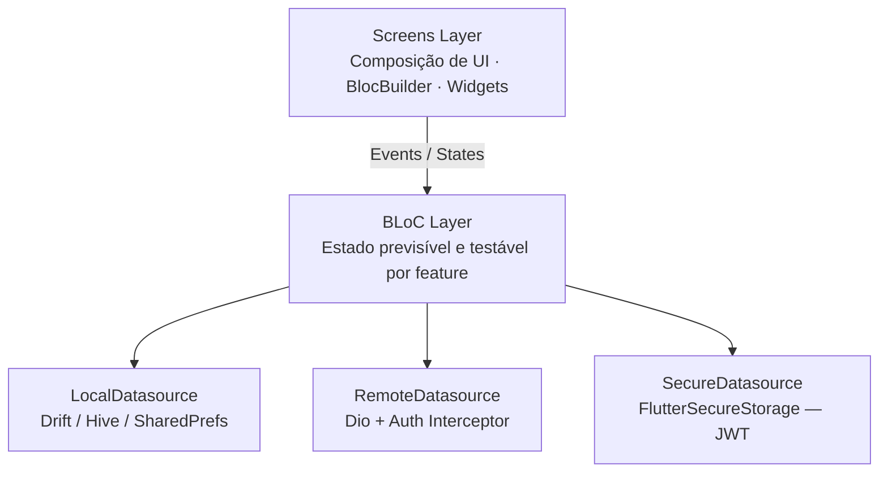
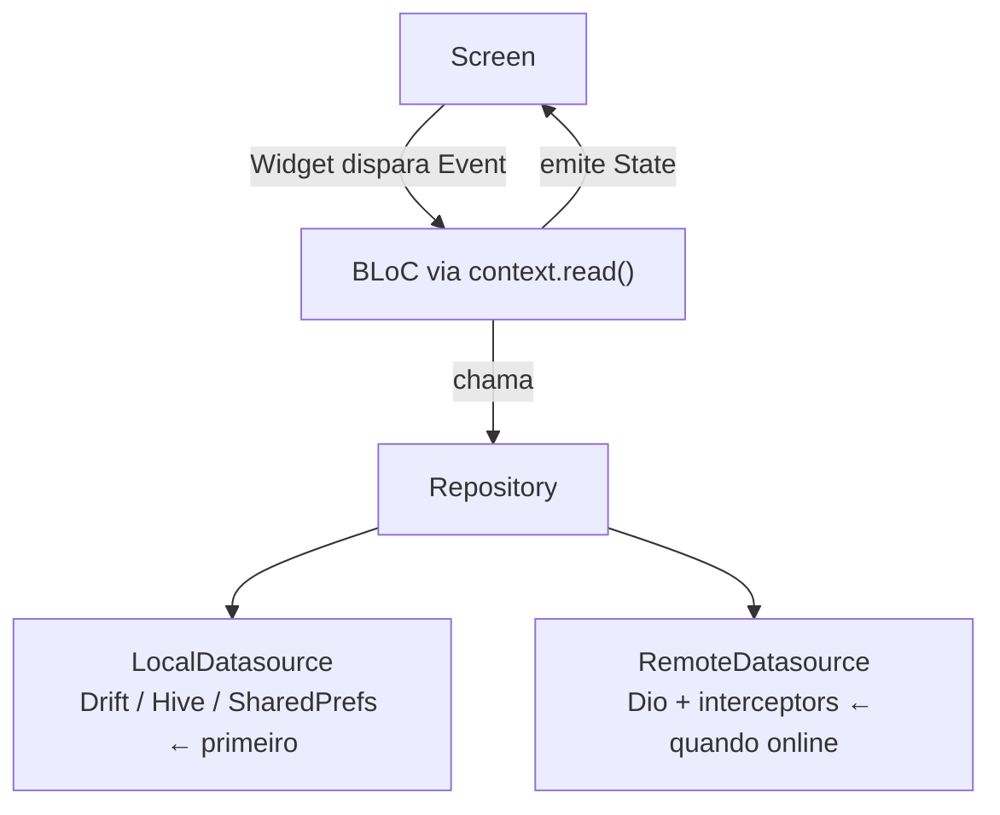

<!--
<div align="center" style="background:#1a1a2e;padding:32px 0;border-radius:12px">
<div align="center" style="background:#3fc3a7;padding:32px 80px;border-radius:12px;width:85%">
-->


# Mobile

> App Flutter offline-first do Biblioo — estantes, feed social, comunidades com chat em tempo real, recomendações personalizadas, DNA Literário e assistente de IA conversacional.

---

## 🛠️ Stack Principal


---

## 📑 Sumário

- [Sobre o app](#-sobre-o-app)
- [Arquitetura](#-arquitetura)
- [Estrutura de módulos](#-estrutura-de-módulos)
- [Estrutura de pastas](#-estrutura-de-pastas)
- [Navegação e rotas](#-navegação-e-rotas)
- [Features](#-features)
- [Screens](#-screens)
- [Core](#-core)
- [Shared](#-shared)
- [Regras de arquitetura](#-regras-de-arquitetura)
- [Fluxo de dados](#-fluxo-de-dados)
- [Variáveis de ambiente](#-variáveis-de-ambiente)
- [Instalação e execução](#-instalação-e-execução)
- [Build e distribuição](#-build-e-distribuição)
- [Testes](#-testes)
- [Tecnologias e dependências](#-tecnologias-e-dependências)

---

## 📖 Sobre o app

O app mobile do **Biblioo** é o ponto principal de uso do produto em dispositivos Android e iOS. Funciona **offline-first** — exibe dados em cache enquanto sem conexão e sincroniza com a API quando a rede retorna. A arquitetura separa **features** (domínio, dados e estado) de **screens** (composição de UI) para manter o código escalável, previsível e independente por domínio.

O app cobre todo o ecossistema da plataforma: autenticação com e-mail/senha ou Google OAuth, biblioteca pessoal com estantes e coleções, rastreamento de progresso de leitura, feed social com posts e reviews, comunidades com chat em tempo real via WebSocket, recomendações geradas pelos seis algoritmos do backend com Roll Dice, DNA Literário, notificações push, compartilhamento de cápsulas de leitura e o assistente conversacional **Bibo** com streaming via API.

---

## 🏛️ Arquitetura

O projeto segue **Feature-first com Screen layer**, com conceitos pontuais de DDD (Value Objects e Aggregate Roots). Não é Clean Architecture completa: sem use cases formais e sem interfaces de repository.



**Padrões centrais:**

| Padrão | Onde se aplica |
|---|---|
| Offline-first | Repository sempre tenta local primeiro, depois sincroniza remoto |
| Auth Interceptor | Injeta JWT em todo request e renova token em 401 automaticamente |
| Retry Interceptor | Backoff exponencial em erros de rede e 5xx |
| Hive Cache | Cache leve de respostas de API por feature (recomendações, feed) |
| Secure Storage | JWT tokens em FlutterSecureStorage (criptografado por plataforma) |
| Global BLoC Providers | 13 BLoCs provisionados globalmente via MultiBlocProvider no bootstrap |
| Cooldown Manager | Rate limiting local para chamadas de refresh frequentes |

---

## 🧩 Estrutura de módulos

| Módulo | Responsabilidade |
|---|---|
| `assistant` | Assistente Bibo — chat com histórico persistido, streaming de resposta |
| `auth` | Autenticação e-mail/senha + Google OAuth, sessão JWT segura |
| `book` | Catálogo de livros, busca, detalhes e avaliação |
| `collection` | Coleções de estantes com estatísticas agregadas |
| `community` | Comunidades públicas/privadas, chat WebSocket, votação de livros, convites |
| `dna` | DNA Literário — snapshots de perfil de leitura, arquétipos, temas |
| `feed` | Feed social com posts e reviews, paginação por cursor, curtidas |
| `notification` | Notificações push e in-app, badge de não lidas |
| `preferences` | Preferências de gêneros e livros (onboarding) |
| `recommendation` | 6 trilhas de recomendação + Roll Dice, carregamento paralelo incremental |
| `share` | Geração de cápsulas de compartilhamento de leitura |
| `shelf` | Estantes, itens, status de leitura e progresso de páginas |
| `user` | Perfil próprio e público, seguidores, edição, visibilidade |

---

## 📁 Estrutura de pastas

```
mobile/
├── .env                           # Variáveis de ambiente (nunca versionar)
├── .env.example                   # Template de variáveis
├── pubspec.yaml
├── android/
│   └── app/src/main/
│       └── AndroidManifest.xml    # Deep link biblioo://, permissões
├── ios/
│   └── Runner/
│       └── Info.plist             # URL scheme biblioo://, orientações
├── assets/
│   └── images/
│       └── biblioo-carinha-branca-logo.png
└── lib/
    ├── main.dart                  # Entry point — inicialização do app
    ├── bootstrap.dart             # App widget raiz com MultiBlocProvider
    ├── core/
    │   ├── config/
    │   │   └── app_env.dart       # Leitura de .env (API_URL)
    │   ├── di/
    │   │   └── injector.dart      # GetIt — registro de todos os BLoCs e repos
    │   ├── network/
    │   │   ├── dio_client.dart    # Dio configurado (timeout, log, interceptors)
    │   │   ├── auth_interceptor.dart  # Injeta JWT, renova token em 401
    │   │   └── retry_interceptor.dart # Retry com backoff exponencial
    │   ├── router/
    │   │   ├── app_router.dart    # GoRouter — 18+ rotas e guard de autenticação
    │   │   └── deep_link_handler.dart # Processa biblioo:// (reset de senha)
    │   ├── shell/
    │   │   └── main_shell.dart    # Bottom nav com 5 tabs + FAB global
    │   └── theme/
    │       ├── app_theme.dart     # Tema claro e escuro (Material 3, teal palette)
    │       └── theme_mode_cubit.dart # Toggle claro/escuro persistido
    ├── features/
    │   ├── assistant/             # Bibo — chat + histórico
    │   ├── auth/                  # Autenticação e sessão
    │   ├── book/                  # Catálogo e busca
    │   ├── collection/            # Coleções de estantes
    │   ├── community/             # Comunidades e chat
    │   ├── dna/                   # DNA Literário
    │   ├── feed/                  # Feed social
    │   ├── notification/          # Notificações
    │   ├── preferences/           # Preferências de gênero
    │   ├── recommendation/        # Recomendações + Roll Dice
    │   ├── share/                 # Cápsulas de compartilhamento
    │   ├── shelf/                 # Estantes e itens
    │   └── user/                  # Perfil e seguidores
    ├── screens/
    │   ├── assistant/
    │   ├── auth/
    │   ├── book/
    │   ├── collection/
    │   ├── community/
    │   ├── feed/
    │   ├── notification/
    │   ├── onboarding/
    │   ├── profile/
    │   ├── recommendation/
    │   ├── search/
    │   └── shelf/
    └── shared/
        ├── widgets/               # Widgets reutilizáveis globais
        └── utils/                 # Utilitários puros (emojis, cooldown)
```

### Estrutura padrão de uma feature

```
features/{feature}/
├── data/
│   ├── {feature}_local_datasource.dart   # Drift / Hive / SharedPreferences
│   ├── {feature}_remote_datasource.dart  # Dio — chamadas à API REST
│   ├── {feature}_repository.dart         # Orquestra local vs remoto
│   └── models/
│       └── {feature}_model.dart          # Freezed + json_serializable
├── domain/
│   ├── {feature}.dart                    # Entidade pura (sem dependência de framework)
│   └── value_objects/
│       └── {value_object}.dart
└── bloc/
    ├── {feature}_bloc.dart
    ├── {feature}_event.dart
    └── {feature}_state.dart
```

### Estrutura padrão de uma screen

```
screens/{screen}/
├── {screen}_screen.dart
└── widgets/
    └── {widget_name}.dart
```

---

## 🗺️ Navegação e rotas

O roteamento usa **GoRouter** com guard de autenticação em três níveis:

1. **Não autenticado** → restrito a `/login`, `/register`, `/forgot-password`
2. **Autenticado, onboarding pendente** → restrito a `/onboarding`
3. **Autenticado e onboarded** → acesso completo a todas as rotas

```
/login                         → LoginScreen
/register                      → RegisterScreen
/forgot-password               → ForgotPasswordScreen
/onboarding                    → OnboardingScreen

/search                        → BookSearchScreen          (sem bottom nav)
/post/create                   → CreatePostScreen          (sem bottom nav)
/notifications                 → NotificationScreen        (sem bottom nav)
/assistant                     → AssistantScreen           (sem bottom nav)
/book/:id                      → BookScreen                (modal slide-up)
/user/:username                → ProfileScreen             (modal slide-up)

[Shell com bottom nav — 5 tabs]
  Tab 0  /feed                 → FeedScreen
  Tab 1  /recommendation       → RecommendationScreen
           /recommendation/dice → DiceScreen
  Tab 2  /shelf                → BibliotecaScreen
  Tab 3  /community            → CommunityListScreen
           /community/:id      → CommunityDetailScreen
  Tab 4  /profile              → ProfileScreen (próprio)
           /profile/edit       → EditProfileScreen
           /profile/settings   → SettingsScreen
           /profile/dna        → DnaScreen
```

**Deep links** registrados: `biblioo://reset-password` (redirecionado a partir do e-mail de redefinição de senha).

---

## ⚙️ Features

### Assistant

Assistente conversacional **Bibo** integrado ao Google Gemini via API REST.

- **BLoC** — eventos: `AssistantMessageSent`, `AssistantHistoryCleared`; states: lista de mensagens, loading, erro
- **Datasources** — remote: `/assistant/chat` e `/assistant/conversations`; local: histórico persistido em SharedPreferences
- **Domínio** — `ChatMessage` (id, content, isUser, timestamp)
- **Destaques:** mensagem de boas-vindas no primeiro acesso · histórico persistente entre sessões · animação typewriter nas respostas

---

### Auth

Autenticação e gerenciamento de sessão JWT.

- **BLoC** — eventos: `AuthStarted`, `LoginRequested`, `LoginWithGoogleRequested`, `RegisterRequested`, `LogoutRequested`; states: `AuthInitial`, `AuthLoading`, `AuthAuthenticated`, `AuthUnauthenticated`, `AuthError`
- **Datasources** — remote: `/auth/*`; secure: `FlutterSecureStorage` para tokens JWT; local: flag de sessão em SharedPreferences
- **Domínio** — `AuthSession` (accessToken, refreshToken, user), `AuthUser`, `AuthFailure`
- **Destaques:** restauração automática de sessão no startup (`AuthStarted`) · Google Sign-In com troca de ID token · interceptor de autenticação cuida do refresh em 401 automaticamente

---

### Book

Catálogo de livros com busca e detalhes.

- **BLoC** — eventos: carregar, buscar, detalhar; states: loading, loaded, erro
- **Datasources** — remote: `/books/search`, `/books/{id}`; local: cache de metadados
- **Domínio** — `Book` (id, title, authors, coverUrl, pageCount, averageRating, description, readerCount)
- **Destaques:** cálculo de estrelas (fullStars + halfStar) · concatenação de autores

---

### Collection

Coleções de estantes com estatísticas agregadas.

- **BLoC** — eventos: `CollectionLoadRequested`, `CollectionCreateRequested`, `CollectionUpdateRequested`, `CollectionDeleteRequested`; states: loading, loaded, mutating, success, erro
- **Datasources** — remote: `/collections/*`; local: cache
- **Domínio** — `Collection` (id, name, description, shelfCount, shelfPreviews), `ShelfPreview`
- **Destaques:** estatísticas calculadas no backend (livros, páginas, status) e exibidas na tela de detalhe

---

### Community

Comunidades com chat em tempo real, votação de livros e sistema de convites.

- **BLoC** — eventos: `CommunityLoadRequested`, `CommunityCreateRequested`, `CommunityJoinRequested`, `CommunityJoinByInviteRequested`, `CommunityLeaveRequested`; states: loading, loaded, mutating, success, erro
- **Datasources** — remote: `/communities/*`, `/voting/*`; WebSocket para chat; local: cache de comunidades e convites
- **Domínio** — `Community`, `CommunityMember`, `CommunityMessage`, `BookVoting`, `BookVotingOption`, `CommunityInvite`, `CommunityJoinRequest`, `CommunityVisibility` (public/private)
- **Destaques:** link de convite por código · votação de livro com ciclo completo (draft → publish → vote → close → approve/reject) · chat WebSocket com `web_socket_channel`

---

### DNA

DNA Literário — análise de perfil e hábitos de leitura.

- **Datasources** — remote: `/dna`; local: cache de snapshots
- **Domínio** — `DnaSnapshot` (isComputed, booksRead, dominantArchetype, complexity, avgDaysPerBook, rereadRate, pagesByYear, themes), `DnaTheme`
- **Destaques:** exige mínimo de livros lidos antes do cálculo · exibe velocidade de leitura, taxa de abandono e distribuição de gêneros

---

### Feed

Feed social com posts e reviews, paginação por cursor e curtidas com atualização otimista.

- **BLoCs** — `FeedBloc` (feed + paginação), `ReviewBloc` (criar/editar review), `PostBloc` (criar post com imagens/GIF)
- **Eventos**: `FeedLoadRequested`, `FeedLoadMoreRequested`, `FeedReviewLikeToggled`, `FeedPostLikeToggled`, `FeedReviewDeleteRequested`, `FeedPostDeleteRequested`, `FeedCommentCountChanged`
- **Datasources** — remote: `/feed`, `/feed/posts/*`, `/feed/reviews/*`; local: cache do feed
- **Domínio** — `FeedItem` (contentId, contentType, author, score, createdAt, content), `FeedContent` (texto, imagens, gifUrl, tags, spoiler, likeCount, commentCount, likedByCurrentUser), `FeedPage`
- **Destaques:** scroll infinito com cursor-based pagination · curtida otimista sem esperar resposta da API · flag de spoiler · suporte a imagens e GIF

---

### Notification

Notificações in-app e push via Firebase FCM.

- **BLoC** — eventos: `NotificationLoadRequested`, `NotificationUnreadCountRequested`, `NotificationMarkAsReadRequested`, `NotificationMarkAllAsReadRequested`; states: loading, loaded, erro
- **Datasources** — remote: `/notifications/*`; sem cache local
- **Domínio** — `Notification` (id, type, userId, message, isRead, actionUrl, createdAt)
- **Destaques:** badge de não lidas · roteamento por `actionUrl` ao abrir notificação

---

### Preferences

Preferências de gêneros e livros coletadas no onboarding.

- **BLoC** — eventos: `PreferencesGenresLoadRequested`, `PreferencesSubmitted`, `PreferencesSkipped`; states: `loadingGenres`, `genresLoaded`, `submitting`, `done`, `genresError`
- **Datasources** — remote: `GET /genres`, `POST /preferences`; local: flag de onboarding concluído por userId em SharedPreferences
- **Domínio** — `Genre` (id, name, original, emoji)
- **Destaques:** mínimo de 3 gêneros obrigatórios · seleção opcional de até 50 livros · POST único combina gêneros + livros · trata 422 graciosamente (preferências já cadastradas)

---

### Recommendation

6 trilhas de recomendação carregadas em paralelo com atualização incremental da UI.

- **BLoC** — eventos: `RecommendationLoadRequested`, `RecommendationDiceRolled`, `RecommendationTrailRefreshed`; states: emissão parcial à medida que cada trilha completa (7 cargas paralelas com updates incrementais)
- **Datasources** — remote: `/recommendations/*`; local: Hive cache por trilha
- **Domínio** — `RecommendedBook` (id, title, authors, coverUrl, reason, score), `BecauseYouReadResult`, `FavoriteGenreNowResult`

| Trilha | Rota | Algoritmo |
|---|---|---|
| T1 — BecauseYouRead | `because-you-read` | Co-leitura via Neo4j |
| T2 — FavoriteGenreNow | `favorite-genre-now` | 3 gêneros dominantes atuais |
| T3 — TrendingInCommunities | `trending-in-communities` | Decay exponencial de engajamento |
| T4 — CatalogSurprise | `catalog-surprise` | Thompson Sampling (Beta(α,β)) |
| T5 — SimilarAuthors | `similar-authors` | Filtragem colaborativa 2 níveis |
| T6 — RereadWorthIt | `reread-worth-it` | Repetição espaçada |
| Roll Dice | `roll-dice` | Seleção aleatória das 6 trilhas |

---

### Share

Geração de cápsulas de compartilhamento de leitura.

- **BLoC** — eventos: gerar cápsula; states: generating, generated, erro
- **Datasources** — remote: `/share` retorna bytes da imagem gerada no backend; local: Hive cache com timestamp para evitar regeneração
- **Domínio** — `ShareCapsule` (bytes, cachedAt)
- **Destaques:** imagem gerada no backend · cache local evita nova geração dentro de intervalo de tempo

---

### Shelf

Biblioteca pessoal organizada em estantes com rastreamento de leitura.

- **BLoC** — eventos: `ShelfLoadRequested`, `ShelfCreateRequested`, `ShelfUpdateRequested`, `ShelfDeleteRequested`, `ShelfItemsLoadRequested`, `ShelfItemAddRequested`, `ShelfItemRemoveRequested`, `ShelfItemProgressUpdated`, `ShelfItemStatusChanged`; states: loading, loaded, mutating, success, erro
- **Datasources** — remote: `/shelves/*`, `/shelves/{id}/items/*`; local: cache de metadados
- **Domínio** — `Shelf` (id, name, description, itemCount, coverPreview), `ShelfItem` (book + status), `ReadingStatus` (reading, read, abandoned, wantToRead), `ShelfPreview`
- **Destaques:** itens carregados por estante · atualização de progresso (página atual) · transições de status (QUERO_LER → LENDO → LIDO)

---

### User

Perfil próprio e público, gestão de seguidores e edição de conta.

- **BLoCs** — `UserBloc` (perfil e ações), `UserSearchBloc` (busca por username)
- **Eventos**: `LoadMyProfile`, `LoadUserProfile`, `UpdateProfile`, `UpdateVisibility`, `FollowUser`, `UnfollowUser`, `DeleteAccount`
- **Datasources** — remote: `/users/*`; local: cache de perfil
- **Domínio** — `User` (id, username, email, bio, avatarUrl, bannerUrl, isPrivate, followerCount, followingCount, createdAt), `FollowPage`
- **Destaques:** upload de avatar e banner · toggle de privacidade (público/privado) · exclusão de conta

---

## 📱 Screens

| Screen | Arquivo | Descrição |
|---|---|---|
| **Login** | `auth/login_screen.dart` | E-mail/senha + botão Google OAuth, validação de formulário |
| **Register** | `auth/register_screen.dart` | Cadastro com validação de e-mail, username e senha |
| **Forgot Password** | `auth/forgot_password_screen.dart` | Token via deep link `biblioo://reset-password`, nova senha |
| **Onboarding** | `onboarding/onboarding_screen.dart` | Seleção de gêneros (mín. 3) + escolha de livros (máx. 50), opção de pular |
| **Feed** | `feed/feed_screen.dart` | Feed com scroll infinito, pull-to-refresh, FeedItemCard com curtida e comentários |
| **Create Post** | `feed/create_post_screen.dart` | Post com texto, image picker, GIF, rating slider para reviews, flag de spoiler |
| **Recommendation** | `recommendation/recommendation_screen.dart` | Banner do Roll Dice + 6 seções de trilhas com carregamento paralelo incremental |
| **Dice Roll** | `recommendation/dice_screen.dart` | Tela full-screen com animação de dado e card do livro sorteado |
| **Biblioteca** | `shelf/biblioteca_screen.dart` | TabBar: Estantes (lista de estantes) + Coleções |
| **Shelf Detail** | `shelf/shelf_list_screen.dart` | Livros de uma estante com ShelfItemCard, status e progresso |
| **Collection Detail** | `collection/collection_detail_screen.dart` | Estatísticas agregadas + previews das estantes da coleção |
| **Book Detail** | `book/book_screen.dart` | Capa, avaliação, descrição, reviews e botão de adicionar à estante |
| **Community List** | `community/community_list_screen.dart` | Minhas comunidades + sugestões + entrada por código de convite |
| **Community Detail** | `community/community_detail_screen.dart` | TabBar: Overview (membros, info) · Chat (WebSocket) · Voting (votação de livros) |
| **Search** | `search/book_search_screen.dart` | Busca full-text de livros e usuários com shimmer de carregamento |
| **Profile (próprio)** | `profile/profile_screen.dart` | Header, stats, 3 tabs (Biblioteca · Atividade · Comunidades), botões de editar e configurações |
| **Profile (público)** | `profile/profile_screen.dart` | Mesmo layout, botão de seguir no lugar de editar, sem acesso a configurações |
| **Edit Profile** | `profile/edit_profile_screen.dart` | Bio, username, avatar (image picker), banner (image picker), toggle de visibilidade |
| **Settings** | `profile/settings_screen.dart` | Toggle de tema claro/escuro, logout, exclusão de conta |
| **DNA** | `profile/dna_screen.dart` | Arquétipo literário, velocidade de leitura, distribuição de gêneros, taxa de releitura |
| **Notifications** | `notification/notification_screen.dart` | Lista paginada de notificações, marcar como lida, roteamento por ação |
| **Assistant** | `assistant/assistant_screen.dart` | Chat com Bibo — lista de mensagens, chips de sugestão, input, animação typewriter |

---

## 🔧 Core

### Injeção de dependência (`core/di/injector.dart`)

Inicializado uma vez no `main()` via `Injector.init()`. O resultado é passado para o `MultiBlocProvider` raiz que provisiona **13 BLoCs globalmente**:

`ThemeModeCubit` · `AuthBloc` · `UserBloc` · `UserSearchBloc` · `BookBloc` · `ShelfBloc` · `CollectionBloc` · `FeedBloc` · `ReviewBloc` · `PostBloc` · `NotificationBloc` · `AssistantBloc` · `RecommendationBloc`

**Ordem de inicialização:**
1. Carrega `.env`
2. Inicializa `SharedPreferences` e `FlutterSecureStorage`
3. Cria `Dio` com `RetryInterceptor` + `AuthInterceptor`
4. Instancia todos os repositórios
5. Cria todos os BLoCs

### Rede (`core/network/`)

| Arquivo | Responsabilidade |
|---|---|
| `dio_client.dart` | Dio configurado com connect/receive timeout de 10 s, `LogInterceptor` em debug |
| `auth_interceptor.dart` | Injeta `Authorization: Bearer {token}` em todo request · renova token em 401 via `/auth/refresh` · persiste novo token no `FlutterSecureStorage` |
| `retry_interceptor.dart` | Retry automático em erros de rede, timeout e 5xx · backoff exponencial |

### Roteamento (`core/router/`)

| Arquivo | Responsabilidade |
|---|---|
| `app_router.dart` | GoRouter com 18+ rotas · guard `_authRedirect()` em 3 níveis (não autenticado → onboarding pendente → autenticado) |
| `deep_link_handler.dart` | Intercepta `biblioo://reset-password` e navega para a tela correta |

### Shell (`core/shell/main_shell.dart`)

- **5 tabs** com `StatefulNavigationShell` (preserva estado ao trocar de tab)
- **FAB global** `BibiFab` visível em todas as tabs (oculto no detalhe da comunidade)
- Tabs: Feed · For You · Biblioteca · Comunidades · Perfil

### Tema (`core/theme/`)

Material 3 com paleta teal/menta alinhada ao design do frontend web.

| Token | Valor |
|---|---|
| Brand Primary | `#3FC3A7` |
| Brand Dark | `#13937A` |
| Light Canvas | `#F4FBF9` |
| Text Primary | `#0F2F2C` |
| Dark Background | `#0F1A17` |

`ThemeModeCubit` persiste a preferência claro/escuro em SharedPreferences.

### Configuração de ambiente (`core/config/app_env.dart`)

Lê `API_URL` do arquivo `.env` via `flutter_dotenv`. Fallback: `http://localhost:8080`. Remove barras finais automaticamente.

---

## 🔗 Shared

### Widgets (`shared/widgets/`)

| Widget | Descrição |
|---|---|
| `BibiFab` | FAB global flutuante com atalho para o assistente Bibo e criação de posts |
| `BiblioWordmark` | Logo/branding do app |
| `BookCoverPlaceholder` | Fallback visual para capas de livros sem imagem |
| `StatItem` | Exibição padronizada de label + valor (stats de perfil, coleções) |

### Utilitários (`utils/`)

| Arquivo | Descrição |
|---|---|
| `genre_emoji.dart` | Mapeamento de 30+ gêneros literários para emoji (ex.: "Science Fiction" → 🚀) com fallback `📖` |
| `cooldown_refresh.dart` | Rate limiting local — previne múltiplas chamadas de refresh num curto intervalo, com backoff exponencial e contador de tentativas persistido em SharedPreferences |

---

## 🔒 Regras de arquitetura

| Regra | Motivação |
|---|---|
| `features/` nunca importa outra feature | Evita acoplamento entre domínios |
| `features/` nunca importa `screens/` | Features não conhecem UI |
| `screens/` pode importar múltiplas features | Composição de domínios na camada de apresentação |
| `shared/` não importa `features/` nem `screens/` | Widgets e utils permanecem genéricos |
| `domain/` não depende de Flutter, Dio, Drift ou DI | Entidades de domínio são Dart puro, testáveis sem framework |
| BLoC chama apenas Repository, nunca DataSource diretamente | Garante que a lógica de offline-first fique isolada no Repository |
| Repository sempre tenta local primeiro | Offline-first: UI responde mesmo sem conexão |
| Tokens JWT somente em `FlutterSecureStorage` | Nunca em SharedPreferences ou memória não criptografada |
| BLoCs provisionados globalmente via `MultiBlocProvider` | Um único ponto de acesso evita instâncias duplicadas |

---

## 🔁 Fluxo de dados



---

## 🔑 Variáveis de ambiente

Crie um `.env` em `code/mobile/` com base no `.env.example`. **Nunca versionar em produção.**

```dotenv
# Web Client ID do Google OAuth (Google Cloud Console)
GOOGLE_WEB_CLIENT_ID=your-web-client-id.apps.googleusercontent.com

# Base URL da API REST do backend (sem barra final)
API_URL=http://localhost:8080
```

| Variável | Uso |
|---|---|
| `GOOGLE_WEB_CLIENT_ID` | ID Web do OAuth do Google — usado para gerar o `idToken` no login com Google |
| `API_URL` | URL base do backend Biblioo. Em produção: URL do Cloud Run |

---

## 🚀 Instalação e execução

### Pré-requisitos

- Flutter SDK >= 3.11
- Android SDK (para Android)
- Xcode >= 15 (para iOS, apenas macOS)
- Backend Biblioo rodando (ver [README do backend](../back/README.md))

### Passo a passo

```bash
cd code/mobile

# 1. Instalar dependências
flutter pub get

# 2. Criar arquivo de variáveis de ambiente
cp .env.example .env
# edite .env com suas credenciais

# 3. Gerar código (Freezed, json_serializable, Drift, injectable)
dart run build_runner build --delete-conflicting-outputs

# 4. Rodar no device/emulador conectado
flutter run
```

### Comandos úteis

```bash
# Verificar dispositivos disponíveis
flutter devices

# Rodar em dispositivo específico
flutter run -d <device-id>

# Hot reload (durante execução): r
# Hot restart (durante execução): R
# Quit (durante execução): q

# Regenerar código após alterar modelos Freezed/Drift
dart run build_runner build --delete-conflicting-outputs

# Verificar problemas de linting
flutter analyze

# Rodar testes
flutter test
```

---

## 📦 Build e distribuição

```bash
# ── Android ────────────────────────────────
# APK para distribuição direta / testes
flutter build apk --release

# App Bundle para Google Play Store
flutter build appbundle --release

# ── iOS (requer macOS + Xcode) ─────────────
# IPA para TestFlight / App Store
flutter build ipa --release
```

**Saídas principais:**

| Plataforma | Arquivo | Localização |
|---|---|---|
| Android APK | `app-release.apk` | `build/app/outputs/flutter-apk/` |
| Android AAB | `app-release.aab` | `build/app/outputs/bundle/release/` |
| iOS IPA | `*.ipa` | `build/ios/ipa/` |

---

## 🧪 Testes

```bash
flutter test
```

Atualmente há um smoke test em `test/widget_test.dart` que valida a inicialização do app com o injetor. A cobertura é expandida conforme novas features são adicionadas.

---

## 📦 Tecnologias e dependências

| Categoria | Tecnologia | Versão |
|---|---|---|
| Framework | Flutter | 3.11+ |
| Linguagem | Dart | 3.11 |
| Estado | flutter_bloc + equatable | ^8.1.6 / ^2.0.5 |
| Roteamento | go_router | ^14.0.0 |
| HTTP | dio | ^5.7.0 |
| WebSocket | web_socket_channel | ^3.0.0 |
| Conectividade | connectivity_plus | ^6.0.0 |
| Banco local | drift + drift_flutter | ^2.18.0 / ^0.2.0 |
| Cache leve | hive_flutter | ^1.1.0 |
| Preferências | shared_preferences | ^2.3.0 |
| Tokens seguros | flutter_secure_storage | ^9.2.4 |
| DI | get_it + injectable | ^8.0.0 / ^2.4.0 |
| Modelos imutáveis | freezed_annotation | ^2.4.0 |
| Serialização JSON | json_annotation | ^4.9.0 |
| Variáveis de ambiente | flutter_dotenv | ^5.1.0 |
| Auth Google | google_sign_in | ^6.2.1 |
| Deep links | app_links | ^6.4.0 |
| Imagens | image_picker | ^1.1.2 |
| Compartilhamento | share_plus | ^10.1.4 |
| Info do app | package_info_plus | ^8.0.2 |
| Paths do sistema | path_provider | ^2.1.4 |
| Ícones iOS | cupertino_icons | ^1.0.8 |
| **Dev** | | |
| Build runner | build_runner | ^2.4.0 |
| Geração Freezed | freezed | ^2.5.0 |
| Geração JSON | json_serializable | ^6.8.0 |
| Geração Drift | drift_dev | ^2.18.0 |
| Geração DI | injectable_generator | ^2.4.0 |
| Ícones do app | flutter_launcher_icons | ^0.14.4 |
| Lint | flutter_lints | ^6.0.0 |

---

<div align="center">
  
</div>
<p align="center">Fonte do banner: <a href="https://github.com/joaopauloaramuni">João Paulo Carneiro Aramuni</a></p>

---
