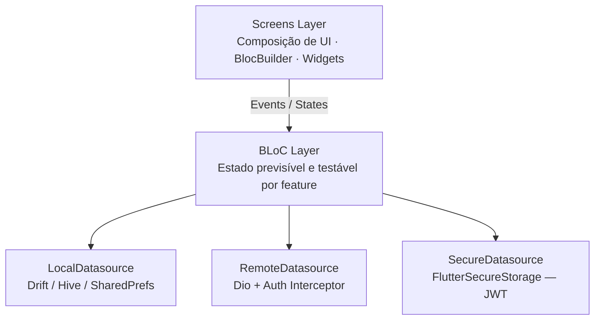
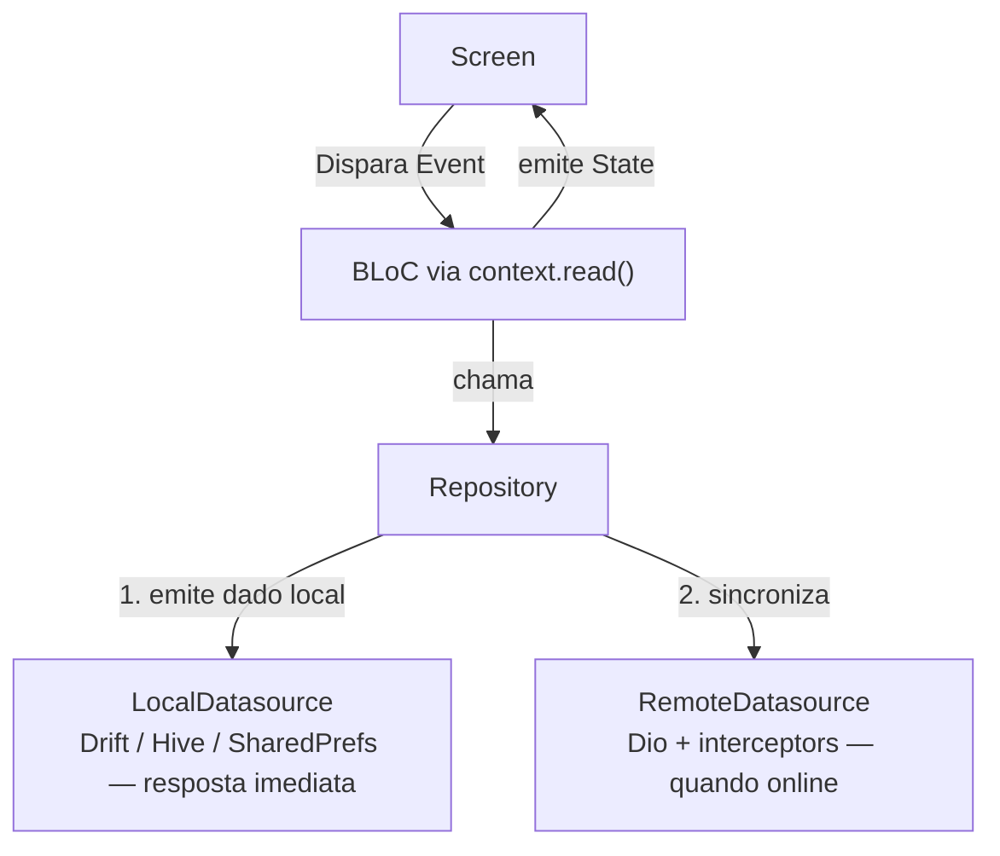

# Mobile

> App Flutter offline-first do Biblioo — estantes, feed social, comunidades com chat em tempo real, recomendações personalizadas, DNA Literário e assistente de IA conversacional.

---

## Stack Principal


---

## Sumário

- [Sobre o app](#sobre-o-app)
- [Arquitetura](#arquitetura)
- [Estratégia offline-first](#estratégia-offline-first)
- [Banco de dados local](#banco-de-dados-local)
- [Estrutura de módulos](#estrutura-de-módulos)
- [BLoCs em detalhe](#blocs-em-detalhe)
- [Estrutura de pastas](#estrutura-de-pastas)
- [Navegação e rotas](#navegação-e-rotas)
- [Screens](#screens)
- [Core](#core)
- [Shared](#shared)
- [Regras de arquitetura](#regras-de-arquitetura)
- [Fluxo de dados](#fluxo-de-dados)
- [Variáveis de ambiente](#variáveis-de-ambiente)
- [Instalação e execução](#instalação-e-execução)
- [Build e distribuição](#build-e-distribuição)
- [Testes](#testes)
- [Tecnologias e dependências](#tecnologias-e-dependências)

---

## Sobre o app

O app mobile do **Biblioo** é o ponto principal de uso do produto em dispositivos Android e iOS. Funciona **offline-first** — exibe dados em cache enquanto sem conexão e sincroniza com a API quando a rede retorna. Cada feature é um módulo isolado com suas próprias camadas de dados, domínio e estado, sem importar diretamente outros módulos.

O app cobre todo o ecossistema da plataforma: autenticação com e-mail/senha ou Google OAuth, biblioteca pessoal com estantes e coleções, rastreamento de progresso de leitura página a página, feed social com posts e reviews, comunidades com chat em tempo real via WebSocket, seis trilhas de recomendação com carregamento paralelo incremental, DNA Literário, notificações push via Firebase FCM, compartilhamento de cápsulas de leitura e o assistente conversacional **Bibo** com streaming de respostas token a token.

---

## Arquitetura

O projeto segue **Feature-first com Screen layer**, com conceitos pontuais de DDD (Value Objects e Aggregate Roots). Não é Clean Architecture completa: sem use cases formais e sem interfaces de repository — a simplicidade é intencional para manter o projeto navegável por uma equipe pequena.



**Padrões centrais:**

| Padrão | Onde se aplica |
|---|---|
| Offline-first | Repository tenta local primeiro, depois sincroniza remoto |
| Auth Interceptor | Injeta JWT em todo request e renova token automaticamente em 401 |
| Retry Interceptor | Backoff exponencial em erros de rede e 5xx |
| Hive Cache | Cache leve de respostas de API por feature (recomendações, feed) |
| Secure Storage | JWT em `FlutterSecureStorage` — criptografado pelo Keychain (iOS) e Keystore (Android) |
| Global BLoC Providers | 13 BLoCs provisionados globalmente via `MultiBlocProvider` no bootstrap |
| Cooldown Manager | Rate limiting local para chamadas de refresh frequentes |

---

## Estratégia offline-first

O app prioriza sempre o dado local para garantir que a interface responda instantaneamente — sem spinner de carregamento na abertura de uma tela que o usuário já visitou.

### Fluxo de leitura

```
Repository.getData()
    ├── 1. Emite dados do cache local (Drift/Hive) imediatamente
    │         → UI renderiza com dado em cache
    └── 2. Busca atualização no backend (se online)
              → Se diferente do cache: atualiza local + emite novo estado
              → Se erro de rede: mantém cache sem mostrar erro ao usuário
```

### Sincronização ao retornar online

O `connectivity_plus` monitora mudanças de conectividade. Quando a conexão é restaurada após um período offline, os BLoCs que tinham dados em cache pendentes de atualização disparam um evento de refresh automático.

### O que é cacheado localmente

| Dado | Armazenamento | TTL |
|---|---|---|
| Itens das estantes | Drift (SQLite) | Permanente (até sync) |
| Metadados de livros | Drift (SQLite) | Permanente (até sync) |
| Feed social | Hive | Curto — expira entre sessões |
| Recomendações (6 trilhas) | Hive (1 box por trilha) | Médio — expira após período configurável |
| Perfil do usuário | Drift | Permanente (até sync) |
| Histórico do assistente | SharedPreferences | Por sessão |
| JWT | FlutterSecureStorage | Até logout ou expiração |

### O que nunca é cacheado

- Mensagens de chat das comunidades (sempre buscadas ao entrar)
- Notificações (sempre buscadas ao abrir o dropdown)
- Resultados de busca

---

## Banco de dados local

O **Drift** (anteriormente Moor) é o ORM para SQLite usado no app. Tabelas são definidas em Dart com type-safety total, e o Drift gera automaticamente os métodos de query, os DAOs e as migrações.

### Tabelas principais

| Tabela | Colunas principais | Uso |
|---|---|---|
| `shelf_items` | `id`, `shelfId`, `bookId`, `bookTitle`, `bookCoverUrl`, `status`, `currentPage`, `totalPages`, `progressPercent` | Cache dos itens das estantes do usuário |
| `shelves` | `id`, `name`, `description`, `itemCount` | Cache das estantes |
| `books_cache` | `id`, `title`, `authors`, `coverUrl`, `pageCount`, `averageRating` | Cache de metadados de livros visitados |
| `collections` | `id`, `name`, `description`, `shelfCount` | Cache de coleções |
| `user_profile` | `id`, `username`, `email`, `avatarUrl`, `bannerUrl`, `bio`, `isPrivate` | Perfil do usuário logado |

### Acesso via DAOs

Cada feature tem seu próprio DAO (Data Access Object), acessado pelo `LocalDatasource`. Exemplo do domínio `shelf`:

```dart
// ShelfItem — entidade de domínio pura
class ShelfItem {
  final int id;
  final int bookId;
  final String bookTitle;
  final String? bookCoverUrl;
  final ReadingStatus status;
  final int? currentPage;
  final int? totalPages;
  final int? progressPercent;

  // Regra de negócio: tem barra de progresso para exibir?
  bool get hasProgress => progressPercent != null && progressPercent! > 0;

  // Regra de negócio: progresso como string formatada
  String get progressLabel =>
    currentPage != null && totalPages != null
      ? '$currentPage / $totalPages páginas'
      : '';
}
```

### Cache com Hive

Dados menos estruturados e com TTL mais curto (feed, recomendações) usam **Hive** ao invés de Drift. Cada feature tem uma box nomeada própria. O `RecommendationRepository` usa uma box por trilha, armazenando a lista serializada como JSON com timestamp de geração para invalidação.

---

## Estrutura de módulos

| Módulo | Responsabilidade |
|---|---|
| `assistant` | Assistente Bibo — chat com histórico persistido em SharedPreferences, streaming de resposta token a token. Chips de sugestões configuráveis. Animação typewriter nas respostas. |
| `auth` | Autenticação com e-mail/senha e Google Sign-In. Sessão JWT em FlutterSecureStorage. Restauração automática de sessão no startup via `AuthStarted`. Renovação automática de token em 401 pelo Auth Interceptor do Dio. |
| `book` | Catálogo de livros com busca por título, autor ou ISBN. Cache de metadados de livros visitados. Cálculo de estrelas (fullStars + halfStar a partir do `averageRating`). |
| `collection` | Coleções de estantes com estatísticas agregadas (livros, páginas, distribuição de status) calculadas no backend. |
| `community` | Comunidades públicas e privadas. Chat em tempo real via WebSocket com `web_socket_channel`. Votação de livros com ciclo completo de estados. Convites por código e diretos. Solicitações de entrada com aprovação. |
| `dna` | DNA Literário — exibe perfil com arquétipo literário, velocidade de leitura, taxa de abandono, distribuição de gêneros e temas. Requer mínimo de livros lidos para exibição. |
| `feed` | Feed social com scroll infinito (cursor-based pagination), pull-to-refresh, curtidas com atualização otimista e flag de spoiler. |
| `notification` | Notificações in-app com badge de não lidas. Push via Firebase FCM quando o app está em background. Roteamento por `actionUrl` ao abrir notificação. |
| `preferences` | Seleção de gêneros (mín. 3 obrigatórios) e livros no onboarding. POST único combina gêneros + livros. Flag de onboarding concluído por userId em SharedPreferences. |
| `recommendation` | 6 trilhas de recomendação carregadas em paralelo com atualização incremental da UI conforme cada trilha resolve. Cache Hive por trilha. Roll Dice como trilha adicional. |
| `share` | Cápsulas de compartilhamento geradas como imagem no backend. Cache local com timestamp para evitar regeneração frequente. |
| `shelf` | Estantes e itens com status de leitura e progresso de páginas. Transições de status (QUERO LER → LENDO → LIDO). |
| `user` | Perfil próprio e público. Seguidores e seguidos. Upload de avatar e banner. Toggle de privacidade. Exclusão de conta. Busca por username. |

---

## BLoCs em detalhe

### AuthBloc

Gerencia o ciclo de vida da sessão JWT. É o primeiro BLoC a ser inicializado — os demais dependem do estado de autenticação para decidir o que carregar.

| Evento | O que faz |
|---|---|
| `AuthStarted` | Restaura sessão do `FlutterSecureStorage`. Se token válido, emite `AuthAuthenticated`. Se expirado, tenta refresh. Se falhar, emite `AuthUnauthenticated`. |
| `LoginRequested` | POST /auth/login. Salva tokens no SecureStorage. |
| `LoginWithGoogleRequested` | Abre o fluxo Google Sign-In, troca o `idToken` por JWT do Biblioo via POST /auth/google. |
| `RegisterRequested` | POST /auth/register. Navega para onboarding após sucesso. |
| `LogoutRequested` | POST /auth/logout para invalidar o refresh token. Limpa SecureStorage e SharedPreferences. |

### ShelfBloc

Gerencia estantes e itens. A regra de negócio de status de leitura vive no `ShelfItem.status` (Value Object).

| Evento | O que faz |
|---|---|
| `ShelfLoadRequested` | Emite do cache local imediatamente, depois sincroniza com o backend |
| `ShelfItemProgressUpdated` | PATCH /shelves/{id}/items/{itemId}/progress. Atualiza cache local otimisticamente |
| `ShelfItemStatusChanged` | PATCH /shelves/{id}/items/{itemId}/status. Dispara eventos de domínio no backend (completar um livro → recomputar 5 trilhas de recomendação via RabbitMQ) |
| `ShelfItemAddRequested` | POST /shelves/{id}/items. Verifica duplicata no cache antes da chamada |
| `ShelfItemRemoveRequested` | DELETE /shelves/{id}/items/{itemId}. Remove do cache local antes da resposta do servidor |

### FeedBloc

Feed com scroll infinito e curtidas otimistas.

| Evento | O que faz |
|---|---|
| `FeedLoadRequested` | Carrega primeira página do cache Hive, depois busca página mais recente da API |
| `FeedLoadMoreRequested` | Busca próxima página usando o cursor retornado pelo backend |
| `FeedReviewLikeToggled` | Atualiza o estado de curtida localmente antes da chamada à API (otimista). Reverte em caso de erro |
| `FeedPostLikeToggled` | Mesmo comportamento — atualização otimista com rollback |
| `FeedReviewDeleteRequested` | Remove o item da lista local. Chama DELETE /feed/reviews/{id} em background |
| `FeedCommentCountChanged` | Atualiza o contador de comentários de um item específico sem recarregar o feed |

### RecommendationBloc

Carrega as 6 trilhas em paralelo e emite estados parciais conforme cada uma resolve — a UI atualiza progressivamente.

| Evento | O que faz |
|---|---|
| `RecommendationLoadRequested` | Dispara 7 Futures em paralelo (6 trilhas + Roll Dice). A cada Future resolvida, emite um `RecommendationState` parcial com aquela trilha preenchida |
| `RecommendationDiceRolled` | Chama `/recommendations/roll-dice` e exibe o livro sorteado na `DiceScreen` |
| `RecommendationTrailRefreshed` | Recarrega uma trilha específica sem resetar as outras |

### CommunityBloc

| Evento | O que faz |
|---|---|
| `CommunityLoadRequested` | Lista comunidades do usuário + sugestões. Cache Hive. |
| `CommunityJoinRequested` | POST /communities/{id}/join. Atualiza estado local otimisticamente. |
| `CommunityJoinByInviteRequested` | POST /communities/join/{token}. Navega para a comunidade após sucesso. |
| `CommunityLeaveRequested` | DELETE /communities/{id}/leave. Remove da lista local. |

---

## Estrutura de pastas

```
mobile/
├── .env                            # Variáveis de ambiente (nunca versionar)
├── .env.example                    # Template de variáveis
├── pubspec.yaml
├── android/
│   └── app/src/main/
│       └── AndroidManifest.xml     # Deep link biblioo://, permissões FCM
├── ios/
│   └── Runner/
│       └── Info.plist              # URL scheme biblioo://, orientações
├── assets/
│   └── images/
│       └── biblioo-carinha-branca-logo.png
└── lib/
    ├── main.dart                   # Entry point — carrega .env, inicializa DI e app
    ├── bootstrap.dart              # App widget raiz com MultiBlocProvider
    ├── core/
    │   ├── config/
    │   │   └── app_env.dart        # Lê API_URL e GOOGLE_WEB_CLIENT_ID do .env
    │   ├── di/
    │   │   └── injector.dart       # GetIt — registra todos os BLoCs, repositórios e datasources
    │   ├── network/
    │   │   ├── dio_client.dart     # Dio com timeout 10s, LogInterceptor em debug
    │   │   ├── auth_interceptor.dart  # Injeta JWT; renova token em 401 via /auth/refresh
    │   │   └── retry_interceptor.dart # Retry com backoff exponencial em erros de rede e 5xx
    │   ├── router/
    │   │   ├── app_router.dart     # GoRouter — 18+ rotas com guard de autenticação em 3 níveis
    │   │   └── deep_link_handler.dart # Intercepta biblioo://reset-password
    │   ├── shell/
    │   │   └── main_shell.dart     # Bottom nav com 5 tabs + FAB global (BibiFab)
    │   └── theme/
    │       ├── app_theme.dart      # Tema claro e escuro (Material 3, paleta teal/menta)
    │       └── theme_mode_cubit.dart # Toggle claro/escuro persistido em SharedPreferences
    ├── features/
    │   ├── assistant/
    │   ├── auth/
    │   ├── book/
    │   ├── collection/
    │   ├── community/
    │   ├── dna/
    │   ├── feed/
    │   ├── notification/
    │   ├── preferences/
    │   ├── recommendation/
    │   ├── share/
    │   ├── shelf/
    │   └── user/
    ├── screens/
    │   ├── assistant/
    │   ├── auth/
    │   ├── book/
    │   ├── collection/
    │   ├── community/
    │   ├── feed/
    │   ├── notification/
    │   ├── onboarding/
    │   ├── profile/
    │   ├── recommendation/
    │   ├── search/
    │   └── shelf/
    └── shared/
        ├── widgets/                # Widgets reutilizáveis globais
        └── utils/                 # Utilitários puros (emojis de gênero, cooldown)
```

### Estrutura padrão de uma feature

```
features/{feature}/
├── data/
│   ├── {feature}_local_datasource.dart   # Drift / Hive / SharedPreferences
│   ├── {feature}_remote_datasource.dart  # Dio — chamadas à API REST
│   ├── {feature}_repository.dart         # Orquestra local vs. remoto (offline-first)
│   └── models/
│       └── {feature}_model.dart          # Freezed + json_serializable
├── domain/
│   ├── {feature}.dart                    # Entidade pura — sem dependência de Flutter, Dio ou Drift
│   └── value_objects/
│       └── {value_object}.dart
└── bloc/
    ├── {feature}_bloc.dart
    ├── {feature}_event.dart
    └── {feature}_state.dart
```

A separação entre `model` (camada de dados, com serialização JSON) e entidade de `domain` (pura, sem dependências de framework) garante que a lógica de negócio possa ser testada sem inicializar Flutter ou banco de dados.

---

## Navegação e rotas

O roteamento usa **GoRouter** com guard de autenticação em três níveis que são verificados em cada navegação:

1. **Não autenticado** → restrito a `/login`, `/register`, `/forgot-password`
2. **Autenticado, onboarding pendente** → restrito a `/onboarding`
3. **Autenticado e onboarded** → acesso completo

```
/login                         → LoginScreen
/register                      → RegisterScreen
/forgot-password               → ForgotPasswordScreen
/onboarding                    → OnboardingScreen

/search                        → BookSearchScreen       (sem bottom nav)
/post/create                   → CreatePostScreen       (sem bottom nav)
/notifications                 → NotificationScreen     (sem bottom nav)
/assistant                     → AssistantScreen        (sem bottom nav)
/book/:id                      → BookScreen             (modal slide-up)
/user/:username                → ProfileScreen          (modal slide-up)

[Shell com bottom nav — 5 tabs, estado preservado]
  Tab 0  /feed                 → FeedScreen
  Tab 1  /recommendation       → RecommendationScreen
           /recommendation/dice → DiceScreen
  Tab 2  /shelf                → BibliotecaScreen
  Tab 3  /community            → CommunityListScreen
           /community/:id      → CommunityDetailScreen
  Tab 4  /profile              → ProfileScreen (próprio)
           /profile/edit       → EditProfileScreen
           /profile/settings   → SettingsScreen
           /profile/dna        → DnaScreen
```

O `StatefulNavigationShell` do GoRouter preserva o estado de cada tab ao trocar — o feed não é recarregado ao voltar para ele após visitar outra aba.

**Deep links:** `biblioo://reset-password` é interceptado pelo `deep_link_handler.dart` e redireciona para a tela de redefinição de senha, processando o token da URL automaticamente.

---

## Screens

| Screen | Arquivo | Descrição |
|---|---|---|
| **Login** | `auth/login_screen.dart` | E-mail/senha + botão Google Sign-In. Navega para onboarding no primeiro acesso ou para o feed se já onboarded |
| **Register** | `auth/register_screen.dart` | Cadastro com validação inline de e-mail, username (sem espaços) e força de senha |
| **Forgot Password** | `auth/forgot_password_screen.dart` | Solicita e-mail. Instrui o usuário a clicar no link recebido (deep link `biblioo://reset-password`) |
| **Onboarding** | `onboarding/onboarding_screen.dart` | Seleção de gêneros com chips visuais (mín. 3) + busca de livros por nome ou autor. Opção de pular. POST único ao confirmar |
| **Feed** | `feed/feed_screen.dart` | Feed com scroll infinito, pull-to-refresh, `FeedItemCard` com curtida otimista e contador de comentários |
| **Create Post** | `feed/create_post_screen.dart` | Texto + image picker (múltiplas imagens) + GIF + rating slider para reviews + flag de spoiler |
| **Recommendation** | `recommendation/recommendation_screen.dart` | Banner do Roll Dice + 6 seções que aparecem progressivamente conforme as trilhas carregam |
| **Dice Roll** | `recommendation/dice_screen.dart` | Tela full-screen com animação de dado rolando e card do livro sorteado com opção de adicionar à estante |
| **Biblioteca** | `shelf/biblioteca_screen.dart` | TabBar: Estantes (lista de estantes do usuário) + Coleções. FAB para criar nova estante |
| **Shelf Detail** | `shelf/shelf_list_screen.dart` | Grid de livros com `ShelfItemCard` mostrando capa, status com badge colorido e barra de progresso |
| **Collection Detail** | `collection/collection_detail_screen.dart` | Estatísticas agregadas no topo (total de livros, páginas lidas, status) + previews das estantes da coleção |
| **Book Detail** | `book/book_screen.dart` | Slide-up modal com capa grande, avaliação média com estrelas, sinopse expansível, reviews recentes e botão de adicionar à estante |
| **Community List** | `community/community_list_screen.dart` | Minhas comunidades + comunidades sugeridas + campo de entrada por código de convite |
| **Community Detail** | `community/community_detail_screen.dart` | TabBar: Overview (info, membros, moderação) · Chat (WebSocket) · Voting (votações ativas e encerradas) |
| **Search** | `search/book_search_screen.dart` | Busca full-text de livros e usuários com shimmer enquanto carrega |
| **Profile (próprio)** | `profile/profile_screen.dart` | Header com avatar/banner, stats (livros lidos, páginas, streak), 3 tabs (Biblioteca · Atividade · Comunidades), botões de editar e configurações |
| **Profile (público)** | `profile/profile_screen.dart` | Mesmo layout, botão de seguir/deixar de seguir no lugar de editar. Mostra se é privado |
| **Edit Profile** | `profile/edit_profile_screen.dart` | Bio, username, image picker para avatar e banner, toggle de visibilidade pública/privada |
| **Settings** | `profile/settings_screen.dart` | Toggle de tema claro/escuro, logout e exclusão permanente de conta com confirmação |
| **DNA** | `profile/dna_screen.dart` | Arquétipo literário com descrição, velocidade de leitura, taxa de abandono, distribuição de gêneros em gráfico |
| **Notifications** | `notification/notification_screen.dart` | Lista paginada com marcação individual ou em massa, ícone por tipo de evento, navegação por `actionUrl` |
| **Assistant** | `assistant/assistant_screen.dart` | Chat com Bibo — lista de mensagens com avatar, chips de sugestões rápidas, campo de input, resposta progressiva token a token |

---

## Core

### Injeção de dependência (`core/di/injector.dart`)

Inicializado uma vez em `main()` via `Injector.init()`. O resultado é passado para o `MultiBlocProvider` raiz que provisiona **13 BLoCs globalmente**, todos acessíveis em qualquer ponto da árvore de widgets via `context.read<T>()`.

```
BLoCs provisionados globalmente:
ThemeModeCubit · AuthBloc · UserBloc · UserSearchBloc · BookBloc
ShelfBloc · CollectionBloc · FeedBloc · ReviewBloc · PostBloc
NotificationBloc · AssistantBloc · RecommendationBloc
```

**Ordem de inicialização no `main()`:**
1. Carrega o arquivo `.env` (flutter_dotenv)
2. Inicializa `SharedPreferences` e `FlutterSecureStorage`
3. Abre os boxes do Hive (um por feature que usa cache Hive)
4. Cria o banco de dados Drift (SQLite)
5. Cria a instância do Dio com `RetryInterceptor` + `AuthInterceptor`
6. Instancia todos os datasources (local e remoto)
7. Instancia todos os repositórios
8. Cria todos os BLoCs e registra no GetIt
9. Roda o app via `runApp(Bootstrap())`

### Rede (`core/network/`)

**`dio_client.dart`** — Dio configurado com:
- Connect timeout: 10s
- Receive timeout: 10s
- `LogInterceptor` em modo debug (loga headers, body e resposta)

**`auth_interceptor.dart`** — Em cada request:
1. Lê o access token do `FlutterSecureStorage`
2. Injeta `Authorization: Bearer {token}` no header
3. Se a resposta for 401: chama `POST /auth/refresh` com o refresh token
4. Persiste o novo access token no `FlutterSecureStorage`
5. Reexecuta o request original com o novo token

O interceptor usa um `Completer` para serializar chamadas de refresh concorrentes — se múltiplos requests retornam 401 ao mesmo tempo, apenas um refresh é feito.

**`retry_interceptor.dart`** — Retry automático com backoff exponencial (1s, 2s, 4s) em:
- Erros de rede (`SocketException`, timeout)
- Respostas 5xx (exceto 501)
- Máximo de 3 tentativas

### Roteamento (`core/router/`)

**`app_router.dart`** — GoRouter com 18+ rotas. O guard `_authRedirect()` é executado antes de cada navegação:
- Sem token → redireciona para `/login`
- Com token, sem onboarding → redireciona para `/onboarding`
- Com token e onboarding completo → permite navegação

**`deep_link_handler.dart`** — Intercepta `biblioo://reset-password?token=...` e navega para `ForgotPasswordScreen` com o token extraído da URL.

### Shell (`core/shell/main_shell.dart`)

5 tabs com `StatefulNavigationShell` — o estado de cada tab (posição de scroll, dados carregados) é preservado ao trocar entre tabs. O **FAB global** `BibiFab` é visível em todas as tabs, com dois botões: atalho para o assistente Bibo e criação de novo post. O FAB se oculta automaticamente dentro da tela de detalhe de comunidade (para não sobrepor o chat).

### Tema (`core/theme/`)

Material 3 com paleta teal/menta alinhada ao frontend web:

| Token | Valor |
|---|---|
| Brand Primary | `#3FC3A7` |
| Brand Dark | `#13937A` |
| Light Canvas | `#F4FBF9` |
| Text Primary | `#0F2F2C` |
| Dark Background | `#0F1A17` |

`ThemeModeCubit` persiste a preferência claro/escuro em SharedPreferences e é o único cubit de UI na lista global.

---

## Shared

### Widgets (`shared/widgets/`)

| Widget | Descrição |
|---|---|
| `BibiFab` | FAB flutuante global com atalho para o assistente e criação de posts. Posicionado acima do bottom nav. |
| `BiblioWordmark` | Logo/branding do app — usado nas telas de autenticação |
| `BookCoverPlaceholder` | Fallback visual para livros sem capa: gradiente com inicial do título |
| `StatItem` | Exibe um label + valor formatado — usado em estatísticas de perfil, coleções e DNA |

### Utilitários (`shared/utils/`)

| Arquivo | Descrição |
|---|---|
| `genre_emoji.dart` | Mapeia 30+ gêneros literários para emoji (`"Science Fiction"` → `🚀`, `"Romance"` → `💕`). Fallback `📚` para gêneros não mapeados |
| `cooldown_refresh.dart` | Rate limiting local para chamadas frequentes de refresh. Backoff exponencial com contador de tentativas persistido em SharedPreferences. Evita spam de requisições quando a conectividade é instável |

---

## Regras de arquitetura

| Regra | Motivação |
|---|---|
| `features/` nunca importa outra feature | Evita acoplamento entre domínios — comunicação entre features só por eventos ou via BLoC global |
| `features/` nunca importa `screens/` | Features não conhecem UI — testáveis sem Flutter |
| `screens/` pode importar múltiplas features | Composição de domínios na camada de apresentação é esperada |
| `shared/` não importa `features/` nem `screens/` | Widgets e utils permanecem genéricos e reutilizáveis |
| `domain/` não depende de Flutter, Dio, Drift ou DI | Entidades são Dart puro — testáveis com `dart test` sem inicializar o framework |
| BLoC chama apenas Repository, nunca DataSource diretamente | A lógica de offline-first fica isolada no Repository |
| Repository sempre tenta local primeiro | A UI responde imediatamente com dado em cache |
| JWT somente em `FlutterSecureStorage` | Nunca em SharedPreferences (não criptografado) ou variáveis de memória não protegidas |
| BLoCs provisionados globalmente via `MultiBlocProvider` | Um único ponto de acesso evita instâncias duplicadas e conflitos de estado |

---

## Fluxo de dados



O padrão de dois emits (local imediato + remoto assíncrono) é implementado com `yield*` no BLoC, garantindo que a UI nunca trave aguardando a rede.

---

## Variáveis de ambiente

Crie `.env` em `code/mobile/` com base no `.env.example`. **Nunca versionar em produção.**

```dotenv
# Web Client ID do Google OAuth (Google Cloud Console)
GOOGLE_WEB_CLIENT_ID=seu-web-client-id.apps.googleusercontent.com

# URL base da API REST do backend (sem barra final)
API_URL=http://localhost:8080
```

Para Android em emulador, use `http://10.0.2.2:8080` em vez de `localhost`. Para dispositivo físico na mesma rede, use o IP local da máquina.

| Variável | Uso |
|---|---|
| `GOOGLE_WEB_CLIENT_ID` | ID Web do OAuth do Google — necessário para gerar o `idToken` no login com Google. É o Web Client ID, não o Android/iOS Client ID. |
| `API_URL` | URL base do backend. Em produção: URL do Cloud Run |

---

## Instalação e execução

### Pré-requisitos

- Flutter SDK >= 3.11
- Android SDK (para Android) — recomendado via Android Studio
- Xcode >= 15 (para iOS, apenas macOS)
- Backend Biblioo rodando (ver [README do backend](../back/README.md))

### Passo a passo

```bash
cd code/mobile

# Instalar dependências
flutter pub get

# Criar arquivo de variáveis de ambiente
cp .env.example .env
# preencher GOOGLE_WEB_CLIENT_ID e API_URL

# Gerar código (Freezed, json_serializable, Drift, injectable)
# Executar sempre após alterar modelos, entidades ou tabelas Drift
dart run build_runner build --delete-conflicting-outputs

# Verificar dispositivos disponíveis
flutter devices

# Rodar no device conectado
flutter run

# Rodar em device específico
flutter run -d <device-id>
```

### Durante a execução

| Atalho | Ação |
|---|---|
| `r` | Hot reload (preserva estado) |
| `R` | Hot restart (reinicia o app) |
| `q` | Encerrar |

### Comandos úteis

```bash
# Analisar problemas de lint
flutter analyze

# Rodar testes
flutter test

# Regenerar código após alterar modelos Freezed/Drift
dart run build_runner build --delete-conflicting-outputs

# Limpar build cache
flutter clean && flutter pub get
```

---

## Build e distribuição

> Um APK Android já compilado está disponível em `mobile/build/app/outputs/apk/flutter-apk/app-release.apk`. Para instalar diretamente em um dispositivo Android, basta transferir e abrir o arquivo (habilitar "Fontes desconhecidas" nas configurações de segurança do Android, se necessário).

```bash
# Android — APK para distribuição direta / testes
flutter build apk --release

# Android — App Bundle para Google Play Store
flutter build appbundle --release

# iOS — IPA para TestFlight / App Store (requer macOS + Xcode)
flutter build ipa --release
```

| Plataforma | Arquivo | Localização |
|---|---|---|
| Android APK | `app-release.apk` | `build/app/outputs/apk/flutter-apk/app-release.apk` |
| Android AAB | `app-release.aab` | `build/app/outputs/bundle/release/app-release.aab` |
| iOS IPA | `Runner.ipa` | `build/ios/ipa/Runner.ipa` |

---

## Testes

```bash
flutter test
```

Atualmente há um smoke test em `test/widget_test.dart` que valida a inicialização do app com o injetor de dependência. A cobertura cresce conforme novas features são adicionadas. Lógica pura de domínio (entidades, value objects) é prioritária para testes unitários.

---

## Tecnologias e dependências

| Categoria | Tecnologia | Versão |
|---|---|---|
| Framework | Flutter | 3.11+ |
| Linguagem | Dart | 3.11 |
| Estado | flutter_bloc + equatable | ^8.1.6 / ^2.0.5 |
| Roteamento | go_router | ^14.0.0 |
| HTTP | dio | ^5.7.0 |
| WebSocket | web_socket_channel | ^3.0.0 |
| Conectividade | connectivity_plus | ^6.0.0 |
| Banco local | drift + drift_flutter | ^2.18.0 / ^0.2.0 |
| Cache leve | hive_flutter | ^1.1.0 |
| Preferências | shared_preferences | ^2.3.0 |
| Tokens seguros | flutter_secure_storage | ^9.2.4 |
| DI | get_it + injectable | ^8.0.0 / ^2.4.0 |
| Modelos imutáveis | freezed_annotation | ^2.4.0 |
| Serialização JSON | json_annotation | ^4.9.0 |
| Variáveis de ambiente | flutter_dotenv | ^5.1.0 |
| Auth Google | google_sign_in | ^6.2.1 |
| Deep links | app_links | ^6.4.0 |
| Imagens | image_picker | ^1.1.2 |
| Compartilhamento | share_plus | ^10.1.4 |
| Info do app | package_info_plus | ^8.0.2 |
| Paths do sistema | path_provider | ^2.1.4 |
| Ícones iOS | cupertino_icons | ^1.0.8 |
| **Dev** | | |
| Build runner | build_runner | ^2.4.0 |
| Geração Freezed | freezed | ^2.5.0 |
| Geração JSON | json_serializable | ^6.8.0 |
| Geração Drift | drift_dev | ^2.18.0 |
| Geração DI | injectable_generator | ^2.4.0 |
| Ícones do app | flutter_launcher_icons | ^0.14.4 |
| Lint | flutter_lints | ^6.0.0 |

---

<div align="center">
  
</div>
<p align="center">Fonte do banner: <a href="https://github.com/joaopauloaramuni">João Paulo Carneiro Aramuni</a></p>

---
