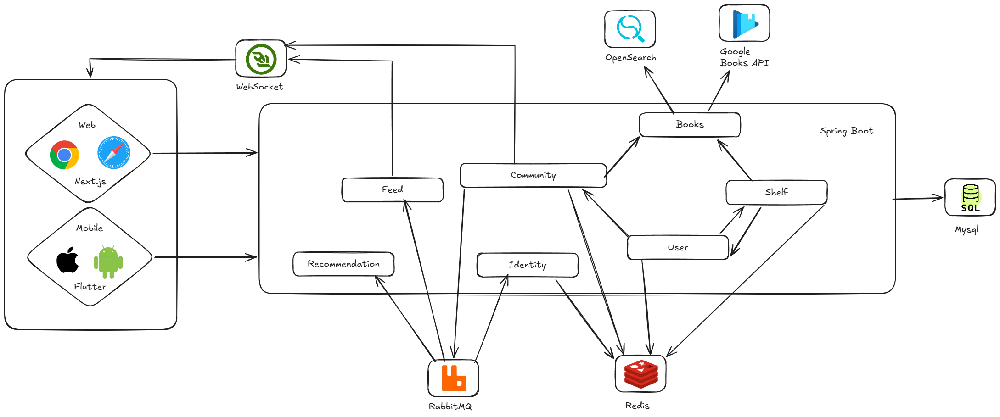
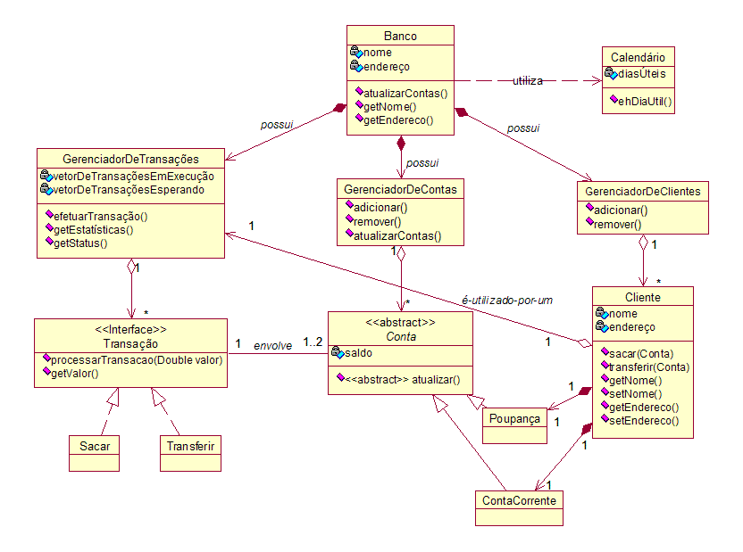
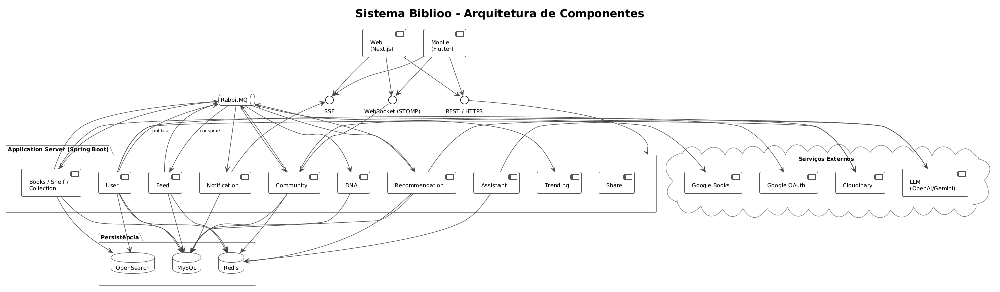

# 4. Modelagem e Projeto Arquitetural

Os clientes web e mobile se conectam a um backend Spring Boot dividido em módulos de negócio: autenticação e perfil de usuário (User), catálogo de livros (Books), estante pessoal (Shelf), comunidades de leitura (Community), timeline social (Feed), recomendações personalizadas (Recommendation) e o DNA Literário, que compila o histórico de leituras e preferências do usuário em um perfil analítico atualizado continuamente (Identity). Esses módulos compartilham um banco de dados MySQL como fonte de verdade, usam Redis para cache e se comunicam entre si de forma assíncrona via RabbitMQ — quando algo relevante acontece em um módulo, ele publica um evento e os outros que precisam daquela informação a consomem no seu próprio ritmo, sem dependência direta entre eles. O módulo de Books ainda se integra com o OpenSearch para busca e com a Google Books API para enriquecer os dados do catálogo. Para funcionalidades em tempo real, como notificações, os clientes mantêm uma conexão WebSocket com o servidor.

## 4.1. Histórias de Usuário

|EU COMO... | QUERO/PRECISO ...  |PARA ...                 |
|--------------------|------------------------------------|-----------------------------------------|
|Leitor|Buscar livros no catálogo por título, autor ou ISBN|Encontrar rapidamente o livro desejado|
|Leitor|Cadastrar-se na plataforma com nome de usuário único, senha e e-mail|Criar uma conta pessoal segura|
|Leitor|Autenticar-se na plataforma com e-mail e senha|Acessar sua conta e funcionalidades|
|Leitor|Seguir e deixar de seguir outros leitores|Acompanhar leituras de interesse|
|Leitor|Configurar a visibilidade do perfil (público ou privado)|Controlar quem vê suas atividades|
|Leitor|Adicionar um livro à estante com status de leitura|Organizar leituras e histórico|
|Leitor|Atualizar status de leitura e página atual|Manter o progresso de leitura atualizado|
|Leitor|Registrar ou editar avaliação com estrelas e comentário|Compartilhar opinião sobre livros|
|Leitor|Criar comunidade de leitura para um livro|Promover leitura coletiva|
|Leitor|Ingressar em uma comunidade de leitura|Participar de leituras coletivas|
|Leitor|Atualizar página atual na comunidade|Registrar progresso coletivo|
|Leitor|Visualizar progresso coletivo da comunidade|Acompanhar ritmo do grupo|
|Leitor|Publicar comentário na comunidade ligado à página atual|Compartilhar impressões sem spoilers|
|Leitor|Visualizar comentários com proteção contra spoilers|Ler discussões sem revelar partes futuras|
|Leitor|Responder comentários na comunidade|Interagir com outros leitores|
|Leitor|Excluir comentário próprio na comunidade|Remover conteúdo sem quebrar a conversa|
|Leitor|Visualizar feed com atividades de leitores seguidos|Descobrir leituras e acompanhar amigos|
|Leitor|Ver feed respeitando configurações de privacidade|Garantir respeito às preferências de perfil|
|Leitor|Curtir itens do feed|Demonstrar engajamento rapidamente|
|Leitor|Receber atualizações e notificações em tempo real|Acompanhar atividades sem recarregar|
|Leitor|Ter DNA Literário gerado automaticamente|Conhecer seu perfil de leitor|
|Leitor|Visualizar afinidade por gêneros e autores favoritos|Entender suas preferências literárias|
|Leitor|Receber recomendações personalizadas|Descobrir novos livros alinhados ao gosto|
|Leitor|Importar biblioteca do Goodreads via CSV|Migrar histórico de leitura facilmente|

## 4.2. Visão Lógica

Esta seção apresenta os artefatos utilizados para modelar o sistema Biblioo. O diagrama de classes foi escolhido para representar a estrutura estática das entidades e suas relações, enquanto o diagrama de componentes ilustra como os módulos de negócio, serviços de infraestrutura e clientes interagem entre si. Juntos, esses dois artefatos fornecem uma visão complementar: o diagrama de classes foca no domínio e nas regras de negócio, enquanto o de componentes revela a separação de responsabilidades e os fluxos de comunicação da solução.

### Diagrama de Classes

O **diagrama de classes** modela a estrutura estática do domínio do Biblioo, representando as principais entidades — Leitor, Livro, Estante, Comunidade, Comentário, Avaliação, Feed e DNA Literário — suas propriedades e os relacionamentos entre elas. Ele evidencia como um Leitor pode possuir múltiplas Estantes, cada uma contendo registros de leitura associados a Livros do catálogo, e como as Comunidades agregam Leitores em torno de um único título, possibilitando troca de Comentários encadeados.

**Figura 2 – Diagrama de Classes. Fonte: o próprio autor.**

### Diagrama de Componentes

O **diagrama de componentes** representa o backend Spring Boot modularizado e os serviços de infraestrutura. Os módulos de negócio — User, Books, Shelf, Community, Feed, Recommendation e Identity — são desacoplados entre si e se comunicam de forma assíncrona via RabbitMQ, o que garante que falhas em um módulo não se propaguem diretamente para os demais. O módulo Books consulta o OpenSearch para buscas de alta performance e a Google Books API para enriquecimento do catálogo. O canal WebSocket mantém a comunicação em tempo real para notificações e atualizações do feed.

**Figura 3 – Diagrama de Componentes. Fonte: o próprio autor.**

#### Estilos e Padrões Arquiteturais Utilizados

1. **Arquitetura Cliente-Servidor**: os clientes Web (React) e Mobile (Flutter) consomem a API REST exposta pelo backend Spring Boot.
2. **Arquitetura em Camadas**: separação clara entre interface do usuário, lógica de negócio e persistência de dados.
3. **API RESTful**: endpoints organizados por recurso, seguindo o nível 2 do modelo de maturidade de Richardson.
4. **Arquitetura Orientada a Eventos (EDA)**: o RabbitMQ gerencia a comunicação assíncrona entre módulos, desacoplando produtor e consumidor de eventos.
5. **Cache Aside**: o Redis armazena em cache resultados de consultas frequentes (ex.: catálogo de livros, feed social), reduzindo carga no banco de dados.

---

#### Descrição dos Componentes

| **Componente** | **Papel na Arquitetura** |
| --- | --- |
| **Web (React)** | Interface web utilizada pelo leitor para acessar todas as funcionalidades da plataforma via navegador. |
| **Mobile (Flutter)** | Aplicativo para iOS e Android que oferece a mesma experiência da versão web em dispositivos móveis. |
| **Módulo User** | Gerencia cadastro, autenticação via JWT, perfil do leitor e controle de privacidade (público/privado). |
| **Módulo Books** | Mantém o catálogo de livros, consultando o OpenSearch para busca e a Google Books API para enriquecer dados. |
| **Módulo Shelf** | Controla a estante pessoal do leitor: status de leitura, progresso por página, avaliações e coleções personalizadas. |
| **Módulo Community** | Gerencia criação e participação em comunidades de leitura vinculadas a um título, incluindo comentários e curtidas. |
| **Módulo Feed** | Agrega e entrega eventos de atividade de leitores e comunidades seguidas pelo leitor.|
| **Módulo Recommendation** | Gera trilhas de recomendação personalizadas com base no histórico de leitura. |
| **Módulo Identity (DNA Literário)** | Compila o perfil analítico do leitor a partir do histórico consolidado, calculando métricas literárias. |
| **MySQL** | Banco de dados relacional principal, fonte de verdade para todas as entidades do domínio. |
| **Redis** | Camada de cache para consultas frequentes, reduzindo latência e carga sobre o banco de dados. |
| **RabbitMQ** | Broker de mensagens responsável pela comunicação assíncrona e desacoplada entre os módulos de negócio. |
| **OpenSearch** | Motor de busca fulltext para o catálogo de livros, com fallback para busca no banco em caso de falha. |
| **Google Books API** | Serviço externo que enriquece os dados do catálogo com metadados de livros (capa, descrição, ISBN etc.). |
| **WebSocket** | Canal de comunicação em tempo real entre backend e clientes para notificações e atualizações de feed. |

---

#### Classificação dos Componentes

| **Tipo** | **Componentes** |
| --- | --- |
| **Reutilizados** | MySQL, Redis, RabbitMQ, OpenSearch, navegadores web. |
| **Adquiridos** | Google Books API (serviço externo). |
| **Desenvolvidos** | Backend Spring Boot (todos os módulos), Web (React), Mobile (Flutter). |

## 4.3. Modelo de Dados

O diagrama da Figura 4 representa o modelo de dados relacional do Biblioo, que organiza todas as entidades do domínio e seus relacionamentos em um banco MySQL.

- A tabela **`user`** armazena os dados do leitor: identificador único, nome de usuário, e-mail, senha (hash bcrypt) e configuração de visibilidade do perfil (público ou privado).
- A tabela **`book`** representa livros presentes no catálogo interno, persistidos após consulta à Google Books API. Contém título, autor(es), ISBN, capa, descrição, categoria e data de publicação.
- A tabela **`shelf`** registra a estante pessoal do leitor, vinculando um usuário a um livro com atributos de status de leitura (Quero Ler, Lendo, Relendo, Lido, Abandonei), página atual e datas de início e conclusão.
- A tabela **`shelf_collection`** representa coleções personalizadas criadas pelo leitor dentro de sua própria conta, com nome único por usuário.
- A tabela **`review`** armazena avaliações de livros feitas pelo leitor, com nota de 1 a 5 estrelas e comentário textual opcional.
- A tabela **`community`** representa grupos de leitura vinculados a um único livro do catálogo. Registra nome, descrição, data de criação e o livro de referência.
- A tabela **`community_member`** controla a associação entre leitores e comunidades, com data de ingresso e papel (membro ou administrador).
- A tabela **`comment`** armazena comentários publicados em comunidades, com suporte a respostas encadeadas (via auto-referência), registro de página e indicador de remoção lógica (`[comentário removido]`).
- A tabela **`comment_like`** registra curtidas em comentários, garantindo unicidade por combinação de usuário e comentário.
- A tabela **`feed_event`** registra os eventos que compõem o feed social (ex.: livro adicionado à estante, avaliação publicada, ingresso em comunidade), vinculados ao usuário que os gerou.
- A tabela **`follow`** mapeia o relacionamento de seguir entre leitores, controlando o grafo social da plataforma.
- A tabela **`literary_dna`** armazena o perfil analítico gerado pelo módulo Identity, consolidando gêneros favoritos, autores mais lidos, ritmo de leitura e outras métricas derivadas do histórico do leitor.

Os relacionamentos foram definidos para garantir integridade referencial em todas as operações, desde o registro de leituras até a publicação de comentários e geração do DNA Literário.

")

**Figura 4 – Diagrama de Entidade e Relacionamento (ER). Fonte: o próprio autor.**
