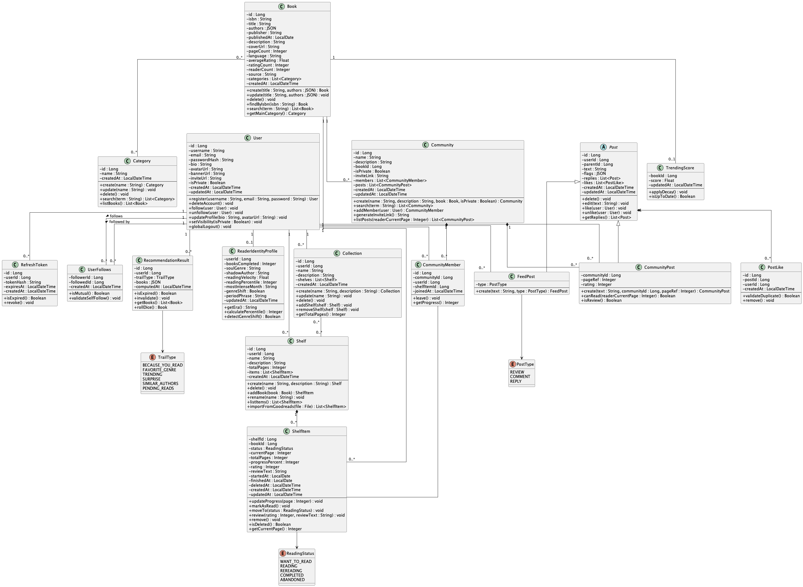

# 4. Modelagem e Projeto Arquitetural

Os clientes web e mobile se conectam a um backend Spring Boot dividido em módulos de negócio: autenticação e perfil de usuário (User), catálogo de livros (Books), estante pessoal (Shelf), comunidades de leitura (Community), timeline social (Feed), recomendações personalizadas (Recommendation) e o DNA Literário, que compila o histórico de leituras e preferências do usuário em um perfil analítico atualizado continuamente (Identity). Esses módulos compartilham um banco de dados MySQL como fonte de verdade, usam Redis para cache e se comunicam entre si de forma assíncrona via RabbitMQ — quando algo relevante acontece em um módulo, ele publica um evento e os outros que precisam daquela informação a consomem no seu próprio ritmo, sem dependência direta entre eles. O módulo de Books ainda se integra com o OpenSearch para busca e com a Google Books API para enriquecer os dados do catálogo. Para funcionalidades em tempo real, como notificações, os clientes mantêm uma conexão WebSocket com o servidor.

## 4.1. Histórias de Usuário

|EU COMO... | QUERO/PRECISO ...  |PARA ...                 |
|--------------------|------------------------------------|-----------------------------------------|
Leitor | Buscar livros no catálogo por título, autor ou ISBN | Encontrar rapidamente o livro desejado
Leitor | Autenticar-se na plataforma com e-mail e senha | Acessar sua conta e funcionalidades
Leitor | Seguir e deixar de seguir outros leitores | Acompanhar atividades e leituras de interesse
Leitor | Configurar a visibilidade do perfil (público ou privado) | Controlar quem pode visualizar suas informações e atividades
Leitor | Adicionar um livro à estante com um status de leitura | Organizar suas leituras e histórico pessoal
Leitor | Atualizar o status de leitura e a página atual de um livro | Manter o progresso de leitura atualizado
Leitor | Registrar e editar uma avaliação com nota e comentário | Compartilhar sua opinião sobre livros com outros leitores
Leitor | Criar uma estante de leitura com um nome | Organizar livros em categorias personalizadas
Leitor | Criar uma coleção de estantes | Agrupar estantes para melhor organização das leituras
Leitor | Adicionar e remover estantes de uma coleção | Gerenciar a composição das suas coleções
Leitor | Visualizar dados estatísticos de uma coleção | Obter insights sobre suas leituras agregadas
Leitor | Criar uma comunidade de leitura vinculada a um livro | Promover discussões e leitura coletiva
Leitor | Ingressar em uma comunidade de leitura | Participar de discussões com outros leitores
Leitor | Visualizar comentários em uma comunidade com respostas aninhadas | Acompanhar discussões organizadas
Leitor | Excluir um comentário de sua autoria em uma comunidade | Remover conteúdo mantendo a estrutura da conversa
Leitor | Visualizar o feed de publicações de outros leitores | Descobrir novas leituras e acompanhar atividades
Leitor | Acessar uma publicação e visualizar comentários e curtidas | Interagir com conteúdos detalhadamente
Leitor | Curtir e remover curtida de comentários | Demonstrar engajamento nas interações
Leitor | Excluir um comentário próprio em uma publicação | Remover conteúdo sem comprometer a conversa
Leitor | Acessar o perfil de outro leitor | Visualizar suas informações conforme permissões de visibilidade
Leitor | Visualizar o perfil de outro leitor com suas publicações e interações | Acompanhar suas atividades respeitando as permissões de visibilidade
Leitor | Acessar o livro a partir de uma publicação | Navegar rapidamente para o conteúdo relacionado
Leitor | Possuir um perfil literário (DNA Literário) gerado automaticamente | Entender seu padrão de leitura
Leitor | Importar biblioteca do Goodreads via arquivo CSV | Migrar seu histórico de leitura facilmente
Leitor | Visualizar trilhas de recomendação personalizadas | Descobrir livros alinhados ao seu gosto
Leitor | Utilizar a funcionalidade "Jogar o Dado" | Escolher um livro aleatoriamente entre recomendações

## 4.2. Visão Lógica

Esta seção apresenta os artefatos utilizados para modelar o sistema Biblioo. O diagrama de classes foi escolhido para representar a estrutura estática das entidades e suas relações, enquanto o diagrama de componentes ilustra como os módulos de negócio, serviços de infraestrutura e clientes interagem entre si. Juntos, esses dois artefatos fornecem uma visão complementar: o diagrama de classes foca no domínio e nas regras de negócio, enquanto o de componentes revela a separação de responsabilidades e os fluxos de comunicação da solução.

### Diagrama de Classes

O **diagrama de classes** modela a estrutura estática do domínio do Biblioo, representando as principais entidades — Leitor, Livro, Estante, Comunidade, Comentário, Avaliação, Feed e DNA Literário — suas propriedades e os relacionamentos entre elas. Ele evidencia como um Leitor pode possuir múltiplas Estantes, cada uma contendo registros de leitura associados a Livros do catálogo, e como as Comunidades agregam Leitores em torno de um único título, possibilitando troca de Comentários encadeados.

**Figura 2 – Diagrama de Classes. Fonte: o próprio autor.**

### Diagrama de Componentes

O **diagrama de componentes** representa o backend Spring Boot modularizado e os serviços de infraestrutura. Os módulos de negócio — User, Books, Shelf, Community, Feed, Recommendation e Identity — são desacoplados entre si e se comunicam de forma assíncrona via RabbitMQ, o que garante que falhas em um módulo não se propaguem diretamente para os demais. O módulo Books consulta o OpenSearch para buscas de alta performance e a Google Books API para enriquecimento do catálogo. O canal WebSocket mantém a comunicação em tempo real para notificações e atualizações do feed.

**Figura 3 – Diagrama de Componentes. Fonte: o próprio autor.**

#### Estilos e Padrões Arquiteturais Utilizados

1. **Arquitetura Cliente-Servidor**: os clientes Web (React) e Mobile (Flutter) consomem a API REST exposta pelo backend Spring Boot.
2. **Arquitetura em Camadas**: separação clara entre interface do usuário, lógica de negócio e persistência de dados.
3. **API RESTful**: endpoints organizados por recurso, seguindo o nível 2 do modelo de maturidade de Richardson.
4. **Arquitetura Orientada a Eventos (EDA)**: o RabbitMQ gerencia a comunicação assíncrona entre módulos, desacoplando produtor e consumidor de eventos.
5. **Cache Aside**: o Redis armazena em cache resultados de consultas frequentes (ex.: catálogo de livros, feed social), reduzindo carga no banco de dados.

---

#### Descrição dos Componentes

| **Componente** | **Papel na Arquitetura** |
| --- | --- |
| **Web (React)** | Interface web utilizada pelo leitor para acessar todas as funcionalidades da plataforma via navegador. |
| **Mobile (Flutter)** | Aplicativo para iOS e Android que oferece a mesma experiência da versão web em dispositivos móveis. |
| **Módulo User** | Gerencia cadastro, autenticação via JWT, perfil do leitor e controle de privacidade (público/privado). |
| **Módulo Books** | Mantém o catálogo de livros, consultando o OpenSearch para busca e a Google Books API para enriquecer dados. |
| **Módulo Shelf** | Controla a estante pessoal do leitor: status de leitura, progresso por página, avaliações e coleções personalizadas. |
| **Módulo Community** | Gerencia criação e participação em comunidades de leitura vinculadas a um título, incluindo comentários e curtidas. |
| **Módulo Feed** | Agrega e entrega eventos de atividade de leitores e comunidades seguidas pelo leitor.|
| **Módulo Recommendation** | Gera trilhas de recomendação personalizadas com base no histórico de leitura. |
| **Módulo Identity (DNA Literário)** | Compila o perfil analítico do leitor a partir do histórico consolidado, calculando métricas literárias. |
| **MySQL** | Banco de dados relacional principal, fonte de verdade para todas as entidades do domínio. |
| **Redis** | Camada de cache para consultas frequentes, reduzindo latência e carga sobre o banco de dados. |
| **RabbitMQ** | Broker de mensagens responsável pela comunicação assíncrona e desacoplada entre os módulos de negócio. |
| **OpenSearch** | Motor de busca fulltext para o catálogo de livros, com fallback para busca no banco em caso de falha. |
| **Google Books API** | Serviço externo que enriquece os dados do catálogo com metadados de livros (capa, descrição, ISBN etc.). |
| **WebSocket** | Canal de comunicação em tempo real entre backend e clientes para notificações e atualizações de feed. |

---

#### Classificação dos Componentes

| **Tipo** | **Componentes** |
| --- | --- |
| **Reutilizados** | MySQL, Redis, RabbitMQ, OpenSearch, navegadores web. |
| **Adquiridos** | Google Books API (serviço externo). |
| **Desenvolvidos** | Backend Spring Boot (todos os módulos), Web (React), Mobile (Flutter). |

## 4.3. Modelo de Dados

O diagrama representa o modelo de dados relacional do Biblioo, que organiza todas as
entidades do domínio e seus relacionamentos em um banco MySQL.

- A tabela **`users`** armazena os dados do leitor: identificador único, nome de usuário,
e-mail, senha (hash bcrypt), bio, URLs de avatar e banner, e configuração de visibilidade
do perfil (`is_private`).

- A tabela **`books`** representa livros do catálogo interno, persistidos após consulta à
Google Books API ou cadastro manual. Contém título, autores (JSON), ISBN, capa, descrição,
editora, idioma, contagem de páginas, média de avaliações (`average_rating`), total de
avaliações (`rating_count`) e total de leitores (`reader_count`), estes três últimos
mantidos por triggers para evitar agregações custosas em tempo de leitura.

- A tabela **`categories`** e a tabela associativa **`book_categories`** representam as
categorias dos livros, permitindo que um livro pertença a múltiplas categorias.

- A tabela **`shelves`** representa estantes personalizadas criadas pelo leitor dentro de
sua conta, com nome único por usuário.

- A tabela **`shelf_items`** vincula um livro a uma estante com atributos de leitura:
status (`WANT_TO_READ`, `READING`, `COMPLETED`, `ABANDONED`), página atual, progresso,
datas de início e conclusão, nota e texto de avaliação. Suporta remoção lógica via
`deleted_at`.

- A tabela **`user_follows`** mapeia o relacionamento de seguir entre leitores, usando
chave primária composta `(follower_id, followed_id)` sem identificador artificial.

- A tabela **`refresh_tokens`** armazena tokens de renovação de sessão vinculados ao
usuário, com controle de expiração.

- A tabela **`communities`** representa grupos de leitura vinculados a um único livro do
catálogo, com nome e descrição.

- A tabela **`community_members`** controla a associação entre leitores e comunidades,
com data de ingresso.

- A tabela **`community_comments`** armazena comentários publicados em comunidades, com
suporte a indicação de página de referência (`page_ref`) e flags extensíveis em JSON
(ex.: `spoiler`, `edited`) para acomodar futuras marcações sem alteração de schema.

- A tabela **`community_comment_reactions`** registra reações (`LIKE` ou `DISLIKE`) em
comentários, garantindo unicidade por combinação de membro e comentário.

- A tabela **`community_reviews`** armazena avaliações de livros no contexto de uma
comunidade, com nota e comentário textual opcional, vinculadas ao membro que as publicou.

- A tabela **`reader_identity_events`** registra eventos do histórico de leitura do
usuário (`BOOK_STARTED`, `BOOK_FINISHED`) com payload JSON para dados adicionais,
servindo como fonte para o cálculo do DNA Literário.

- A tabela **`reader_identity_profiles`** armazena o perfil analítico gerado pelo módulo
de DNA Literário, consolidando gênero predominante, autor mais lido (`shadow_author`),
ritmo de leitura, percentil entre os leitores, mês mais intenso e uma frase narrativa
do período (`period_phrase`).

- A tabela **`recommendation_results`** armazena os resultados pré-computados de
recomendação por trilha (`BECAUSE_YOU_READ`, `FAVORITE_GENRE`, `SURPRISE`, `TRENDING`,
`SIMILAR_AUTHORS`, `PENDING_READS`), garantindo unicidade por combinação de usuário e
trilha.

- A tabela **`recommendation_event_log`** registra os eventos que disparam ou atualizam
recomendações, com payload JSON para rastreabilidade.

- A tabela **`trending_scores`** mantém a pontuação de tendência de cada livro,
atualizada periodicamente para alimentar a trilha `TRENDING`.

Os relacionamentos foram definidos para garantir integridade referencial em todas as
operações, desde o registro de leituras até a publicação de comentários e a geração
do DNA Literário.

")

**Figura 4 – Modelo Relacional (MR). Fonte: o próprio autor.**

")
**Figura 5 – Diagrama Entidade-Relacionamento (DER). Fonte: o próprio autor.**

