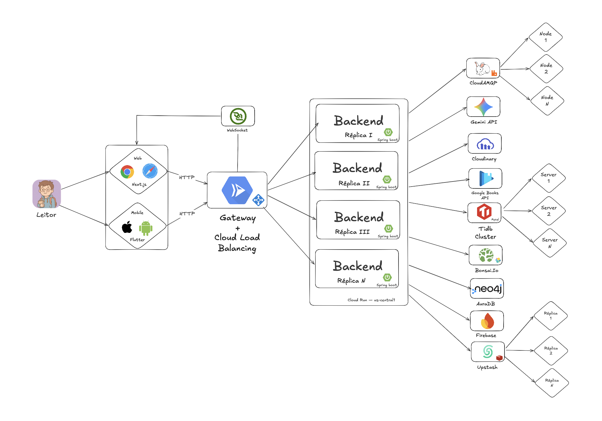
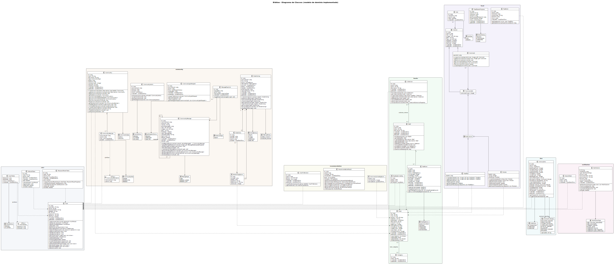

# 4. Modelagem e Projeto Arquitetural

**Figura 1a – Arquitetura de Domínio. Fonte: o próprio autor.**

**Figura 1b – Arquitetura de Infraestrutura. Fonte: o próprio autor.**

Os clientes web (Next.js) e mobile (Flutter) se conectam a um backend Spring Boot gerenciado por um Gateway com Cloud Load Balancing, que distribui as requisições entre múltiplas réplicas do serviço hospedadas na nuvem. O backend é dividido em módulos de negócio: autenticação e perfil de usuário (User), catálogo de livros (Books), estante pessoal (Shelf), comunidades de leitura (Community), timeline social (Feed), recomendações personalizadas (Recommendation), o DNA Literário — que compila o histórico de leituras e preferências do usuário em um perfil analítico atualizado continuamente (Dna) — compartilhamento de leituras (Share), ranking de tendências (Trending) e assistente literário com IA (Assistant). Esses módulos usam o TiDB como banco de dados relacional principal (compatível com MySQL), o Upstash como cache Redis gerenciado e o Neo4j via AuraDB como banco de grafos para relações entre leitores e livros. A comunicação assíncrona entre módulos ocorre via CloudAMQP (RabbitMQ gerenciado na nuvem) — quando algo relevante acontece em um módulo, ele publica um evento e os demais o consomem no seu próprio ritmo, sem dependência direta. O módulo Books integra-se com o Bonsai.io (OpenSearch gerenciado) para buscas de alta performance e com a Google Books API para enriquecer o catálogo. O módulo Assistant consome a Gemini API para geração de recomendações e respostas com IA. O armazenamento e a entrega de imagens e GIFs enviados pelos usuários — avatares, banners, posts, comentários e mídia do chat das comunidades — são feitos de forma assíncrona via Cloudinary. As notificações push são enviadas via Firebase. Para funcionalidades em tempo real os clientes mantêm uma conexão WebSocket com o servidor.

## 4.1. Histórias de Usuário

| **ID** | **EU COMO...** | **QUERO/PRECISO ...** | **PARA ...** |
|---|---|---|---|
| HU-01 | Leitor | Buscar livros no catálogo por título, autor ou ISBN, com resultados ampliados por fontes externas quando necessário | Encontrar rapidamente o livro desejado |
| HU-02 | Leitor | Criar uma conta informando nome de usuário, e-mail e senha | Acessar a plataforma com identidade própria |
| HU-03 | Leitor | Autenticar-me com e-mail e senha | Acessar minha conta e funcionalidades da plataforma |
| HU-04 | Leitor | Seguir e deixar de seguir outros leitores, com pedido pendente para contas privadas até ser aceito ou recusado pelo dono do perfil | Acompanhar atividades e leituras de interesse |
| HU-05 | Leitor | Configurar a visibilidade do meu perfil como público ou privado, exigindo aprovação de seguidores para exibir o conteúdo quando privado | Controlar quem pode visualizar minhas informações e atividades |
| HU-06 | Leitor | Adicionar um livro à minha estante | Organizar minhas leituras e histórico pessoal |
| HU-07 | Leitor | Atualizar o status de leitura e a página em que parei de um livro na minha estante | Manter meu progresso de leitura atualizado |
| HU-08 | Leitor | Registrar e editar uma avaliação para um livro, atribuindo uma nota de 1 a 5 estrelas e, opcionalmente, um texto de review | Compartilhar minha opinião sobre livros com outros leitores |
| HU-09 | Leitor | Criar, renomear e excluir estantes de leitura na minha biblioteca pessoal | Organizar livros em categorias personalizadas |
| HU-10 | Leitor | Criar uma coleção agrupando uma ou mais estantes com nome e descrição | Agrupar estantes para melhor organização das leituras |
| HU-11 | Leitor | Adicionar e remover estantes de uma coleção existente | Gerenciar a composição das minhas coleções |
| HU-12 | Leitor | Visualizar um resumo estatístico de uma coleção com total de livros, páginas e distribuição por status de leitura de todas as estantes que a compõem | Obter insights sobre minhas leituras agregadas |
| HU-13 | Leitor | Buscar outros leitores da plataforma pelo nome de usuário e acessar seus perfis públicos | Encontrar e conectar-me com outros leitores da plataforma |
| HU-14 | Leitor | Fazer upload de uma foto de perfil e de uma imagem de capa para personalizar minha página | Personalizar minha página na plataforma |
| HU-15 | Leitor | Visualizar as estantes e coleções públicas de outro leitor diretamente no perfil desse leitor | Descobrir o que outros leitores estão lendo |
| HU-16 | Leitor | Definir preferências de gêneros literários e livros favoritos no fluxo de boas-vindas após o primeiro acesso | Receber recomendações personalizadas desde o início |
| HU-17 | Leitor | Criar uma comunidade de leitura definindo nome, descrição e visibilidade pública ou privada | Promover discussões e leitura coletiva em torno de um livro |
| HU-18 | Leitor | Ingressar em comunidades públicas ao encontrá-las na plataforma ou por link de convite, convidar outros leitores diretamente ou compartilhar um link de acesso, e enviar solicitação de entrada para comunidades privadas | Participar de discussões com outros leitores |
| HU-19 | Leitor | Trocar mensagens em tempo real no chat de uma comunidade da qual sou membro, visualizar o histórico de mensagens e editar ou excluir mensagens de minha autoria | Interagir de forma dinâmica com os demais membros |
| HU-20 | Leitor responsável pela comunidade | Remover membros, alterar a função de cada membro (administrador ou membro comum) e transferir a liderança da comunidade para outro participante | Gerenciar a comunidade e garantir um ambiente saudável |
| HU-21 | Leitor | Criar e participar de votações para escolha do próximo livro da comunidade, com possibilidade de encerramento antecipado e aprovação ou rejeição do resultado pelo responsável | Decidir coletivamente qual livro ler em grupo |
| HU-22 | Leitor | Visualizar no chat da comunidade avisos automáticos quando outro membro entra ou sai, e um indicador de digitação quando outro membro está escrevendo | Acompanhar a atividade da comunidade em tempo real |
| HU-23 | Leitor | Visualizar os cinco livros que estão gerando mais engajamento na plataforma no momento | Descobrir rapidamente os livros mais populares no momento |
| HU-24 | Leitor | Visualizar no feed posts e reviews de leitores que sigo | Acompanhar as atividades de leitura da minha rede |
| HU-25 | Leitor | Publicar posts no feed com texto, imagens e, opcionalmente, marcar o conteúdo como spoiler ou associar um livro do catálogo à publicação, e editar ou excluir posts de minha autoria | Compartilhar minhas experiências de leitura com a comunidade |
| HU-26 | Leitor | Curtir e remover a curtida de posts, reviews e comentários no feed | Demonstrar engajamento com os conteúdos que me interessam |
| HU-27 | Leitor | Comentar em posts e reviews do feed, curtir comentários e excluir comentários de minha autoria | Interagir de forma aprofundada com as publicações da rede |
| HU-28 | Leitor | Acessar o livro referenciado em uma publicação do feed diretamente a partir da publicação | Navegar rapidamente para o conteúdo relacionado ao post |
| HU-29 | Leitor | Acessar o perfil público de outro leitor e visualizar suas publicações, estantes, comunidades e perfil literário, respeitando a visibilidade configurada pelo dono da conta | Conhecer outros leitores respeitando as permissões de visibilidade |
| HU-30 | Leitor | Ter um DNA Literário gerado automaticamente com arquétipo literário dominante, temas preferidos, velocidade de leitura e distribuição de gêneros, a partir de no mínimo 5 livros lidos, atualizado periodicamente | Entender meu padrão de leitura de forma visual |
| HU-31 | Leitor | Receber avisos sobre eventos relevantes da plataforma, como curtidas, comentários, novos seguidores e convites de comunidade, em tempo real na web e como push no mobile | Ser informado de eventos relevantes sem precisar recarregar a página |
| HU-32 | Leitor | Interagir com o assistente conversacional Bibo via chat em linguagem natural para executar ações diretamente na plataforma: criar estantes, coleções e comunidades vinculadas a livros específicos, atualizar progresso de leitura, encontrar livros e autores, e obter sugestões de leitura personalizadas | Realizar ações na plataforma de forma conversacional e ágil |
| HU-33 | Leitor | Gerar e compartilhar uma cápsula visual com minhas estatísticas de leitura em redes sociais ou salvar no dispositivo | Compartilhar minha jornada literária de forma visual |
| HU-34 | Leitor | Autenticar-me na plataforma utilizando minha conta Google | Acessar a plataforma de forma rápida com minha identidade Google sem criar uma senha separada |
| HU-35 | Leitor | Solicitar a redefinição de senha informando o e-mail cadastrado e criar uma nova senha pelo link de uso único recebido por e-mail. | Recuperar o acesso à minha conta em caso de esquecimento da senha ou definir uma credencial de senha para conta vinculada ao Google |
| HU-36 | Leitor | Visualizar o número de dias em que registrei progresso de leitura | Acompanhar minha consistência e hábito de leitura |
| HU-37 | Leitor | Importar minha biblioteca do Goodreads enviando o arquivo de exportação disponibilizado pela própria plataforma | Migrar meu histórico de leitura facilmente para o Biblioo |
| HU-38 | Leitor | Visualizar seis trilhas de recomendação personalizadas, cada uma com critério de afinidade distinto: leituras recentes em comum, gêneros mais consumidos, livros em destaque nas comunidades, títulos fora do perfil habitual, autores com gostos semelhantes e livros já lidos que podem ser revisitados | Descobrir livros alinhados ao meu gosto por diferentes perspectivas |
| HU-39 | Leitor | Acionar o "Roll Dice" para sortear aleatoriamente um livro entre todos os disponíveis nas minhas trilhas de recomendação | Escolher minha próxima leitura quando não sei por onde começar |
| HU-40 | Leitor | Alternar entre o tema claro e escuro do aplicativo mobile nas configurações, com a preferência salva e aplicada automaticamente na próxima abertura do app | Personalizar a experiência visual do aplicativo conforme minha preferência ou condição de uso |
| HU-41 | Leitor | Navegar pelo aplicativo e visualizar dados de estantes, feed, recomendações e comunidades mesmo sem conexão com a internet, com sincronização automática com o servidor ao reconectar | Continuar acompanhando minhas leituras sem depender de acesso contínuo à internet |

## 4.2. Visão Lógica

Esta seção apresenta os artefatos utilizados para modelar o sistema Biblioo. O diagrama de classes foi escolhido para representar a estrutura estática das entidades e suas relações, enquanto o diagrama de componentes ilustra como os módulos de negócio, serviços de infraestrutura e clientes interagem entre si. Juntos, esses dois artefatos fornecem uma visão complementar: o diagrama de classes foca no domínio e nas regras de negócio, enquanto o de componentes revela a separação de responsabilidades e os fluxos de comunicação da solução.

### Diagrama de Classes

O **diagrama de classes** modela a estrutura estática do domínio do Biblioo, representando as principais entidades — Leitor, Livro, Estante, Comunidade, Comentário, Avaliação, Feed e DNA Literário — suas propriedades e os relacionamentos entre elas. Ele evidencia como um Leitor pode possuir múltiplas Estantes, cada uma contendo registros de leitura associados a Livros do catálogo, e como as Comunidades agregam Leitores em torno de um único título, possibilitando troca de Comentários encadeados.

**Figura 2 – Diagrama de Classes. Fonte: o próprio autor.**

### Diagrama de Componentes

O **diagrama de componentes** representa o backend Spring Boot modularizado, os serviços de infraestrutura e as integrações externas. Os módulos de negócio — User, Books, Shelf, Community, Feed, Recommendation, Dna, Share, Trending e Assistant — são desacoplados entre si e se comunicam de forma assíncrona via CloudAMQP (RabbitMQ gerenciado), o que garante que falhas em um módulo não se propaguem diretamente para os demais. O módulo Books consulta o Bonsai.io (OpenSearch) para buscas de alta performance e a Google Books API para enriquecimento do catálogo. O módulo Assistant consome a Gemini API para geração de conteúdo com IA. O Neo4j via AuraDB modela o grafo de relações entre leitores e livros. O Cloudinary é responsável pelo armazenamento e entrega de imagens e GIFs — avatares, banners, posts, comentários e chat das comunidades — recebidos via upload assíncrono. As notificações push são entregues via Firebase, e o canal WebSocket mantém a comunicação em tempo real entre backend e clientes.

**Figura 3 – Diagrama de Componentes. Fonte: o próprio autor.**

#### Estilos e Padrões Arquiteturais Utilizados

1. **Arquitetura Cliente-Servidor**: os clientes Web (Next.js) e Mobile (Flutter) consomem a API REST exposta pelo backend Spring Boot via Gateway com Cloud Load Balancing.
2. **Arquitetura em Camadas**: separação clara entre interface do usuário, lógica de negócio e persistência de dados.
3. **API RESTful**: endpoints organizados por recurso, seguindo o nível 2 do modelo de maturidade de Richardson.
4. **Arquitetura Orientada a Eventos (EDA)**: o CloudAMQP (RabbitMQ) gerencia a comunicação assíncrona entre módulos, desacoplando produtor e consumidor de eventos.
5. **Cache Aside**: o Upstash (Redis gerenciado) armazena em cache resultados de consultas frequentes (ex.: catálogo de livros, feed social), reduzindo carga no banco de dados.
6. **Banco de Grafos**: o Neo4j via AuraDB modela relações complexas entre leitores e livros, viabilizando recomendações baseadas em grafo.
7. **Escalabilidade Horizontal**: o Gateway com Cloud Load Balancing distribui a carga entre múltiplas réplicas do backend, garantindo disponibilidade e elasticidade.

---

#### Descrição dos Componentes

| **Componente** | **Papel na Arquitetura** |
| --- | --- |
| **Web (Next.js)** | Interface web utilizada pelo leitor para acessar todas as funcionalidades da plataforma via navegador. |
| **Mobile (Flutter)** | Aplicativo para iOS e Android que oferece a mesma experiência da versão web em dispositivos móveis. |
| **Gateway + Cloud Load Balancing** | Ponto de entrada único que autentica requisições e distribui carga entre as réplicas do backend na nuvem. |
| **Módulo User** | Gerencia cadastro, autenticação via JWT, perfil do leitor e controle de privacidade (público/privado). |
| **Módulo Books** | Mantém o catálogo de livros, consultando o Bonsai.io para busca e a Google Books API para enriquecer dados. |
| **Módulo Shelf** | Controla a estante pessoal do leitor: status de leitura, progresso por página, avaliações e coleções personalizadas. |
| **Módulo Community** | Gerencia criação e participação em comunidades de leitura vinculadas a um título, incluindo comentários e curtidas. |
| **Módulo Feed** | Agrega e entrega eventos de atividade de leitores e comunidades seguidas pelo leitor. |
| **Módulo Recommendation** | Gera trilhas de recomendação personalizadas com base no histórico de leitura e no grafo de relações. |
| **Módulo Dna (DNA Literário)** | Compila o perfil analítico do leitor a partir do histórico consolidado, calculando métricas literárias. |
| **Módulo Share** | Gerencia o compartilhamento de leituras e atividades entre leitores, publicando eventos no broker. |
| **Módulo Trending** | Produz e mantém pontuações de tendência dos livros mais lidos, alimentando a trilha de recomendação Trending. |
| **Módulo Assistant** | Assistente literário com IA, integrado à Gemini API para responder perguntas e sugerir leituras por linguagem natural. |
| **TiDB** | Banco de dados relacional distribuído compatível com MySQL, fonte de verdade para todas as entidades do domínio. |
| **Upstash** | Redis gerenciado na nuvem usado como camada de cache para consultas frequentes, reduzindo latência e carga no banco. |
| **CloudAMQP** | RabbitMQ gerenciado na nuvem, broker de mensagens responsável pela comunicação assíncrona entre os módulos. |
| **Neo4j / AuraDB** | Banco de grafos gerenciado usado para modelar relações entre leitores e livros, viabilizando recomendações baseadas em grafo. |
| **Bonsai.io** | OpenSearch gerenciado na nuvem, motor de busca fulltext para o catálogo de livros. |
| **Google Books API** | Serviço externo que enriquece os dados do catálogo com metadados de livros (capa, descrição, ISBN etc.). |
| **Gemini API** | API de IA generativa do Google, consumida pelo módulo Assistant para geração de respostas e recomendações. |
| **Cloudinary** | Serviço gerenciado de armazenamento e entrega de imagens e GIFs — avatares, banners, posts, comentários e mídia do chat das comunidades — com upload assíncrono e detecção de tipo de arquivo. |
| **Firebase** | Plataforma do Google utilizada para entrega de notificações push aos clientes web e mobile. |
| **WebSocket** | Canal de comunicação em tempo real entre backend e clientes para notificações e atualizações de feed. |

---

#### Classificação dos Componentes

| **Tipo** | **Componentes** |
| --- | --- |
| **Reutilizados** | TiDB, Upstash (Redis), CloudAMQP (RabbitMQ), Bonsai.io (OpenSearch), Neo4j/AuraDB, Cloudinary, Firebase, navegadores web. |
| **Adquiridos** | Google Books API, Gemini API (serviços externos). |
| **Desenvolvidos** | Backend Spring Boot (todos os módulos), Web (Next.js), Mobile (Flutter). |

## 4.3. Modelo de Dados

O diagrama representa o modelo de dados relacional do Biblioo, com 47 tabelas organizadas em MySQL. As tabelas estão agrupadas abaixo por domínio funcional.

---

### Domínio User

- **`users`** — dados do leitor: `username`, `email`, `password_hash` (bcrypt), `bio`, `avatar_url`, `banner_url`, `is_private`, `google_id` (para login social). É a entidade central referenciada por quase todos os demais domínios.

- **`user_follows`** — relacionamento de seguir entre leitores com chave composta `(follower_id, followed_id)` e campo `status` (`PENDING` / `ACCEPTED`) para suportar solicitações de seguimento em perfis privados.

- **`refresh_tokens`** — tokens de renovação de sessão JWT vinculados ao usuário, com `expires_at` e flag `used` para rotação obrigatória (invalidação após uso).

- **`password_reset_tokens`** — tokens de redefinição de senha enviados por e-mail, com `expires_at` e flag `used` para uso único.

- **`device_tokens`** — tokens de dispositivo mobile (FCM) vinculados ao usuário, utilizados para entrega de notificações push via Firebase.

- **`user_preferences`** — preferências literárias do leitor coletadas no fluxo de boas-vindas, com relacionamentos para `user_preference_genres` e `user_preference_books`.

- **`user_preference_genres`** — tabela associativa que armazena os gêneros literários preferidos de cada conjunto de preferências.

- **`user_preference_books`** — tabela associativa que armazena os livros favoritos informados pelo leitor no onboarding.

---

### Domínio Books

- **`books`** — catálogo interno de livros, persistidos após consulta à Google Books API ou cadastro manual. Contém `title`, `isbn`, `cover_url`, `description`, `publisher`, `page_count`, `published_at`, `complexity_score`, além de contadores desnormalizados `average_rating`, `rating_count` e `reader_count` mantidos por triggers, e campo `search_text` para busca fulltext de fallback no MySQL.

- **`book_authors`** — tabela associativa normalizada que vincula cada livro (`book_id`) aos seus autores (`author`), permitindo múltiplos autores por livro.

- **`categories`** — categorias e gêneros literários disponíveis no catálogo.

- **`book_categories`** — associação many-to-many entre `books` e `categories`.

---

### Domínio Shelf

- **`shelves`** — estantes personalizadas criadas pelo leitor, com `name`, `description` e remoção lógica via `deleted_at`.

- **`shelf_items`** — vínculo entre livro e estante com atributos de leitura: `status` (`WANT_TO_READ`, `READING`, `COMPLETED`, `ABANDONED`), `current_page`, `progress_percent`, `total_pages`, `started_at`, `finished_at`, `reread_count` e remoção lógica via `deleted_at`.

- **`shelf_collections`** — coleções criadas pelo leitor para agrupar estantes, com `name`, `description` e `user_id`.

- **`collection_shelves`** — associação many-to-many entre `shelf_collections` e `shelves`.

- **`reading_active_days`** — registra os dias em que o leitor registrou progresso de leitura (`active_date`, `book_id`, `user_id`), base para o contador de dias ativos (RF-37).

---

### Domínio Feed

- **`content`** — entidade polimórfica central do feed: armazena o conteúdo publicável (`text`, `gif_url`, `has_spoiler`, `like_count`, `is_deleted`, `user_id`). Posts e reviews referenciam esta tabela.

- **`content_images`** — imagens anexadas a um `content` (`content_id`, `image_url`), permitindo múltiplas imagens por publicação.

- **`content_tags`** — tags associadas a um `content` para categorização e busca.

- **`feed_posts`** — extensão de `content` que representa posts do feed, com associação opcional a um livro do catálogo (`book_id`).

- **`reviews`** — extensão de `content` que representa avaliações de livros publicadas no feed, com `book_id`, `rating` e flag `is_published`.

- **`commentable`** — entidade polimórfica que habilita comentários em qualquer entidade do sistema, com contador `comment_count`.

- **`comments`** — comentários encadeados (`parent_id` para threads), vinculados a um `commentable` e ao autor.

- **`likes`** — curtidas genéricas em qualquer `content`, com `type` e `user_id`, garantindo unicidade por combinação de usuário e conteúdo.

- **`feed_content`** — tabela de união usada pela camada de fanout para referenciar conteúdo a ser distribuído no feed.

- **`feed_items`** — itens individuais do feed de cada leitor (`user_id`, `content_id`, `content_type`, `author_id`, `score`), resultantes do processo de fanout.

- **`feed_fanout_progress`** — rastreia o progresso da distribuição de um conteúdo para os seguidores do autor (`last_processed_follower_id`, `total_processed`, `status`), permitindo fanout incremental sem perda em caso de falha.

---

### Domínio Community

- **`communities`** — grupos de leitura vinculados a um livro (`book_id`), com `name`, `description`, `type` (PUBLIC/PRIVATE), `owner_id`, `invite_link`, `member_count` e remoção lógica via `is_deleted`.

- **`community_members`** — associação entre leitores e comunidades, com `role` (OWNER/ADMIN/MEMBER) e `joined_at`.

- **`community_invites`** — convites diretos de um leitor (`inviter_id`) para outro (`invitee_id`) em uma comunidade, com `status` (PENDING/ACCEPTED/DECLINED).

- **`community_join_requests`** — solicitações de entrada em comunidades privadas, com `status` (PENDING/APPROVED/REJECTED), `reviewed_by` e `reviewed_at`.

- **`community_messages`** — mensagens do chat em tempo real (WebSocket/STOMP), com `author_id`, `community_id`, `content`, `type`, `has_spoiler`, `gif_url`, `heart_count`, `parent_message_id` (threads), `client_message_id` (idempotência), `version` e `edited_at`. Remoção lógica via `is_deleted`.

- **`community_message_images`** — imagens anexadas a mensagens do chat (`message_id`, `image_url`).

- **`community_message_reactions`** — reações a mensagens do chat (`reaction_type`, `user_id`, `message_id`).

- **`community_message_tags`** — tags associadas a mensagens do chat para menções e categorização.

- **`community_votings`** — sessões de votação para escolha do próximo livro da comunidade, com `title`, `status`, `starts_at`, `ends_at`, `closed_at`, `tie_break_rule`, `winner_option_id` e `rejection_reason`.

- **`community_voting_options`** — opções de votação dentro de uma sessão, cada uma vinculada a um livro do catálogo (`book_id`, `book_title`, `book_cover_url`) com contador `vote_count`.

- **`community_votes`** — voto individual de um leitor em uma opção (`option_id`, `voting_id`, `user_id`, `voted_at`), com unicidade por `(user_id, voting_id)`.

- **`community_trending_scores`** — pontuação de tendência por livro (`book_id`, `current_score`, `last_updated`), atualizada a cada evento de engajamento para alimentar a trilha `TRENDING` e os rankings.

- **`community_trending_dedup`** — registro de eventos de engajamento já contabilizados no score (`book_id`, `user_id`, `event_type`, `contributed_at`), prevenindo que o mesmo usuário infle repetidamente a pontuação do mesmo livro.

---

### Domínio DNA Literário

- **`literary_dna`** — perfil analítico gerado automaticamente pelo módulo DNA a partir de no mínimo 5 livros lidos. Armazena `dominant_archetype`, `secondary_archetypes_json`, `central_themes_json`, `books_read_count`, `total_pages_read`, `avg_days_per_book`, `complexity_score`, `complexity_label`, `reread_count`, `reread_rate`, `abandoned_count`, `most_abandoned_genre`, `pages_by_year_json`, `status` e `calculated_at`.

- **`dna_event_log`** — log de eventos de leitura (`BOOK_STARTED`, `BOOK_FINISHED`) com `payload` JSON e `event_id` para idempotência, consumidos pelo módulo DNA para recalcular o perfil.

---

### Domínio Recommendation

- **`recommendation_results`** — resultados pré-computados por trilha de recomendação (`trail_type`: `BECAUSE_YOU_READ`, `FAVORITE_GENRE`, `SURPRISE`, `TRENDING`, `SIMILAR_AUTHORS`, `PENDING_READS`), armazenando a lista de livros recomendados (`books` JSON) e metadados de personalização, com unicidade por `(user_id, trail_type)`.

- **`recommendation_event_log`** — log de eventos que disparam recálculo das trilhas, com `event_id` para idempotência e `payload` JSON para rastreabilidade.

---

### Domínio Notifications

- **`notifications`** — notificações geradas para o leitor (`recipient_id`) com `type` (LIKE, COMMENT, FOLLOW, INVITE, etc.), referências ao ator (`actor_id`, `actor_username`, `actor_avatar_url`), à entidade relacionada (`entity_id`, `community_id`) e controle de leitura via `read_at`.

---

### Domínio Assistant

- **`assistant_conversation`** — conversas com o assistente Bibo, armazenando `title`, `history_json` (histórico completo da conversa em formato JSON para ser enviado ao modelo de linguagem) e `user_id`.

- **`assistant_action_log`** — log de cada ação executada pelo assistente dentro de uma conversa (`conversation_id`), registrando `tool_name`, `params_json` e `result_summary` para auditoria e rastreabilidade.

---

### Infraestrutura

- **`outbox_events`** — implementação do Outbox Pattern: todo evento de domínio é gravado aqui na mesma transação da operação de negócio, garantindo que a publicação no RabbitMQ seja sempre consistente com a persistência. Armazena `aggregate_type`, `aggregate_id`, `event_type`, `routing_key`, `payload`, `status`, `attempts` e `processed_at`.

---

Os relacionamentos foram definidos para garantir integridade referencial em todas as operações, desde o registro de leituras até a publicação de comentários e a geração do DNA Literário.

")

**Figura 4 – Modelo Relacional (MR). Fonte: o próprio autor.**

---

## 4.4. Evidências de Qualidade

### 4.4.1. Testes de Performance — Bateria de Stress

A bateria completa de 72 testes (load · spike · stress) valida empiricamente que a arquitetura atende os requisitos não-funcionais sob carga extrema. O relatório técnico completo está na seção [7. Avaliação da Arquitetura](7.avaliacao.md#avaliacao). As evidências abaixo representam os domínios centrais sob stress máximo — cada imagem é a saída-resumo real do k6 com o bloco `THRESHOLDS` aprovado, gerada pela ferramenta `freeze`.

**Busca de livros — `books-stress` (400 VUs · p95 100,89 ms · PASSOU)**

**Feed social — `feed-stress` (600 VUs · p95 303,43 ms · PASSOU)**

**Motor de recomendação (6 trilhas em paralelo) — `recommendation-stress` (400 VUs · p95 1 210 ms · PASSOU)**

**Perfil do leitor — `user-stress` (600 VUs · p95 349,76 ms · PASSOU)**

---

### 4.4.2. Evidências de Mensageria — RabbitMQ / Outbox Pattern / WebSocket

O RabbitMQ (CloudAMQP) é o backbone assíncrono de toda a comunicação inter-módulo do Biblioo. Nenhum módulo chama outro diretamente — toda interação entre domínios ocorre via eventos publicados no broker, consumidos no próprio ritmo de cada módulo. O **Outbox Pattern** garante que toda publicação aconteça dentro de `@Transactional`, eliminando a possibilidade de evento perdido por falha entre a gravação no banco e a publicação na fila.

**Fluxos de mensageria ativos no sistema:**

| Fluxo | Evento | Producer | Consumer | Efeito |
| --- | --- | --- | --- | --- |
| Feed social | `POST_CREATED`, `REVIEW_CREATED`, `FOLLOW_ACCEPTED` | `feed`, `user` | `FeedConsumer` | Atualiza timeline dos seguidores (fanout-on-write) |
| Recomendações | `BOOK_FINISHED`, `BOOK_STARTED` | `shelf` | `RecommendationConsumer` | Recalcula as 6 trilhas do usuário |
| DNA Literário | `BOOK_FINISHED`, `BOOK_STARTED` | `shelf` | `DnaConsumer` | Reconstrói perfil analítico literário |
| Notificações | `LIKE_CREATED`, `COMMENT_CREATED`, `FOLLOW_REQUESTED`, `INVITE_SENT` | `feed`, `user`, `community` | `NotificationConsumer` | Envia SSE (web) e Firebase FCM (mobile) |
| Trending | `BOOK_FINISHED`, `COMMUNITY_JOINED`, `SHELF_ITEM_ADDED` | `shelf`, `community` | `TrendingConsumer` | Atualiza pontuação de tendência dos livros |
| Share | `SHARE_CARD_GENERATED` | `share` | — | Persiste cartão de compartilhamento e invalida cache Redis |
| Chat multi-instância | `CHAT_MESSAGE_SENT` | `community` (via STOMP) | `CommunityBroadcastConsumer` | `FanoutExchange` reentrega para todas as réplicas Cloud Run ativas |

Todos os consumers verificam o `event_id` antes de processar — eventos reentregues por falha de rede não produzem efeitos duplicados (idempotência garantida).

**Evidência — `message-stress` (WebSocket/STOMP · 250 VUs · 100% de entrega · p95 32 ms · PASSOU)**

**Evidência — `message-concurrency-stress` (múltiplas salas simultâneas via FanoutExchange · PASSOU)**

**Evidência — `messageRest-stress` (histórico de chat via REST · 600 VUs · p95 525,69 ms · PASSOU)**

