
# 5. Wireframes

> Wireframes são protótipos das telas da aplicação usados em design de interface para sugerir a
> estrutura de um site web e seu relacionamentos entre suas
> páginas. Um wireframe web é uma ilustração semelhante ao
> layout de elementos fundamentais na interface.

## 5.1 Wireframes Mobile

### Login
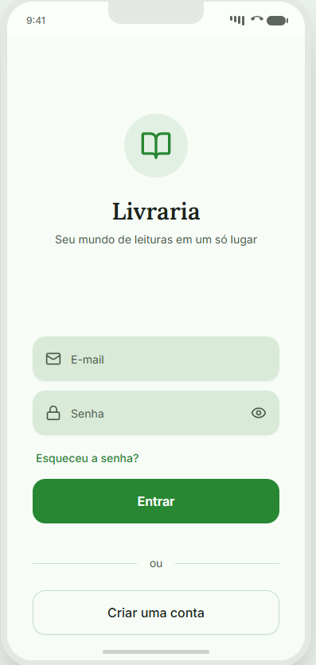

### Feed
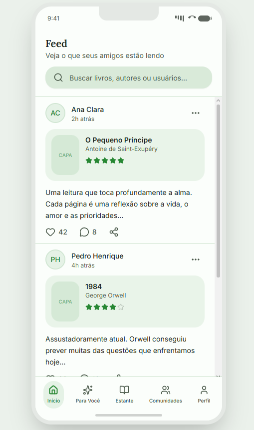

### Para Você (Recomendação)
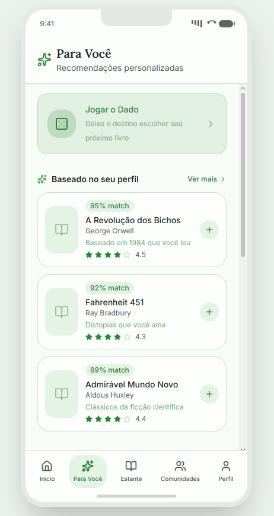

### Estante
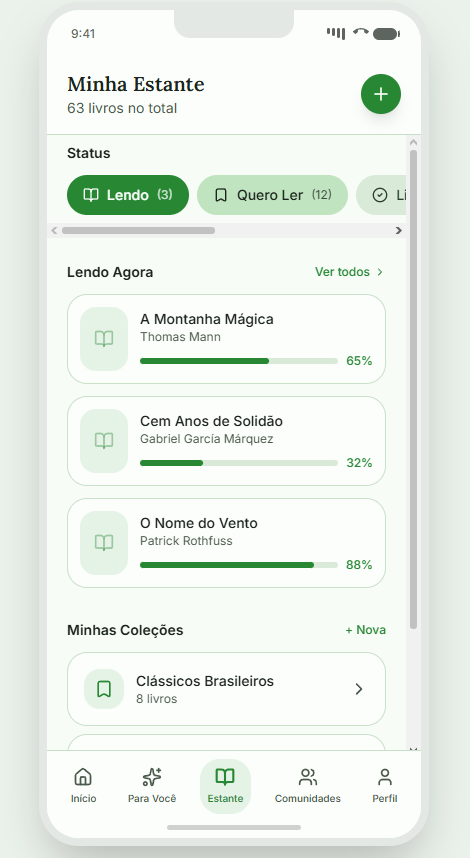

### Comunidades
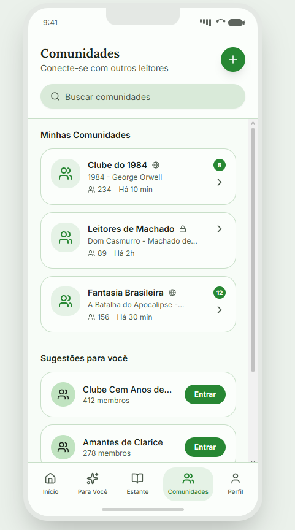

### Chat
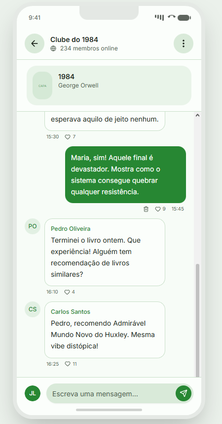

### Perfil
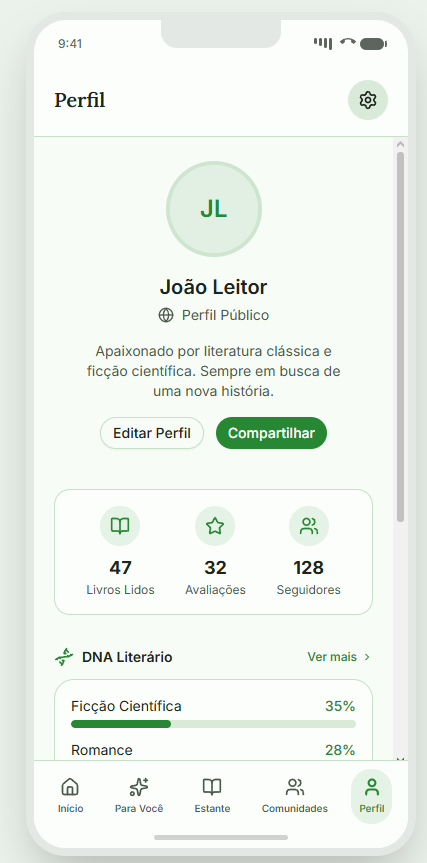

## 5.2 Wireframes Web

### Login
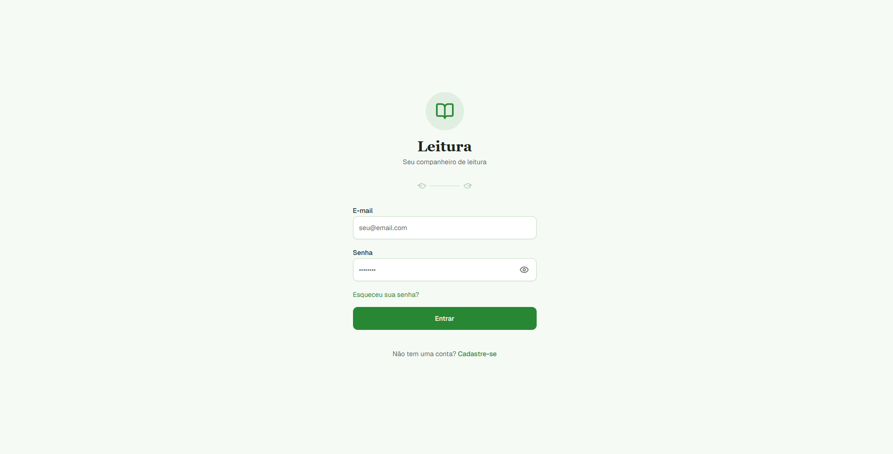

### Feed
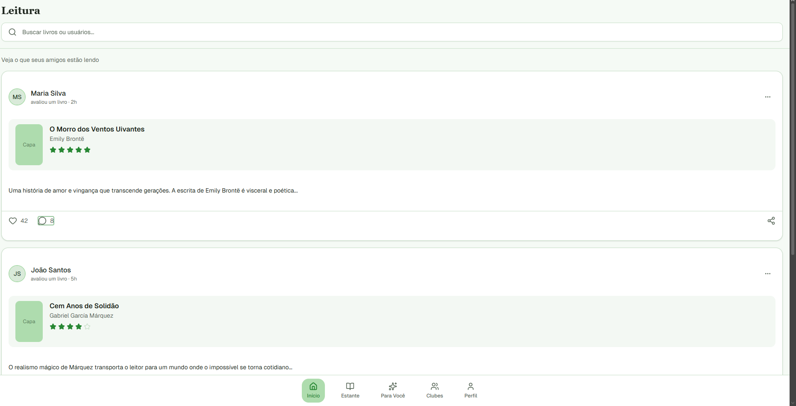

### Para Você (Recomendação)
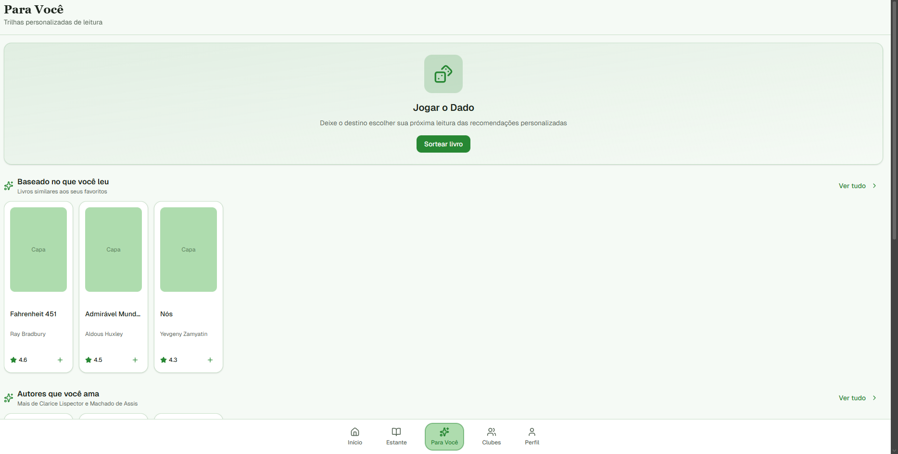

### Estante
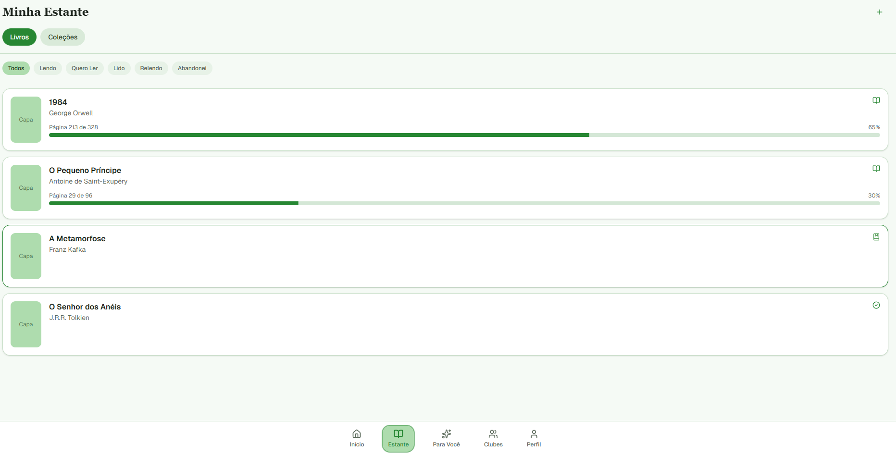

### Estante - Coleções
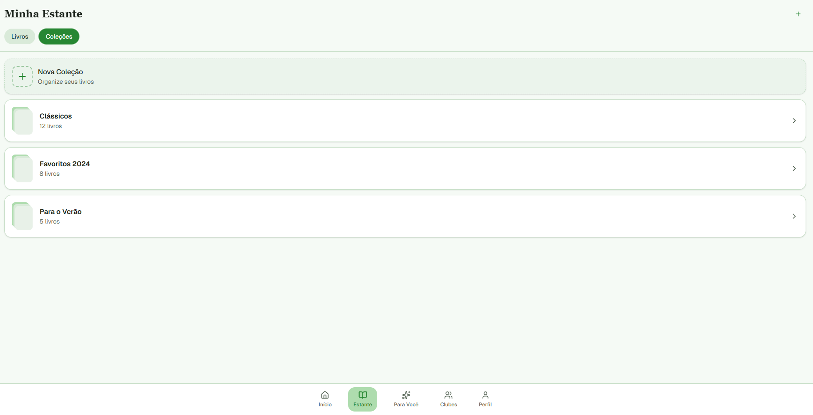

### Comunidades
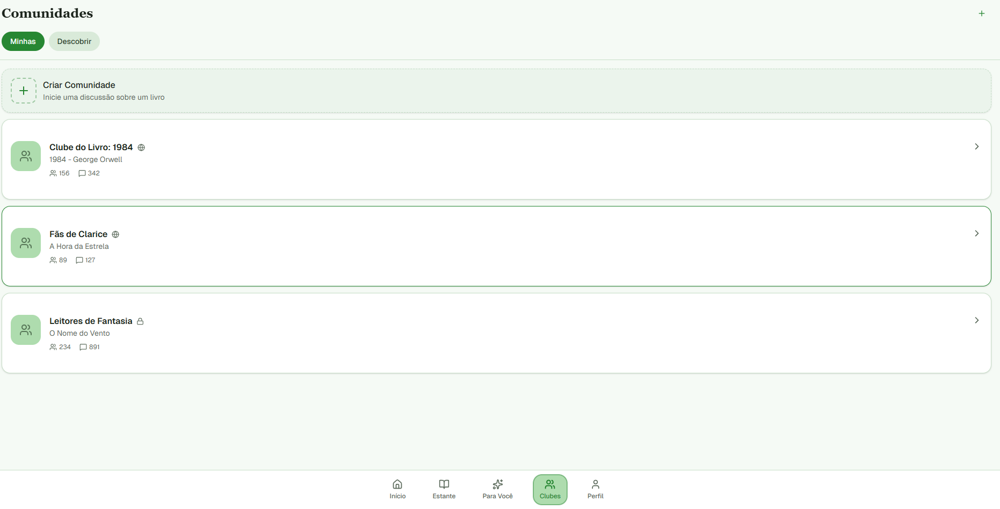

### Chat
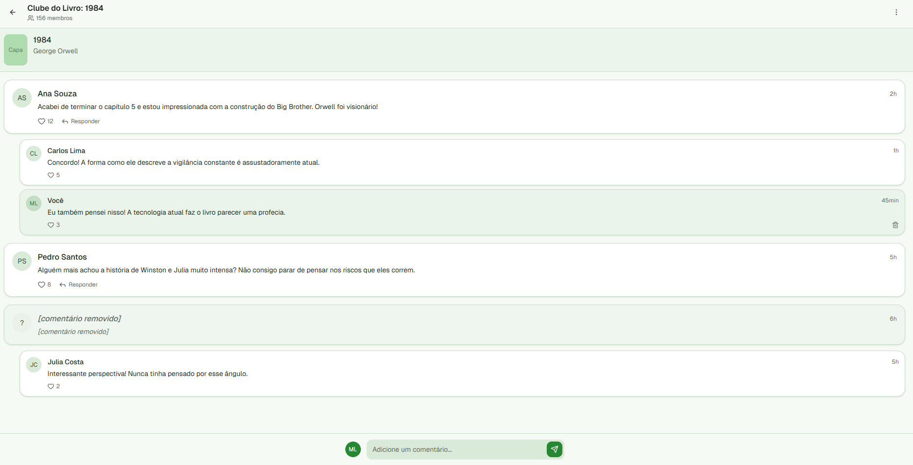

### Perfil
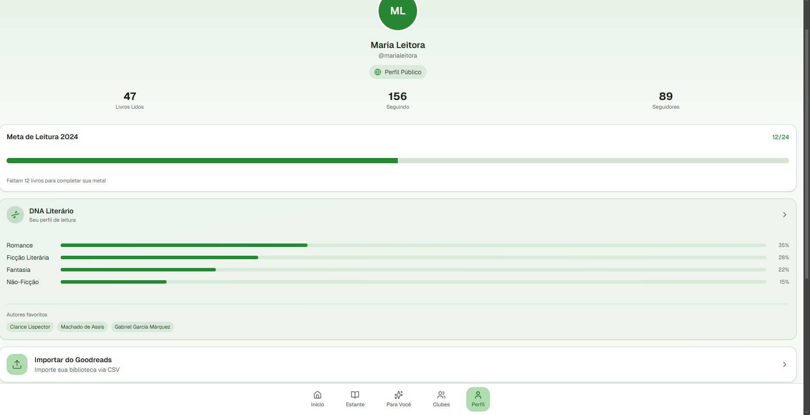
