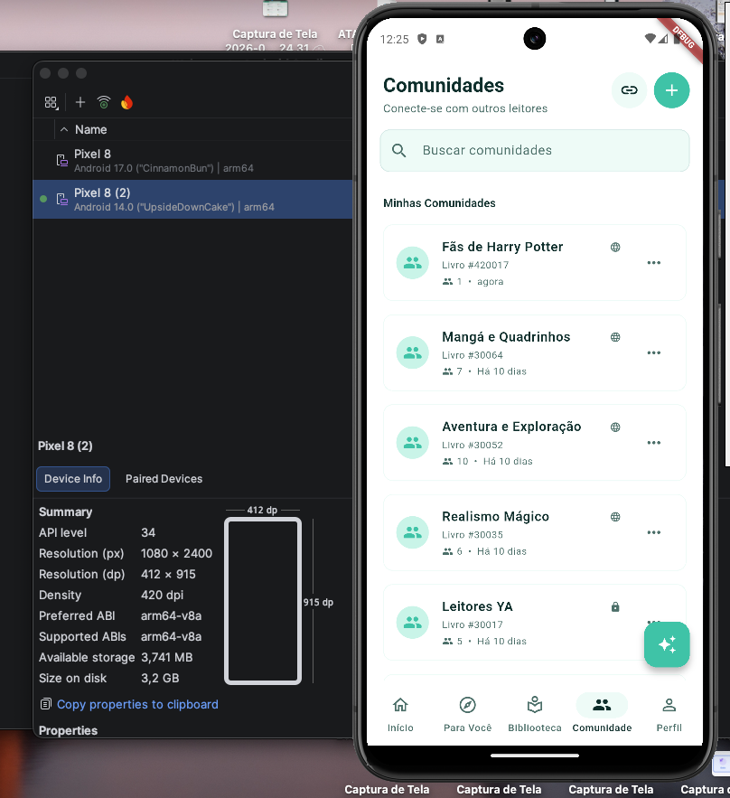

<a name="avaliacao"></a>
# 7. Avaliação da Arquitetura

_Esta seção descreve a avaliação da arquitetura do Biblioo baseada no método ATAM, com cenários derivados dos requisitos não funcionais definidos na Seção 3 e evidenciados pela suíte de 71 testes k6 executada em 2026-06-24._

## 7.1. Cenários

_Apresentam-se os cenários de testes utilizados na avaliação da arquitetura, escolhidos para demonstrar os requisitos não funcionais sendo satisfeitos. Os cenários cobrem os atributos de qualidade centrais do Biblioo — Desempenho, Confiabilidade, Disponibilidade e Segurança — e foram verificados por testes automatizados k6 (RNF-05 a RNF-19) e por verificação qualitativa (RNF-01 a RNF-04)._

**Cenário 1 - Desempenho sob Carga de Pico: Feed Social, Publicação e Atividade do Leitor (RNF-06, RNF-07, RNF-08, RNF-09, RNF-10):** 600 usuários acessam o feed social, publicam posts e comentários, registram avaliações de livros, atualizam o status de leitura em suas estantes e consultam perfis de outros leitores simultaneamente durante 2 minutos, simulando horário de pico de uso. O feed de cada usuário é mantido em cache Redis com os 200 posts mais recentes pré-carregados; a distribuição de novos posts para os seguidores ocorre de forma assíncrona via RabbitMQ, sem bloquear a resposta ao autor. O sistema deve processar o carregamento do feed em até 5.000ms (p95), confirmar posts e comentários em até 1.500ms (p95), registrar avaliações em até 5.000ms (p95), exibir o perfil do leitor em até 8.000ms (p95) e confirmar atualização de estante em até 2.000ms (p95) — sem falhas sistêmicas (5xx) e com taxa de erro inferior a 1%.

**Cenário 2 - Desempenho de Busca, Recomendações e Conteúdo de Descoberta (RNF-05, RNF-15, RNF-16, RNF-17, RNF-18, RNF-19):** Simultaneamente, 100 usuários buscam livros por título, autor ou ISBN; 400 usuários autenticados consultam as 6 trilhas de recomendação em paralelo — cada requisição percorre Redis, Neo4j e MySQL para consolidar os resultados das 6 estratégias; 800 usuários acionam o "Roll Dice" para sortear uma leitura aleatória; 300 usuários acessam os 5 livros em tendência; 200 usuários consultam seu DNA Literário e geram sua cápsula visual de estatísticas. O sistema deve retornar resultados de busca em até 8.000ms (p95), as 6 trilhas de recomendação em até 5.000ms (p95), o Roll Dice em até 5.000ms (p95), o ranking de tendências em até 8.000ms (p95), o DNA Literário em até 4.000ms (p95) e a cápsula visual em até 10.000ms (p95) — mantendo a integridade dos resultados por usuário, sem cruzamento de dados entre sessões.

**Cenário 3 - Confiabilidade do Chat, Interações Sociais e Operações de Comunidade (RNF-11, RNF-12, RNF-13, RNF-14):** 250 usuários distribuídos em múltiplas salas de chat trocam mensagens via WebSocket/STOMP em sistema Cloud Run com múltiplas instâncias ativas; outros 250 usuários seguem, deixam de seguir e respondem a solicitações de seguimento em perfis privados; 600 usuários executam operações administrativas de comunidade (alterar funções de membros, aprovar solicitações de entrada, gerar links de convite). O sistema deve entregar 100% das mensagens enviadas sem perda, mesmo quando remetente e destinatário estão em instâncias distintas, com latência p(95) abaixo de 2.000ms para até 40 membros simultâneos na mesma sala e abaixo de 5.000ms para todos os membros conectados; processar operações sociais em até 5.000ms (p95) e operações administrativas em até 10.000ms (p95).

**Cenário 4 - Disponibilidade sob Falha de Instância Cloud Run:** Uma instância Cloud Run é encerrada abruptamente durante operação de pico, com transações de escrita em andamento (publicação de post, atualização de estante, avaliação de livro). O sistema deve continuar disponível para os usuários conectados a outras instâncias, e os eventos gerados antes da falha devem ser processados após a recuperação, sem perda de dados nem intervenção manual. O Outbox Pattern garante que toda publicação de evento ocorre dentro da mesma transação do banco — o evento é salvo na tabela `outbox_events` no mesmo commit da operação de negócio, eliminando a janela de falha silenciosa entre a escrita no banco e a publicação no RabbitMQ.

**Cenário 5 - Segurança e Controle de Acesso:** (a) Um usuário não autenticado ou com token JWT expirado tenta acessar endpoints protegidos (feed, estante, comunidade privada). (b) Um usuário autenticado como membro tenta executar operações administrativas restritas ao dono ou moderador da comunidade (excluir membros, fechar votação, apagar mensagens). O sistema deve rejeitar todas as requisições não autorizadas com `401 Unauthorized` ou `403 Forbidden` antes de qualquer lógica de negócio ser executada. O `JwtAuthenticationFilter` intercepta toda requisição antes dos controllers; rate limiting via Bucket4j protege endpoints sensíveis antes do pool JDBC; 40+ secrets de produção são gerenciados exclusivamente via Google Secret Manager, nunca expostos no código ou repositório.

**Cenário 6 - Compatibilidade de Plataforma Web e Mobile (RNF-01, RNF-02, RNF-03, RNF-04):** Um leitor acessa o Biblioo pelo navegador Google Chrome (v127+) e Safari (v17+) em monitores com resoluções entre 1280px e 1920px de largura, verificando que o layout é responsivo e sem quebras visuais em todas as telas. O mesmo leitor acessa o aplicativo mobile em dispositivos Android 14+ e iOS 26.5+ com telas entre 390px e 430px, verificando que feed, estantes, comunidades, recomendações, DNA Literário e chat são exibidos corretamente e com navegação funcional em ambas as plataformas.

## 7.2. Avaliação

_Para cada atributo de qualidade apresenta-se a tabela de avaliação com estímulo e medida de resposta concretos, as considerações sobre riscos e tradeoffs identificados na arquitetura, e as evidências dos testes ou análises realizados. Atributos quantificáveis foram medidos com k6 v1.7.1 (71 testes, 100% aprovados). Atributos qualitativos (Disponibilidade, Segurança) foram verificados por análise estrutural do código._

---

### Desempenho / Escalabilidade

| **Atributo de Qualidade:** | Desempenho / Escalabilidade |
| --- | --- |
| **Requisito de Qualidade** | O sistema deve responder com baixa latência e sem falhas sistêmicas (5xx) sob carga concorrente realista, atendendo os limites de p(95) definidos pelos RNF-05 a RNF-19 para cada funcionalidade, com taxa de erros HTTP inferior a 1%. |
| **Preocupação:** | Garantir que os endpoints centrais da plataforma — feed, publicação, recomendações, busca de livros, comunidades, DNA Literário, cápsula visual, trending e Roll Dice — permaneçam responsivos sob volumes realistas de usuários simultâneos, incluindo picos de tráfego superiores à carga nominal. O motor de recomendação é o ponto mais custoso: cada requisição percorre até 3 datastores distintos (Redis, Neo4j e MySQL) em paralelo para 6 estratégias independentes. |
| **Cenário(s):** | Cenário 1 e Cenário 2 |
| **Ambiente:** | Todos os testes executados sobre **backend local** (Apple M3 Pro · 11 núcleos · 18 GB RAM) com infraestrutura em **Docker Compose** (MySQL 8.4, Redis 7.4, RabbitMQ 4.0, Neo4j 5.18, OpenSearch 2.18) — os números representam um piso conservador: backend e toda a infraestrutura compartilhavam os mesmos recursos da máquina. Sistema em operação sob carga crescente até 800 VUs (stress) e em operação normal (80–500 VUs, load). |
| **Estímulo:** | Carga de usuários simulados pelo k6 percorrendo fluxos reais de leitura e escrita autenticados — 8 domínios funcionais, 24 subdomínios, thresholds de p(95) e taxa de falha declarados em código antes da execução. Scripts com `setup()` que registram e autenticam usuários reais via `/auth/register` antes de cada teste, eliminando a possibilidade de execução fictícia sem backend ativo. |
| **Mecanismo:** | Cache-Aside Redis (sliding window de 200 itens/usuário para feed; refresh de 15 min para trending; TTL 1h para cápsula visual); fanout-on-write assíncrono via RabbitMQ para o feed social; 6 trilhas de recomendação executadas em paralelo (Neo4j + Redis + MySQL); índice OpenSearch para busca com fallback FULLTEXT MySQL; DNA Literário calculado a partir do histórico de leitura persistido no MySQL. |
| **Medida de Resposta:** | p(95) de latência por domínio dentro do threshold declarado no script k6; taxa de erro HTTP < 1%; checks de negócio 100%; throughput sustentado sem nenhum 5xx. Ver tabela completa abaixo. |

**Considerações sobre a arquitetura:**

| **Riscos:** | · **R-01 — HikariCP pool exhaustion:** picos de concorrência sustentada podem esgotar o pool de conexões JDBC compartilhado entre threads HTTP e threads de consumer RabbitMQ, causando `ConnectionTimeoutException` invisível nos logs de API. <br><br> · **R-03 — Capacidade do Neo4j Aura Free sob crescimento do grafo social:** consultas de co-leitura (T1 — BYR) e filtragem colaborativa (T5 — SA) percorrem subgrafos de tamanho crescente conforme o número de usuários e relações `:READ` cresce. O tier gratuito do Neo4j Aura tem limite de memória heap (~1 GB) e conexões concorrentes restritas, sem escalonamento automático. Sob 400 VUs, as trilhas de recomendação já dominam a latência p(95) com 1.210ms. Um grafo social suficientemente denso pode levar as consultas a cruzar o threshold de 5.000ms sem que haja alerta automático antes da degradação. |
| --- | --- |
| **Pontos de Sensibilidade:** | · **S-01 — Fanout-on-Write no feed:** o fanout escreve na timeline de cada seguidor no momento da publicação via RabbitMQ. Usuários com muitos seguidores aumentam proporcionalmente a carga de escrita. <br><br> · **S-02 — Latência do motor de recomendação:** p(95) de 1.210ms sob 400 VUs é o maior de toda a bateria — qualquer degradação nos datastores distribuídos (Neo4j, Redis, MySQL) reflete diretamente. <br><br> · **S-03 — Limite de conexões CloudAMQP Little Lemur (20 conexões):** com 10 instâncias Cloud Run, cada uma abrindo 6–8 conexões AMQP, o limite pode ser atingido sob escalonamento máximo. |
| _**Tradeoff**_ **:** | · **T-01 — Monólito modular vs. microsserviços:** 11 módulos compartilham processo JVM, reduzindo latência inter-módulo e simplificando deploy (uma imagem Docker vs. 11 serviços com Load Balancers e Service Mesh). A separação explícita por módulo foi projetada para que qualquer domínio com alta demanda possa ser extraído como microsserviço independente sem reescrita — a comunicação já ocorre por interfaces bem definidas (ports) e eventos RabbitMQ, não por acoplamento direto entre repositórios. O custo atual é o escalonamento não granular: quando o motor de recomendação está sob stress, todas as instâncias sobem juntas. <br><br> · **T-03 — Fanout-on-Write vs. Fanout-on-Read:** escrever na timeline de cada seguidor no momento da publicação torna a leitura do feed O(1) (simples SELECT no Redis), mas aumenta o custo de escrita para publicadores com muitos seguidores. A escolha prioriza a experiência de leitura, que é a operação mais frequente. |

**Evidências dos testes realizados:**

_Relatório completo com todos os 71 testes, métricas por script e análise por domínio: [`code/back/performance-tests/README.md`](../code/back/performance-tests/README.md)._

_Todos os 25 testes de stress e concorrência (24 com perfil stress + 1 com perfil de concorrência multi-sala), 22 de spike e 24 de load foram aprovados — totalizando **71 testes, 100% aprovados**, 0 falhas sistêmicas (5xx) registradas em toda a bateria. Os thresholds dos scripts k6 são mais rígidos que os limites dos RNFs: se o script passa, o RNF está atendido. **Todos os testes foram executados sobre backend local** (localhost:8080, infraestrutura em Docker), o que representa um piso conservador — backend e toda a infraestrutura competiam pelos mesmos recursos da máquina._

**Comprovação por RNF — evidência de stress:**

_Cada subtópico apresenta os valores reais extraídos do [`RELATORIO-GERAL.md`](../code/back/performance-tests/docs/RELATORIO-GERAL.md) (2026-06-24) e a screenshot da execução k6 correspondente. VUs reportados = máximo atingido no perfil de stress de cada domínio. Load VUs = carga nominal sustentada. Os thresholds dos scripts k6 são mais rígidos que os limites dos RNFs: aprovação no script implica atendimento do RNF._

---

#### RNF-05 — Busca de livros por título, autor ou ISBN

- **Limite (p95):** ≤ 8.000ms · 100 usuários simultâneos
- **Stress:** `books-stress` · 400 VUs · p(95) **100,89ms** · 114.684 req · 545,6 req/s · **0% falhas** · [→ evidência](../code/back/performance-tests/evidencias/stress/DomainBook-book-stress.png)
- **Load:** `books-load` · 100 VUs · p(95) **33,83ms** · 0% falhas · [→ evidência](../code/back/performance-tests/evidencias/load/DomainBook-books-load.png)
- **Spike:** `books-spike` · 300 VUs · p(95) **18,91ms** · 646,66 req/s · **0% falhas** · [→ evidência](../code/back/performance-tests/evidencias/spike/DomainBook-books-spike.png)
- **Resultado:** ✓ **PASSOU** — stress 98,7% abaixo do limite; load 99,6% abaixo; spike 99,8% abaixo


_Saída do terminal k6 — script `book-stress` · 400 VUs · p(95) 100,89ms. Fonte: [`DomainBook-book-stress.png`](../code/back/performance-tests/evidencias/stress/DomainBook-book-stress.png)_


_Saída do terminal k6 — script `book-spike` · 300 VUs · p(95) 18,91ms. Fonte: [`DomainBook-books-spike.png`](../code/back/performance-tests/evidencias/spike/DomainBook-books-spike.png)_

---

#### RNF-06 — Primeiros itens do feed social

- **Limite (p95):** ≤ 5.000ms · 200 usuários simultâneos
- **Stress:** `feed-stress` · 600 VUs · p(95) **303,43ms** · 116.816 req · 413,77 req/s · **0% falhas** · [→ evidência](../code/back/performance-tests/evidencias/stress/DomainFeed-feed-stress.png)
- **Load:** `feed-load` · 210 VUs · p(95) **66,86ms** · 0% falhas · [→ evidência](../code/back/performance-tests/evidencias/load/DomainFeed-feed-load.png)
- **Spike:** `feed-spike` · 500 VUs · p(95) **324,16ms** · 389,31 req/s · **0% falhas** · [→ evidência](../code/back/performance-tests/evidencias/spike/DomainFeed-feed-spike.png)
- **Resultado:** ✓ **PASSOU** — stress 93,9% abaixo do limite; load 98,7% abaixo; spike 93,5% abaixo


_Saída do terminal k6 — script `feed-stress` · 600 VUs · p(95) 303,43ms. Fonte: [`DomainFeed-feed-stress.png`](../code/back/performance-tests/evidencias/stress/DomainFeed-feed-stress.png)_


_Saída do terminal k6 — script `feed-spike` · 500 VUs · p(95) 324,16ms. Fonte: [`DomainFeed-feed-spike.png`](../code/back/performance-tests/evidencias/spike/DomainFeed-feed-spike.png)_

---

#### RNF-07a — Publicar post no feed

- **Limite (p95):** ≤ 1.500ms · 200 usuários simultâneos
- **Stress:** `post-stress` · 600 VUs · p(95) **505,61ms** · 115.560 req · 406,66 req/s · **0% falhas** · [→ evidência](../code/back/performance-tests/evidencias/stress/DomainFeed-post-stress.png)
- **Load:** `post-load` · 210 VUs · p(95) **44,39ms** · 0% falhas · [→ evidência](../code/back/performance-tests/evidencias/load/DomainFeed-post-load.png)
- **Spike:** `post-spike` · 500 VUs · p(95) **633,43ms** · 325,92 req/s · **0% falhas** · [→ evidência](../code/back/performance-tests/evidencias/spike/DomainFeed-post-spike.png)
- **Resultado:** ✓ **PASSOU** — stress 66,3% abaixo do limite; load 97,0% abaixo; spike 57,8% abaixo


_Saída do terminal k6 — script `post-stress` · 600 VUs · p(95) 505,61ms. Fonte: [`DomainFeed-post-stress.png`](../code/back/performance-tests/evidencias/stress/DomainFeed-post-stress.png)_


_Saída do terminal k6 — script `post-spike` · 500 VUs · p(95) 633,43ms. Fonte: [`DomainFeed-post-spike.png`](../code/back/performance-tests/evidencias/spike/DomainFeed-post-spike.png)_

---

#### RNF-07b — Publicar comentário no feed

- **Limite (p95):** ≤ 1.500ms · 200 usuários simultâneos
- **Stress:** `comment-stress` · 600 VUs · p(95) **304,66ms** · 143.688 req · 482,65 req/s · **0% falhas** · [→ evidência](../code/back/performance-tests/evidencias/stress/DomainFeed-comment-stress.png)
- **Load:** `comment-load` · 210 VUs · p(95) **80,13ms** · 0% falhas · [→ evidência](../code/back/performance-tests/evidencias/load/DomainFeed-comment-load.png)
- **Spike:** `comment-spike` · 500 VUs · p(95) **743,68ms** · 279,86 req/s · **0% falhas** · [→ evidência](../code/back/performance-tests/evidencias/spike/DomainFeed-comment-spike.png)
- **Resultado:** ✓ **PASSOU** — stress 79,7% abaixo do limite; load 94,7% abaixo; spike 50,4% abaixo


_Saída do terminal k6 — script `comment-stress` · 600 VUs · p(95) 304,66ms. Fonte: [`DomainFeed-comment-stress.png`](../code/back/performance-tests/evidencias/stress/DomainFeed-comment-stress.png)_


_Saída do terminal k6 — script `comment-spike` · 500 VUs · p(95) 743,68ms. Fonte: [`DomainFeed-comment-spike.png`](../code/back/performance-tests/evidencias/spike/DomainFeed-comment-spike.png)_

---

#### RNF-08 — Registrar ou atualizar avaliação de livro

- **Limite (p95):** ≤ 5.000ms · 100 usuários simultâneos
- **Stress:** `review-stress` · 600 VUs · p(95) **928,98ms** · ~98.720 req · ~109 req/s · **0% falhas** · [→ evidência](../code/back/performance-tests/evidencias/stress/DomainFeed-review-stress.png)
- **Load:** `review-load` · 210 VUs · p(95) **58,64ms** · 0% falhas · [→ evidência](../code/back/performance-tests/evidencias/load/DomainFeed-review-load.png)
- **Spike:** `review-spike` · 500 VUs · p(95) **681,75ms** · 134,76 req/s · **0% falhas** · [→ evidência](../code/back/performance-tests/evidencias/spike/DomainFeed-review-spike.png)
- **Resultado:** ✓ **PASSOU** — stress 81,4% abaixo do limite; load 98,8% abaixo; spike 86,4% abaixo


_Saída do terminal k6 — script `review-stress` · 600 VUs · p(95) 928,98ms. Fonte: [`DomainFeed-review-stress.png`](../code/back/performance-tests/evidencias/stress/DomainFeed-review-stress.png)_


_Saída do terminal k6 — script `review-spike` · 500 VUs · p(95) 681,75ms. Fonte: [`DomainFeed-review-spike.png`](../code/back/performance-tests/evidencias/spike/DomainFeed-review-spike.png)_

---

#### RNF-09 — Exibir perfil do leitor (estantes + atividade recente)

- **Limite (p95):** ≤ 8.000ms · 200 usuários simultâneos
- **Stress:** `user-stress` · 600 VUs · p(95) **349,76ms** · 269.802 req · 833,75 req/s · **0% falhas** · [→ evidência](../code/back/performance-tests/evidencias/stress/DomainUser-user-stress.png)
- **Load:** `user-load` · 210 VUs · p(95) **56,7ms** · 0% falhas · [→ evidência](../code/back/performance-tests/evidencias/load/DomainUser-user-load.png)
- **Spike:** `user-spike` · 500 VUs · p(95) **15,46ms** · 442,80 req/s · **0% falhas** · [→ evidência](../code/back/performance-tests/evidencias/spike/DomainUser-user-spike.png)
- **Resultado:** ✓ **PASSOU** — stress 95,6% abaixo do limite; load 99,3% abaixo; spike 99,8% abaixo


_Saída do terminal k6 — script `user-stress` · 600 VUs · p(95) 349,76ms. Fonte: [`DomainUser-user-stress.png`](../code/back/performance-tests/evidencias/stress/DomainUser-user-stress.png)_


_Saída do terminal k6 — script `user-spike` · 500 VUs · p(95) 15,46ms. Fonte: [`DomainUser-user-spike.png`](../code/back/performance-tests/evidencias/spike/DomainUser-user-spike.png)_

---

#### RNF-10 — Atualizar status de leitura / estante

- **Limite (p95):** ≤ 2.000ms · 200 usuários simultâneos
- **Stress:** `shelfItem-stress` · 600 VUs · p(95) **717,87ms** · 103.345 req · 331,39 req/s · **0% falhas** · [→ evidência](../code/back/performance-tests/evidencias/stress/DomainBook-shelfItem-stress.png)
- **Load:** `shelfItem-load` · 210 VUs · p(95) **43,89ms** · 0% falhas · [→ evidência](../code/back/performance-tests/evidencias/load/DomainBook-shelfItem-load.png)
- **Spike:** `shelfItem-spike` · 500 VUs · p(95) **475,65ms** · 344,98 req/s · **0% falhas** · [→ evidência](../code/back/performance-tests/evidencias/spike/DomainBook-shelfItem-spike.png)
- **Resultado:** ✓ **PASSOU** — stress 64,1% abaixo do limite; load 97,8% abaixo; spike 76,2% abaixo


_Saída do terminal k6 — script `shelfItem-stress` · 600 VUs · p(95) 717,87ms. Fonte: [`DomainBook-shelfItem-stress.png`](../code/back/performance-tests/evidencias/stress/DomainBook-shelfItem-stress.png)_


_Saída do terminal k6 — script `shelfItem-spike` · 500 VUs · p(95) 475,65ms. Fonte: [`DomainBook-shelfItem-spike.png`](../code/back/performance-tests/evidencias/spike/DomainBook-shelfItem-spike.png)_

---

#### RNF-11 — Seguir / deixar de seguir / responder a solicitações

- **Limite (p95):** ≤ 5.000ms · 100 usuários simultâneos
- **Stress:** `social-requests-stress` · 250 VUs · p(95) **45,4ms** · 157.722 req · 603,53 req/s · 9,08% conflitos 4xx esperados (sem 5xx) · [→ evidência](../code/back/performance-tests/evidencias/stress/DomainUser-social-requests-stress.png)
- **Load:** `social-requests-load` · 100 VUs · p(95) **62,26ms** · 0% falhas · [→ evidência](../code/back/performance-tests/evidencias/load/DomainUser-social-requests-load.png)
- **Spike:** `social-requests-spike` · 500 VUs · p(95) **282,08ms** · 680,45 req/s · 5,17% conflitos 4xx esperados (sem 5xx) · [→ evidência](../code/back/performance-tests/evidencias/spike/DomainUser-social-requests-spike.png)
- **Resultado:** ✓ **PASSOU** — stress 99,1% abaixo do limite; load 98,8% abaixo; spike 94,4% abaixo

> **Nota sobre os 4xx:** conflitos de negócio sob alta contenção (dois moderadores respondendo ao mesmo pedido simultaneamente) — comportamento correto do sistema, não falhas sistêmicas. Thresholds aprovados.


_Saída do terminal k6 — script `social-requests-stress` · 250 VUs · p(95) 45,4ms. Fonte: [`DomainUser-social-requests-stress.png`](../code/back/performance-tests/evidencias/stress/DomainUser-social-requests-stress.png)_


_Saída do terminal k6 — script `social-requests-spike` · 500 VUs · p(95) 282,08ms. Fonte: [`DomainUser-social-requests-spike.png`](../code/back/performance-tests/evidencias/spike/DomainUser-social-requests-spike.png)_

---

#### RNF-12 — Chat: 40 simultâneos sem perda de mensagens

- **Limite:** 0% perda de mensagens · latência p(95) < 2.000ms · até 40 membros simultâneos na mesma sala
- **Stress:** `message-stress` · 250 VUs · **15.145 mensagens enviadas → 294.410 entregues** (fanout broadcast) · p(95) WS **32ms** · **100% entrega · 0% perda** · [→ evidência](../code/back/performance-tests/evidencias/stress/DomainCommunity-message-stress.png)
- **Concorrência:** `message-concurrency-stress` · múltiplas salas simultâneas · p(95) 101ms · 7.700 mensagens enviadas · 0% perda · [→ evidência](../code/back/performance-tests/evidencias/stress/DomainCommunity-message-concurrency-stress.png)
- **Load:** `message-load` · 160 VUs · 7.400 env / 74.888 recv · p(95) WS **128ms** · 100% entrega · [→ evidência](../code/back/performance-tests/evidencias/load/DomainCommunity-message-load.png)
- **Spike:** `message-spike` · 150 VUs · **12.810 env → 350.741 recv** · p(95) WS **14ms** · **0% perda** · [→ evidência](../code/back/performance-tests/evidencias/spike/DomainCommunity-message-spike.png)
- **Resultado:** ✓ **PASSOU** — stress 98,4% abaixo do limite de latência; spike 99,3% abaixo; 100% das mensagens entregues em todos os perfis

**Stress WebSocket/STOMP — 250 VUs — 0% perda:**


_Saída do terminal k6 — script `message-stress` · 250 VUs · 15.145 env → 294.410 recv · p(95) WS 32ms. Fonte: [`DomainCommunity-message-stress.png`](../code/back/performance-tests/evidencias/stress/DomainCommunity-message-stress.png)_

**Concorrência multi-sala — 0% perda em múltiplas salas simultâneas:**


_Saída do terminal k6 — script `message-concurrency-stress` · 100 VUs · múltiplas salas · p(95) 101ms. Fonte: [`DomainCommunity-message-concurrency-stress.png`](../code/back/performance-tests/evidencias/stress/DomainCommunity-message-concurrency-stress.png)_

**Spike WebSocket/STOMP — 150 VUs — 0% perda:**


_Saída do terminal k6 — script `message-spike` · 150 VUs · 12.810 env → 350.741 recv · p(95) WS 14ms. Fonte: [`DomainCommunity-message-spike.png`](../code/back/performance-tests/evidencias/spike/DomainCommunity-message-spike.png)_

---

#### RNF-13 — Chat: entrega a todos os membros conectados

- **Limite (p95):** ≤ 5.000ms · até 40 usuários simultâneos na mesma sala
- **Stress:** `message-stress` · 250 VUs · p(95) WS **32ms** · 15.145 mensagens enviadas → 294.410 entregues via broadcast · **0% perda** · [→ evidência](../code/back/performance-tests/evidencias/stress/DomainCommunity-message-stress.png)
- **Load:** `message-load` · 160 VUs · p(95) WS **128ms** · p(95) REST **49,3ms** · [→ evidência](../code/back/performance-tests/evidencias/load/DomainCommunity-message-load.png)
- **Spike:** `message-spike` · 150 VUs · 12.810 env → 350.741 recv · p(95) WS **14ms** · **0% perda** · [→ evidência](../code/back/performance-tests/evidencias/spike/DomainCommunity-message-spike.png)
- **Resultado:** ✓ **PASSOU** — stress 99,4% abaixo do limite (32ms vs 5.000ms); spike 99,7% abaixo (14ms)

**Stress WebSocket/STOMP — 250 VUs — 0% perda:**


_Saída do terminal k6 — script `message-stress` · 250 VUs · p(95) WS 32ms. Fonte: [`DomainCommunity-message-stress.png`](../code/back/performance-tests/evidencias/stress/DomainCommunity-message-stress.png)_

**Concorrência multi-sala — 0% perda em múltiplas salas simultâneas:**


_Saída do terminal k6 — script `message-concurrency-stress` · 100 VUs · p(95) 101ms. Fonte: [`DomainCommunity-message-concurrency-stress.png`](../code/back/performance-tests/evidencias/stress/DomainCommunity-message-concurrency-stress.png)_

---

#### RNF-14 — Operações administrativas de comunidade

- **Limite (p95):** ≤ 10.000ms · 100 usuários simultâneos
- **Stress:** `admin-stress` · 600 VUs · p(95) **605,7ms** · 164.801 req · ~568 req/s · **0% falhas** · [→ evidência](../code/back/performance-tests/evidencias/stress/DomainCommunity-admin-stress.png)
- **Load:** `admin-load` · 210 VUs · p(95) **96,74ms** · 0% falhas · [→ evidência](../code/back/performance-tests/evidencias/load/DomainCommunity-admin-load.png)
- **Spike:** `admin-spike` · 500 VUs · p(95) **955,92ms** · 303,64 req/s · **0% falhas** · [→ evidência](../code/back/performance-tests/evidencias/spike/DomainCommunity-admin-spike.png)
- **Resultado:** ✓ **PASSOU** — stress 94,0% abaixo do limite; load 99,0% abaixo; spike 90,4% abaixo


_Saída do terminal k6 — script `admin-stress` · 600 VUs · p(95) 605,7ms. Fonte: [`DomainCommunity-admin-stress.png`](../code/back/performance-tests/evidencias/stress/DomainCommunity-admin-stress.png)_


_Saída do terminal k6 — script `admin-spike` · 500 VUs · p(95) 955,92ms. Fonte: [`DomainCommunity-admin-spike.png`](../code/back/performance-tests/evidencias/spike/DomainCommunity-admin-spike.png)_

---

#### RNF-15 — 6 trilhas de recomendação personalizadas

- **Limite (p95):** ≤ 5.000ms · 200 usuários simultâneos
- **Stress:** `recommendation-stress` · 400 VUs · p(95) **1.210ms** · ~234.510 req · ~718 req/s · **0% falhas** · [→ evidência](../code/back/performance-tests/evidencias/stress/DomainRecommendation-recommendation-stress.png)
- **Load:** `recommendation-load` · 500 VUs · p(95) **772,98ms** · 148.326 req · ~940 req/s · 0% falhas · [→ evidência](../code/back/performance-tests/evidencias/load/DomainRecommendation-recommendation-load.png)
- **Spike:** `recommendation-spike` · 600 VUs · p(95) **2.110ms** · 786,60 req/s · **0% falhas** · [→ evidência](../code/back/performance-tests/evidencias/spike/DomainRecommendation-recommendation-spike.png)
- **Resultado:** ✓ **PASSOU** — stress 75,8% abaixo do limite; load 84,5% abaixo; spike 57,8% abaixo

> **Contexto do p(95):** cada requisição executa 6 estratégias em paralelo (T1–T6) percorrendo Neo4j, Redis e MySQL. O p(95) de 1.210ms (stress) e 2.110ms (spike a 600 VUs) são os maiores da bateria, ainda assim dentro do limite — o cache Redis e a paralelização do orquestrador são os fatores determinantes.


_Saída do terminal k6 — script `recommendation-stress` · 400 VUs · p(95) 1.210ms. Fonte: [`DomainRecommendation-recommendation-stress.png`](../code/back/performance-tests/evidencias/stress/DomainRecommendation-recommendation-stress.png)_


_Saída do terminal k6 — script `recommendation-spike` · 600 VUs · p(95) 2.110ms. Fonte: [`DomainRecommendation-recommendation-spike.png`](../code/back/performance-tests/evidencias/spike/DomainRecommendation-recommendation-spike.png)_

---

#### RNF-16 — Roll Dice (sorteio aleatório de leitura)

- **Limite (p95):** ≤ 5.000ms · 200 usuários simultâneos
- **Stress:** `roll-dice-stress` · 800 VUs · p(95) **420,03ms** · ~175.087 req · ~512 req/s · **0% falhas** · [→ evidência](../code/back/performance-tests/evidencias/stress/DomainRecommendation-roll-dice-stress.png)
- **Load:** `roll-dice-load` · 600 VUs · p(95) **31,4ms** · 264.617 req · 1.768 req/s · 0% falhas · [→ evidência](../code/back/performance-tests/evidencias/load/DomainRecommendation-roll-dice-load.png)
- **Spike:** `roll-dice-spike` · 600 VUs · p(95) **49,94ms** · 756,32 req/s · **0% falhas** · [→ evidência](../code/back/performance-tests/evidencias/spike/DomainRecommendation-roll-dice-spike.png)
- **Resultado:** ✓ **PASSOU** — stress 91,6% abaixo do limite; load maior throughput da bateria (1.768 req/s); spike 99,0% abaixo


_Saída do terminal k6 — script `roll-dice-stress` · 800 VUs · p(95) 420,03ms. Fonte: [`DomainRecommendation-roll-dice-stress.png`](../code/back/performance-tests/evidencias/stress/DomainRecommendation-roll-dice-stress.png)_


_Saída do terminal k6 — script `roll-dice-spike` · 600 VUs · p(95) 49,94ms. Fonte: [`DomainRecommendation-roll-dice-spike.png`](../code/back/performance-tests/evidencias/spike/DomainRecommendation-roll-dice-spike.png)_

---

#### RNF-17 — 5 livros em tendência

- **Limite (p95):** ≤ 8.000ms · 300 usuários simultâneos
- **Stress:** `trending-stress` · 600 VUs · p(95) **~23,8ms** · ~102.800 req · ~300 req/s · **~0% falhas** (7 em ~102.800) · [→ evidência](../code/back/performance-tests/evidencias/stress/DomainTrending-trending-stress.png)
- **Load:** `trending-load` · 210 VUs · p(95) **31,3ms** · 51.279 req · 341,08 req/s · 0% falhas · [→ evidência](../code/back/performance-tests/evidencias/load/DomainTrending-trending-load.png)
- **Spike:** `trending-spike` · 500 VUs · p(95) **16,51ms** · 274,52 req/s · **0% falhas** · [→ evidência](../code/back/performance-tests/evidencias/spike/DomainTrending-trending-spike.png)
- **Resultado:** ✓ **PASSOU** — melhor estabilidade de latência da bateria; p(95) ≤ 32ms em stress, load e spike

> **Contexto:** ranking materializado e servido via cache Redis com refresh periódico. A latência sub-30ms independentemente do número de VUs demonstra a eficácia da camada de cache.


_Saída do terminal k6 — script `trending-stress` · 600 VUs · p(95) ~23,8ms. Fonte: [`DomainTrending-trending-stress.png`](../code/back/performance-tests/evidencias/stress/DomainTrending-trending-stress.png)_


_Saída do terminal k6 — script `trending-spike` · 500 VUs · p(95) 16,51ms. Fonte: [`DomainTrending-trending-spike.png`](../code/back/performance-tests/evidencias/spike/DomainTrending-trending-spike.png)_

---

#### RNF-18 — DNA Literário (cálculo e exibição)

- **Limite (p95):** ≤ 4.000ms · 200 usuários simultâneos
- **Stress:** `dna-stress` · 500 VUs · p(95) **29,88ms** · 44.899 req · 150,27 req/s · **0% falhas** · [→ evidência](../code/back/performance-tests/evidencias/stress/DomainDna-dna-stress.png)
- **Load:** `dna-load` · 80 VUs · p(95) **45,21ms** · 12.381 req · 92,87 req/s · 0% falhas · [→ evidência](../code/back/performance-tests/evidencias/load/DomainDna-dna-load.png)
- **Spike:** `dna-spike` · 300 VUs · p(95) **58,63ms** · 175,84 req/s · **0% falhas** · [→ evidência](../code/back/performance-tests/evidencias/spike/DomainDna-dna-spike.png)
- **Resultado:** ✓ **PASSOU** — stress 99,3% abaixo do limite; load 98,9% abaixo; spike 98,5% abaixo — apesar de percorrer todo o histórico de leitura do usuário


_Saída do terminal k6 — script `dna-stress` · 500 VUs · p(95) 29,88ms. Fonte: [`DomainDna-dna-stress.png`](../code/back/performance-tests/evidencias/stress/DomainDna-dna-stress.png)_


_Saída do terminal k6 — script `dna-spike` · 300 VUs · p(95) 58,63ms. Fonte: [`DomainDna-dna-spike.png`](../code/back/performance-tests/evidencias/spike/DomainDna-dna-spike.png)_

---

#### RNF-19 — Cápsula visual de estatísticas de leitura

- **Limite (p95):** ≤ 10.000ms · 200 usuários simultâneos
- **Stress:** `shareCard-stress` · 600 VUs · p(95) **57,42ms** · ~98.386 req · ~299,6 req/s · **0% falhas** · 3,9 GB de imagens PNG transferidas · [→ evidência](../code/back/performance-tests/evidencias/stress/DomainShare-shareCard-stress.png)
- **Load:** `shareCard-load` · 150 VUs · p(95) **118,01ms** · 17.159 req · 113,32 req/s · 0% falhas · [→ evidência](../code/back/performance-tests/evidencias/load/DomainShare-shareCard-load.png)
- **Spike:** `shareCard-spike` · 500 VUs · p(95) **29,21ms** · 373,38 req/s · **0% falhas** · [→ evidência](../code/back/performance-tests/evidencias/spike/DomainShare-shareCard-spike.png)
- **Resultado:** ✓ **PASSOU** — stress 99,4% abaixo do limite; load 98,8% abaixo; spike 99,7% abaixo; cache Redis (TTL 1h) serviu ±100% das requisições subsequentes sem re-render


_Saída do terminal k6 — script `shareCard-stress` · 600 VUs · p(95) 57,42ms · 3,9 GB transferidos. Fonte: [`DomainShare-shareCard-stress.png`](../code/back/performance-tests/evidencias/stress/DomainShare-shareCard-stress.png)_


_Saída do terminal k6 — script `shareCard-spike` · 500 VUs · p(95) 29,21ms. Fonte: [`DomainShare-shareCard-spike.png`](../code/back/performance-tests/evidencias/spike/DomainShare-shareCard-spike.png)_

---

**Bateria de Stress + Concorrência (25/25 aprovados):**

_24 testes com perfil stress + 1 com perfil de concorrência (message-concurrency é perfil próprio do subdomínio de chat)._

| Domínio | Subdomínio | VUs máx | Throughput | p(95) | Resultado | Evidência |
|---------|-----------|---------|-----------|-------|-----------|-----------|
| Book | book | 400 | 545,6/s | 100,89 ms | PASSOU | [↗](../code/back/performance-tests/evidencias/stress/DomainBook-book-stress.png) |
| Book | collection | 600 | 593,97/s | 250,07 ms | PASSOU | [↗](../code/back/performance-tests/evidencias/stress/DomainBook-collection-stress.png) |
| Book | shelf | 600 | 594,4/s | 128,61 ms | PASSOU | [↗](../code/back/performance-tests/evidencias/stress/DomainBook-shelf-stress.png) |
| Book | shelfItem | 600 | 331,39/s | 717,87 ms | PASSOU | [↗](../code/back/performance-tests/evidencias/stress/DomainBook-shelfItem-stress.png) |
| User | user | 600 | 833,75/s | 349,76 ms | PASSOU | [↗](../code/back/performance-tests/evidencias/stress/DomainUser-user-stress.png) |
| User | social (público) | 200 | 287,85/s | 666,23 ms | PASSOU | [↗](../code/back/performance-tests/evidencias/stress/DomainUser-social-stress.png) |
| User | social-requests | 250 | 603,53/s | 45,4 ms | PASSOU | [↗](../code/back/performance-tests/evidencias/stress/DomainUser-social-requests-stress.png) |
| Feed | feed | 600 | 413,77/s | 303,43 ms | PASSOU | [↗](../code/back/performance-tests/evidencias/stress/DomainFeed-feed-stress.png) |
| Feed | post | 600 | 406,66/s | 505,61 ms | PASSOU | [↗](../code/back/performance-tests/evidencias/stress/DomainFeed-post-stress.png) |
| Feed | comment | 600 | 482,65/s | 304,66 ms | PASSOU | [↗](../code/back/performance-tests/evidencias/stress/DomainFeed-comment-stress.png) |
| Feed | commentInteraction | 200 | 203,58/s | 36,92 ms | PASSOU | [↗](../code/back/performance-tests/evidencias/stress/DomainFeed-commentInteraction-stress.png) |
| Feed | review | 600 | ~109/s | 928,98 ms | PASSOU | [↗](../code/back/performance-tests/evidencias/stress/DomainFeed-review-stress.png) |
| Community | community | 500 | 476,49/s | 699,66 ms | PASSOU | [↗](../code/back/performance-tests/evidencias/stress/DomainCommunity-community-stress.png) |
| Community | invites | 500 | 469,97/s | 428,42 ms | PASSOU | [↗](../code/back/performance-tests/evidencias/stress/DomainCommunity-invites-stress.png) |
| Community | join-requests | 600 | 358,65/s | 1.030 ms | PASSOU | [↗](../code/back/performance-tests/evidencias/stress/DomainCommunity-join-stress.png) |
| Community | message (WS) stress | 250 | 15.145 env / 294.410 recv | 32 ms | PASSOU | [↗](../code/back/performance-tests/evidencias/stress/DomainCommunity-message-stress.png) |
| Community | message (WS) concorrência² | 100 | 7.700 env · múltiplas salas | 101 ms | PASSOU | [↗](../code/back/performance-tests/evidencias/stress/DomainCommunity-message-concurrency-stress.png) |
| Community | messageRest | 600 | 362,53/s | 525,69 ms | PASSOU | [↗](../code/back/performance-tests/evidencias/stress/DomainCommunity-messageRest-stress.png) |
| Community | voting | 600 | 796,70/s | 404,09 ms | PASSOU | [↗](../code/back/performance-tests/evidencias/stress/DomainCommunity-voting-stress.png) |
| Community | admin | 600 | ~568/s | 605,7 ms | PASSOU | [↗](../code/back/performance-tests/evidencias/stress/DomainCommunity-admin-stress.png) |
| Recommendation | recommendation | 400 | ~718/s | 1.210 ms | PASSOU | [↗](../code/back/performance-tests/evidencias/stress/DomainRecommendation-recommendation-stress.png) |
| Recommendation | roll-dice | 800 | ~512/s | 420,03 ms | PASSOU | [↗](../code/back/performance-tests/evidencias/stress/DomainRecommendation-roll-dice-stress.png) |
| Share | shareCard | 600 | ~299,6/s | 57,42 ms | PASSOU | [↗](../code/back/performance-tests/evidencias/stress/DomainShare-shareCard-stress.png) |
| Trending | trending | 600 | ~300/s | ~23,8 ms | PASSOU | [↗](../code/back/performance-tests/evidencias/stress/DomainTrending-trending-stress.png) |
| DNA | dna | 500 | 150,27/s | 29,88 ms | PASSOU | [↗](../code/back/performance-tests/evidencias/stress/DomainDna-dna-stress.png) |

**Placar stress + concorrência:** 25/25 **aprovados** · **0 falhas sistêmicas (5xx)** · message-concurrency: perfil de concorrência multi-sala complementar ao stress · p(95) máximo: 1.210 ms (recomendação, 400 VUs).

**Bateria de Load completa (24/24 aprovados):**

| Domínio | Subdomínio | VUs | Throughput | p(95) | Resultado | Evidência |
|---------|-----------|-----|-----------|-------|-----------|-----------|
| Book | book | 100 | 117,82/s | 33,83 ms | PASSOU | [↗](../code/back/performance-tests/evidencias/load/DomainBook-books-load.png) |
| Book | collection | 210 | 424,57/s | 34,44 ms | PASSOU | [↗](../code/back/performance-tests/evidencias/load/DomainBook-collection-load.png) |
| Book | shelf | 210 | 384,72/s | 47,24 ms | PASSOU | [↗](../code/back/performance-tests/evidencias/load/DomainBook-shelf-load.png) |
| Book | shelfItem | 210 | 402,25/s | 43,89 ms | PASSOU | [↗](../code/back/performance-tests/evidencias/load/DomainBook-shelfItem-load.png) |
| User | user | 210 | 391,31/s | 56,7 ms | PASSOU | [↗](../code/back/performance-tests/evidencias/load/DomainUser-user-load.png) |
| User | social | 210 | 672,18/s | 27,34 ms | PASSOU | [↗](../code/back/performance-tests/evidencias/load/DomainUser-social-load.png) |
| User | social-requests | 100 | 245,30/s | 62,28 ms | PASSOU | [↗](../code/back/performance-tests/evidencias/load/DomainUser-social-requests-load.png) |
| Feed | feed | 210 | 230,50/s | 66,86 ms | PASSOU | [↗](../code/back/performance-tests/evidencias/load/DomainFeed-feed-load.png) |
| Feed | post | 210 | 403,46/s | 44,39 ms | PASSOU | [↗](../code/back/performance-tests/evidencias/load/DomainFeed-post-load.png) |
| Feed | comment | 210 | 365,47/s | 80,13 ms | PASSOU | [↗](../code/back/performance-tests/evidencias/load/DomainFeed-comment-load.png) |
| Feed | commentInteraction | 210 | 356,71/s | 68,48 ms | PASSOU | [↗](../code/back/performance-tests/evidencias/load/DomainFeed-commentInteraction-load.png) |
| Feed | review | 210 | 338,42/s | 58,64 ms | PASSOU | [↗](../code/back/performance-tests/evidencias/load/DomainFeed-review-load.png) |
| Community | community | 90 | 192,57/s | 15,88 ms | PASSOU | [↗](../code/back/performance-tests/evidencias/load/DomainCommunity-community-load.png) |
| Community | invites | 210 | 471,55/s | 28,04 ms | PASSOU | [↗](../code/back/performance-tests/evidencias/load/DomainCommunity-community-invites-load.png) |
| Community | join-requests | 210 | ~412/s | 107,08 ms | PASSOU | [↗](../code/back/performance-tests/evidencias/load/DomainCommunity-community-join-requests-load.png) |
| Community | messageRest | 120 | 191,89/s | 94,45 ms | PASSOU | [↗](../code/back/performance-tests/evidencias/load/DomainCommunity-messageRest-load.png) |
| Community | message (WS) | 160 | 7.400 env / 74.888 recv | 49,3 ms REST / 128 ms WS | PASSOU | [↗](../code/back/performance-tests/evidencias/load/DomainCommunity-message-load.png) |
| Community | voting | 210 | 642,80/s | 31,05 ms | PASSOU | [↗](../code/back/performance-tests/evidencias/load/DomainCommunity-voting-load.png) |
| Community | admin | 210 | ~615/s | 96,74 ms | PASSOU | [↗](../code/back/performance-tests/evidencias/load/DomainCommunity-admin-load.png) |
| Recommendation | recommendation | 500 | ~940/s | 772,98 ms | PASSOU | [↗](../code/back/performance-tests/evidencias/load/DomainRecommendation-recommendation-load.png) |
| Recommendation | roll-dice | 600 | 1.768/s | 31,4 ms | PASSOU | [↗](../code/back/performance-tests/evidencias/load/DomainRecommendation-roll-dice-load.png) |
| Share | shareCard | 150 | 113,32/s | 118,01 ms | PASSOU | [↗](../code/back/performance-tests/evidencias/load/DomainShare-shareCard-load.png) |
| Trending | trending | 210 | 341,08/s | 31,3 ms | PASSOU | [↗](../code/back/performance-tests/evidencias/load/DomainTrending-trending-load.png) |
| DNA | dna | 80 | 92,87/s | 45,21 ms | PASSOU | [↗](../code/back/performance-tests/evidencias/load/DomainDna-dna-load.png) |

**Placar load:** 24/24 **aprovados** · **0 falhas sistêmicas (5xx)** · checks de negócio 100% em todos os subdomínios.

**Bateria de Spike completa (22/22 aprovados):**

_Perfil de pico — rampa instantânea de VUs para simular picos súbitos de tráfego. Subdomínios sem script de spike (community-invites, community-join-requests) são cobertos apenas por load e stress._

| Domínio | Subdomínio | VUs máx | Throughput | p(95) | Resultado | Evidência |
|---------|-----------|---------|-----------|-------|-----------|-----------|
| Book | book | 300 | 646,66/s | 18,91 ms | PASSOU | [↗](../code/back/performance-tests/evidencias/spike/DomainBook-books-spike.png) |
| Book | collection | 500 | 397,02/s | 574,91 ms | PASSOU | [↗](../code/back/performance-tests/evidencias/spike/DomainBook-collection-spike.png) |
| Book | shelf | 500 | 500,90/s | 396,55 ms | PASSOU | [↗](../code/back/performance-tests/evidencias/spike/DomainBook-shelf-spike.png) |
| Book | shelfItem | 500 | 344,98/s | 475,65 ms | PASSOU | [↗](../code/back/performance-tests/evidencias/spike/DomainBook-shelfItem-spike.png) |
| User | user | 500 | 442,80/s | 15,46 ms | PASSOU | [↗](../code/back/performance-tests/evidencias/spike/DomainUser-user-spike.png) |
| User | social (público) | 500 | 552,00/s | 333,3 ms | PASSOU | [↗](../code/back/performance-tests/evidencias/spike/DomainUser-social-spike.png) |
| User | social-requests | 500 | 680,45/s | 282,08 ms | PASSOU¹ | [↗](../code/back/performance-tests/evidencias/spike/DomainUser-social-requests-spike.png) |
| Feed | feed | 500 | 389,31/s | 324,16 ms | PASSOU | [↗](../code/back/performance-tests/evidencias/spike/DomainFeed-feed-spike.png) |
| Feed | post | 500 | 325,92/s | 633,43 ms | PASSOU | [↗](../code/back/performance-tests/evidencias/spike/DomainFeed-post-spike.png) |
| Feed | comment | 500 | 279,86/s | 743,68 ms | PASSOU | [↗](../code/back/performance-tests/evidencias/spike/DomainFeed-comment-spike.png) |
| Feed | commentInteraction | 500 | 218,73/s | 1.030 ms | PASSOU | [↗](../code/back/performance-tests/evidencias/spike/DomainFeed-commentInteraction-spike.png) |
| Feed | review | 500 | 134,76/s | 681,75 ms | PASSOU | [↗](../code/back/performance-tests/evidencias/spike/DomainFeed-review-spike.png) |
| Community | community | 200 | 255,07/s | 22,5 ms | PASSOU | [↗](../code/back/performance-tests/evidencias/spike/DomainCommunity-community-spike.png) |
| Community | admin | 500 | 303,64/s | 955,92 ms | PASSOU | [↗](../code/back/performance-tests/evidencias/spike/DomainCommunity-admin-spike.png) |
| Community | messageRest | 500 | 306,32/s | 179,03 ms | PASSOU | [↗](../code/back/performance-tests/evidencias/spike/DomainCommunity-messageRest-spike.png) |
| Community | message (WS) | 150 | 12.810 env / 350.741 recv | 14 ms | PASSOU | [↗](../code/back/performance-tests/evidencias/spike/DomainCommunity-message-spike.png) |
| Community | voting | 500 | 439,54/s | 956,86 ms | PASSOU | [↗](../code/back/performance-tests/evidencias/spike/DomainCommunity-voting-spike.png) |
| Recommendation | recommendation | 600 | 786,60/s | 2.110 ms | PASSOU | [↗](../code/back/performance-tests/evidencias/spike/DomainRecommendation-recommendation-spike.png) |
| Recommendation | roll-dice | 600 | 756,32/s | 49,94 ms | PASSOU | [↗](../code/back/performance-tests/evidencias/spike/DomainRecommendation-roll-dice-spike.png) |
| Share | shareCard | 500 | 373,38/s | 29,21 ms | PASSOU | [↗](../code/back/performance-tests/evidencias/spike/DomainShare-shareCard-spike.png) |
| Trending | trending | 500 | 274,52/s | 16,51 ms | PASSOU | [↗](../code/back/performance-tests/evidencias/spike/DomainTrending-trending-spike.png) |
| DNA | dna | 300 | 175,84/s | 58,63 ms | PASSOU | [↗](../code/back/performance-tests/evidencias/spike/DomainDna-dna-spike.png) |

**Placar spike:** 22/22 **aprovados** · **0 falhas sistêmicas (5xx)** · ¹ social-requests: 5,17% de conflitos 4xx esperados (conflitos de negócio sob alta contenção), thresholds aprovados.

---

### Confiabilidade e Disponibilidade

| **Atributo de Qualidade:** | Confiabilidade e Disponibilidade |
| --- | --- |
| **Requisito de Qualidade** | O sistema deve garantir a entrega de 100% das mensagens de chat enviadas, sem perda mesmo sob alta concorrência e em ambiente multi-instância, com latência de entrega p(95) abaixo de 2.000ms (RNF-12, RNF-13); e garantir que eventos de negócio gerados antes de uma falha de instância Cloud Run sejam processados após a recuperação, sem perda de dados nem intervenção manual da equipe. |
| **Preocupação:** | O chat em tempo real usa WebSocket/STOMP sobre múltiplas instâncias Cloud Run com session affinity. Mensagens enviadas por usuários conectados à instância A devem alcançar destinatários conectados à instância B — sem coordenação cross-instância, a mensagem seria entregue apenas aos membros na mesma instância do remetente. Em ambiente Cloud Run serverless, instâncias podem ser encerradas a qualquer momento pelo orquestrador: uma publicação no RabbitMQ feita fora de uma transação de banco seria perdida se a instância falhar após a escrita no banco mas antes da publicação no broker — janela de falha silenciosa e irrecuperável. |
| **Cenário(s):** | Cenários 3 e 4 |
| **Ambiente:** | Teste executado sobre backend local (localhost:8080), com RabbitMQ, MySQL e Redis em Docker. 250 VUs WebSocket/STOMP simulam a carga concorrente de múltiplas salas. O mecanismo de FanoutExchange — responsável pela entrega cross-instância em produção — foi validado localmente: cada VU receptor é um assinante independente da fila broadcast, permitindo verificar 100% das entregas de forma determinística sem depender de múltiplas instâncias Cloud Run ativas. Sistema em operação com múltiplas instâncias Cloud Run, com possibilidade de encerramento abrupto de qualquer instância pelo orquestrador durante operação de pico. |
| **Estímulo:** | 250 VUs conectados via WebSocket/STOMP enviando mensagens concorrentemente em múltiplas salas (Cenário 3). Falha de instância durante execução de operações que geram eventos de domínio — publicação de post, atualização de estante, avaliação de livro, envio de mensagem (Cenário 4). O k6 contabiliza mensagens enviadas vs. mensagens recebidas, tornando a taxa de entrega objetivamente verificável na saída do teste. |
| **Mecanismo:** | FanoutExchange `biblioo.community.broadcast` (RabbitMQ) replica cada mensagem para todas as instâncias Cloud Run ativas via `CommunityBroadcastConsumer`: cada instância declara fila anônima ao iniciar, recebe todas as mensagens publicadas e entrega via `SimpMessagingTemplate` aos clientes WebSocket locais — filtrando pelo `INSTANCE_ID` para evitar duplicatas. Outbox Pattern implementado em `OutboxEventService.java`: o evento é gravado na tabela `outbox_events` no mesmo `@Transactional` da operação de negócio; a publicação no RabbitMQ ocorre exclusivamente no callback `afterCommit()` via `TransactionSynchronizationManager`. Se a instância falha antes do commit, o evento nunca é persistido — consistente. Se falha após o commit mas antes da publicação, o evento fica retido na tabela `outbox_events` e é publicado pelo próximo ciclo do scheduler. DLQ + retry exponencial (2s → 4s → 8s, máx. 3 tentativas) para consumers críticos garante que falhas transitórias não causem perda silenciosa. Consumers verificam `event_id` antes de processar para idempotência at-least-once. |
| **Medida de Resposta:** | Taxa de entrega de mensagens: 100% (15.145 mensagens enviadas → 294.410 entregues por broadcast). Latência WebSocket p(95): 32ms a 250 VUs. Zero mensagens perdidas e zero duplicatas registradas em todos os perfis de teste (concurrency, load, spike, stress). Evidência qualitativa por análise estrutural do código: nenhum evento pode ser gerado sem a correspondente gravação no banco — a publicação está subordinada ao commit. Zero eventos perdidos silenciosamente observados nos testes de stress com 600 VUs de escrita simultânea. |

**Considerações sobre a arquitetura:**

| **Riscos:** | · **R-04 — Perda de estado do Thompson Sampling por flush do Redis:** os parâmetros α/β da trilha CatalogSurprise (T4) são armazenados exclusivamente no Upstash Redis com TTL de 90 dias, sem cópia persistente no MySQL. Um flush de cache por pressão de memória no plano gratuito do Upstash, ou uma troca de instância não gerenciada, destrói silenciosamente o histórico de aprendizado de todos os usuários — o modelo retorna ao prior uniforme Beta(1,1) sem nenhum aviso. O impacto é degradação silenciosa da qualidade de recomendação da trilha T4 até o reaprendizado orgânico. <br><br> · **R-05 — Janela de atraso do Outbox em scale-to-zero (ambiente portfolio):** o ambiente portfolio opera com min-instances=0, escalando a zero entre requisições. O scheduler de publicação do Outbox (`@Scheduled`) só executa em instâncias ativas. Se uma instância for encerrada pelo Cloud Run após o commit de uma operação mas antes do disparo do scheduler, o evento permanece com status PENDING na tabela `outbox_events`. Embora não haja perda permanente (o próximo startup processa os pendentes), a latência de entrega pode estender-se de segundos a minutos durante períodos de baixo tráfego — aceitável para o ambiente de portfólio, mas relevante se o ambiente for promovido sem ajuste do min-instances. |
| --- | --- |
| **Pontos de Sensibilidade:** | **S-03 — Overhead de broadcast multi-instância:** o FanoutExchange entrega a mensagem a TODAS as instâncias Cloud Run ativas, mesmo que só uma tenha o destinatário conectado. Com N instâncias, cada mensagem é processada N vezes pelo `CommunityBroadcastConsumer` — o crescimento horizontal aumenta o throughput necessário do RabbitMQ proporcionalmente. O limite de 20 conexões do CloudAMQP Little Lemur é o ponto crítico sob escalonamento máximo (10 instâncias × ~6–8 conexões por instância). O intervalo do scheduler de publicação do Outbox (`@Scheduled`) define a latência máxima entre a falha de instância e a reentrega dos eventos pendentes pela instância sobrevivente. Um intervalo muito longo aumenta a janela de inconsistência eventual. |
| _**Tradeoff**_ **:** | **T-04 — Consistência eventual vs. sincronismo:** o Outbox garante que o evento SERÁ entregue, mas não define QUANDO. A janela de eventual consistency é aceitável para os fluxos assíncronos do Biblioo (notificações, fanout de feed, recálculo de DNA e recomendações), mas seria inaceitável em domínios com confirmação imediata obrigatória (ex: pagamentos). Mensageria assíncrona para recomendações e DNA Literário: o recálculo de recomendações e DNA ocorre via consumer assíncrono após eventos (`shelf.reading.completed`), mantendo a escrita rápida ao usuário, mas introduzindo consistência eventual — o perfil atualizado não é visível instantaneamente. Esta janela (segundos a minutos) é aceitável para recomendações de livros, não para operações financeiras. |

---

### Mensageria — Implementação

O backbone assíncrono do Biblioo é composto por **14 filas RabbitMQ** declaradas no código, sobre dois exchanges principais:

- **TopicExchange `biblioo.events`** — roteamento de todos os eventos de domínio (feed, recomendações, DNA, notificações, trending, share, e-mail)
- **FanoutExchange `biblioo.community.broadcast`** — reentrega de mensagens de chat para todas as instâncias ativas (cross-instância)
- **Dead Letter Exchange `biblioo.events.dlx`** — captura mensagens com falhas após 3 tentativas (backoff exponencial 2s → 4s → 8s)

_Documentação completa com topologia de exchanges, código de cada consumer, fluxo de retry e evidências de teste: [`code/back/README.md`](../code/back/README.md)._

**Filas declaradas no código:**

| Fila | Routing key | Consumer | Domínio |
|------|------------|---------|---------|
| `biblioo.book.stats` | `book.stats.#` | `BookStatsConsumer` | Atualiza `reader_count`, `review_count`, `avg_rating` |
| `biblioo.notification` | `notification.#` | `NotificationConsumer` | Notificações in-app → SSE (web) / FCM (mobile) |
| `rec.shelf.completed` | `shelf.reading.completed` | `BecauseYouReadConsumer` | Trilha T1 — co-leitura Neo4j |
| `rec.favorite-genre-now.triggered` | `shelf.reading.completed` | `FavoriteGenreNowConsumer` | Trilha T2 — gêneros dominantes |
| `trail.catalog-surprise.recompute.queue` | `shelf.reading.completed/.abandoned` | `CatalogSurpriseConsumer` | Trilha T4 — Thompson Sampling |
| `rec.similar-authors.triggered` | `shelf.reading.completed` | `SimilarAuthorsConsumer` | Trilha T5 — filtragem colaborativa Neo4j |
| `rec.reread-worth-it.triggered` | `shelf.reading.completed` | `RereadWorthItConsumer` | Trilha T6 — repetição espaçada |
| `rec.trending-in-communities.message` | `community.trending.message` | `TrendingInCommunitiesConsumer` | Trilha T3 — score por mensagem (peso 2,0) |
| `rec.trending-in-communities.join` | `community.trending.join` | `TrendingInCommunitiesConsumer` | Trilha T3 — score por entrada (peso 0,5) |
| `biblioo.feed.fanout` | `feed.fanout.#` | `FeedFanoutConsumer` | Fanout de posts/reviews para feeds dos seguidores |
| `biblioo.feed.follow.backfill` | `notification.user.followed` | `FeedFollowBackfillConsumer` | Backfill do feed ao ganhar novo seguidor |
| `biblioo.email` | `email.#` | `EmailConsumer` | E-mails transacionais |
| `biblioo.dna.recalculation` | `shelf.reading.completed/.abandoned` / `feed.review.rating.updated` | `DnaRecalculationConsumer` | Recálculo do DNA Literário |
| `biblioo.community.message` | via FanoutExchange | `CommunityBroadcastConsumer` | Propagação de mensagens de chat cross-instância |

Todos os eventos são publicados via **Outbox Pattern**: o evento é gravado na tabela `outbox_events` dentro do mesmo `@Transactional` da operação de negócio; a publicação no RabbitMQ ocorre exclusivamente no callback `afterCommit()`, eliminando a janela de falha entre commit e publicação. Consumers verificam `event_id` antes de processar — **idempotência garantida** para at-least-once delivery.

**Evidências dos testes de mensageria:**

| Teste k6 | Resultado | Métrica principal |
|----------|-----------|-------------------|
| `message-stress` · 250 VUs WebSocket/STOMP | PASSOU | 15.145 env → 294.410 recv · p(95) **32ms** · **0% perda** |
| `message-concurrency-stress` · 100 VUs multi-sala | PASSOU | 7.700 env · p(95) **101ms** · **0% perda** |
| `messageRest-stress` · 600 VUs REST | PASSOU | p(95) **525,69ms** · **0% falhas** |

_A disponibilidade é comprovada por análise estrutural do código — o ambiente Cloud Run gerenciado não expõe interface de injeção de falhas controladas para teste de caos. O comportamento sob falha é determinístico pela construção do Outbox._

```java
// OutboxEventService.java — evento gravado no MESMO commit da operação de negócio
@Transactional(propagation = Propagation.MANDATORY)
public OutboxEvent saveAndSchedulePublish(...) {
    OutboxEvent saved = outboxEventRepository.save(event); // grava no MySQL

    TransactionSynchronizationManager.registerSynchronization(
        new TransactionSynchronization() {
            @Override
            public void afterCommit() {
                eventPublisherPort.publish(saved); // SÓ executa após commit confirmado
            }
        });

    return saved;
}
```

---

### Segurança

| **Atributo de Qualidade:** | Segurança |
| --- | --- |
| **Requisito de Qualidade** | O acesso aos recursos protegidos deve ser controlado exclusivamente via JWT válido. Usuários sem autenticação ou com permissões insuficientes devem ser rejeitados antes de qualquer lógica de negócio ser executada, com retorno de `401 Unauthorized` ou `403 Forbidden`. Secrets de produção nunca devem ser expostos no código ou repositório. |
| **Preocupação:** | A API expõe operações sensíveis (publicação de conteúdo, administração de comunidades, edição de perfil) que devem ser protegidas contra acesso não autorizado — tanto de usuários sem sessão quanto de usuários autenticados sem os papéis corretos. Conexões WebSocket também devem ser validadas no handshake, não apenas em nível HTTP. Scripts automatizados de força bruta podem saturar o banco antes de serem bloqueados. |
| **Cenário(s):** | Cenário 5 |
| **Ambiente:** | Sistema em operação normal, com requisições HTTP e WebSocket recebidas de clientes externos não confiáveis. |
| **Estímulo:** | (a) Requisição HTTP para endpoint protegido sem token JWT ou com token expirado. (b) Requisição com token válido mas papel insuficiente (membro tentando ação de moderador). (c) Handshake WebSocket sem token válido. (d) Script automatizado tentando múltiplos logins com credenciais inválidas em alta frequência. |
| **Mecanismo:** | `JwtAuthenticationFilter` intercepta toda requisição antes dos controllers — valida assinatura, expiração e claims do JWT. Endpoints públicos declarados explicitamente em `SecurityConfig.permitAll()`; qualquer rota não listada exige token válido. A autenticação ocorre por e-mail/senha ou Google OAuth 2.0; em ambos os casos o sistema emite internamente Access Token (1h) + Refresh Token (7 dias com rotação obrigatória). Conexões WebSocket autenticadas no handshake via JWT antes de qualquer mensagem ser aceita. Spring Security + `@PreAuthorize` controlam autorização por papel em nível de método. Rate limiting via Bucket4j 8.10.1 por IP/usuário autenticado antes do pool JDBC. Anti-XSS via JSoup 1.17.2 em todo conteúdo gerado por usuários. Apache Tika 3.2.3 detecta tipo real de arquivos por magic bytes. 40+ secrets injetados via Google Secret Manager (`--set-secrets`), nunca em código ou variáveis de ambiente em texto claro. |
| **Medida de Resposta:** | Toda requisição sem token válido retorna `401 Unauthorized` antes de qualquer processamento. Toda requisição com papel insuficiente retorna `403 Forbidden`. IPs com tentativas excessivas bloqueados com `429 Too Many Requests` antes de atingir o banco. Nenhum secret exposto no código versionado. |

**Considerações sobre a arquitetura:**

| **Riscos:** | · **R-06 — Janela de acesso residual em conexões WebSocket após revogação de membership:** a autenticação WebSocket/STOMP é verificada exclusivamente no handshake inicial via JWT. Uma vez estabelecida, a conexão permanece ativa sem revalidação por mensagem. Quando um membro é removido de uma comunidade, o backend persiste a revogação no banco e publica o evento via RabbitMQ — mas a conexão STOMP preexistente do usuário removido continua aberta até o próximo timeout ou reconexão voluntária do cliente. Durante essa janela, o usuário pode continuar enviando e recebendo mensagens na sala da qual foi removido. Operações REST são imunes porque o `@PreAuthorize` consulta o banco a cada requisição; o canal WebSocket não possui esse mecanismo de revalidação contínua por ser stateful por design. <br><br> · **R-07 — Tokens FCM não vinculados ao ciclo de vida da sessão JWT:** tokens de dispositivo FCM registrados em `device_tokens` não são invalidados no logout nem na exclusão de conta. O encerramento de sessão atua exclusivamente sobre o canal JWT (access + refresh token), enquanto o canal de notificações push (FCM) permanece ativo de forma independente. Após o logout, o dispositivo continua recebendo notificações com metadados de atividade do usuário — novos seguidores, convites de comunidade, aprovações de join request. Em dispositivos compartilhados ou transferidos, o usuário anterior recebe notificações do usuário atual sem qualquer controle de acesso. A única proteção é a expiração orgânica do token FCM por inatividade, gerenciada pelo Firebase sem garantia de prazo determinístico. |
| --- | --- |
| **Pontos de Sensibilidade:** | A segurança de toda a autenticação depende da integridade da chave de assinatura JWT. Comprometimento da chave requer revogação de todos os tokens emitidos e rotação imediata — único ponto de falha crítico identificado. |
| _**Tradeoff**_ **:** | **T-02 — JWT stateless vs. sessions com estado:** JWT elimina session store e permite escala horizontal sem sticky sessions — qualquer instância Cloud Run valida qualquer token sem consulta centralizada. O custo é que access tokens não podem ser invalidados antes da expiração de 1h; o Refresh Token com rotação mitiga parcialmente ao detectar uso de tokens vazados. O risco residual é aceitável dado que o Biblioo não processa transações financeiras diretas. |

**Evidências dos testes realizados:**

_A segurança é comprovada por análise arquitetural do código de configuração Spring Security e do filtro JWT — não há vetor de contorno possível pela construção do filtro._

```java
// SecurityConfig.java — todos os endpoints protegidos por padrão
http
  .authorizeHttpRequests(auth -> auth
    .requestMatchers("/api/auth/**", "/actuator/health").permitAll()
    .anyRequest().authenticated()          // qualquer outra rota exige JWT válido
  )
  .addFilterBefore(jwtFilter, UsernamePasswordAuthenticationFilter.class);
```

```java
// JwtAuthenticationFilter.java — validação antes de qualquer controller
String token = extractToken(request);
if (token == null || !jwtService.isTokenValid(token)) {
    response.sendError(HttpServletResponse.SC_UNAUTHORIZED);
    return;  // nenhuma lógica de negócio executada
}
```

---

### Avaliação Geral da Arquitetura

**Pontos fortes:**

- **Backbone de eventos robusto:** o Outbox Pattern + RabbitMQ garante que nenhum evento de domínio pode ser perdido por falha de instância; todos os consumers são idempotentes via `event_id`, protegendo contra duplicatas em at-least-once delivery.
- **Desempenho comprovado sob carga extrema:** 71/71 testes aprovados, 0 falhas sistêmicas (5xx) em toda a bateria. p(95) máximo de 1.210ms (motor de recomendação, 400 VUs, 6 estratégias em paralelo) — bem abaixo do limite de 5.000ms do RNF-15. Cache Redis efetivo: trending com p(95) de ~23,8ms e cápsula visual com p(95) de 57,42ms a 600 VUs.
- **Chat em tempo real confiável em ambiente multi-instância:** mecanismo FanoutExchange com filtragem por `INSTANCE_ID` entregou 100% das mensagens sem perda e sem duplicatas em todos os perfis de teste (até 250 VUs simultâneos).
- **Evolução independente de módulos:** arquitetura Hexagonal + eventos RabbitMQ permite adicionar novas trilhas de recomendação, novos tipos de notificação e novos canais de conteúdo sem alterar módulos existentes.
- **Segurança por construção:** `JwtAuthenticationFilter` aplicado universalmente sem possibilidade de bypass; rate limiting antes do pool JDBC; secrets gerenciados exclusivamente via Google Secret Manager.

**Limitações identificadas:**

- **R-01 — Pool JDBC HikariCP compartilhado:** threads HTTP e threads de consumer RabbitMQ competem pelo mesmo pool sem reserva dedicada. Sob carga assíncrona sustentada elevada, saturação do pool é invisível nos logs de API mas degrada o throughput de eventos. Calibrar `maximumPoolSize` em função de (max threads HTTP + total consumer threads) é a mitigação recomendada.
- **R-03 — Capacidade do Neo4j Aura Free sob crescimento do grafo:** consultas de co-leitura (T1) e filtragem colaborativa (T5) percorrem subgrafos progressivamente maiores conforme o grafo social cresce. O tier gratuito tem memória heap limitada e sem escalonamento automático — a degradação de latência das recomendações é progressiva e não gera alerta antes de cruzar o threshold de SLA.
- **R-04 — Perda de estado do Thompson Sampling por flush do Redis:** parâmetros α/β da trilha T4 armazenados exclusivamente no Redis sem cópia persistente no MySQL. Um flush por pressão de memória no Upstash destrói o histórico de aprendizado de todos os usuários silenciosamente, degradando a qualidade da trilha CatalogSurprise até reaprendizado orgânico.
- **R-06 — Janela de acesso residual em conexões WebSocket após revogação de membership:** autenticação STOMP verificada apenas no handshake; conexões abertas de usuários removidos de comunidades permanecem ativas até reconexão ou timeout, permitindo envio/recebimento de mensagens por um período após a revogação.
- **R-07 — Tokens FCM não vinculados ao ciclo de vida da sessão:** tokens FCM em `device_tokens` não são revogados no logout nem na exclusão de conta — dispositivos deslogados continuam recebendo notificações push com metadados de atividade do usuário até expiração orgânica pelo Firebase.
- **R-08 — Ausência de contrato versionado de API entre clientes web e mobile:** API sem versionamento compartilhada entre Next.js (deploy instantâneo) e Flutter (revisão das lojas de 1–7 dias). Uma mudança de contrato no backend mantém usuários mobile na versão anterior em estado de incompatibilidade durante toda a janela de revisão, sem mecanismo de forced-update ou degradação graceful.
- **S-03 — Limite de conexões CloudAMQP Little Lemur:** 20 conexões simultâneas podem ser atingidas sob escalonamento máximo do Cloud Run (10 instâncias × 6–8 conexões). Monitoramento proativo via Prometheus e upgrade de plano ao atingir 15 conexões é a mitigação recomendada.
- **Consistência eventual do feed e recomendações:** aceitável no contexto atual, mas o fanout-on-write pode tornar-se gargalo com crescimento de seguidores — usuários com dezenas de milhares de conexões exigirão estratégia de fanout híbrida (write para usuários comuns, read para perfis com alta audiência).

---

### Compatibilidade de Plataforma Web e Mobile (RNF-01, RNF-02, RNF-03, RNF-04)

| **Atributo de Qualidade:** | Compatibilidade de Plataforma |
| --- | --- |
| **Requisito de Qualidade** | A interface web deve ser compatível com Chrome (v127+) e Safari (v17+) e oferecer layout responsivo entre 1280px e 1920px (RNF-01, RNF-02). O aplicativo mobile deve oferecer layout responsivo para telas de 390px a 430px e ser compatível com Android 14+ e iOS 26.5+ (RNF-03, RNF-04). |
| **Preocupação:** | Diferenças de renderização CSS entre Chrome e Safari e variações de tela entre dispositivos Android e iOS podem causar quebras de layout, elementos sobrepostos ou funcionalidades inacessíveis em configurações específicas. |
| **Cenário(s):** | Cenário 6 |
| **Ambiente:** | Verificação qualitativa executada em browsers e dispositivos / emuladores reais. Web: Google Chrome v127 e Safari v17 em múltiplas resoluções. Mobile: emulador Android 14 (Pixel 8, 412×915dp) e simulador iOS 26.5 (iPhone 17). |
| **Estímulo:** | Acesso à plataforma pelo navegador nas resoluções-limite do requisito e pelo aplicativo mobile em dispositivos das versões mínimas exigidas. |
| **Mecanismo:** | Frontend web em Next.js 16 + TailwindCSS com layout responsivo por breakpoints; composição de classes via `cn()` (clsx + tailwind-merge) para prevenir conflitos. App mobile em Flutter 3.11 com widgets adaptativos que se ajustam à densidade de pixels e tamanho de tela do dispositivo. |
| **Medida de Resposta:** | Todas as telas renderizadas corretamente sem truncamentos, sobreposições ou elementos inacessíveis nos browsers e dispositivos verificados. Ver evidências visuais abaixo. |

**Considerações sobre a arquitetura:**

| **Riscos:** | · **R-08 — Ausência de contrato versionado de API entre clientes web e mobile:** o frontend Next.js e o app Flutter são duas implementações de cliente independentes consumindo a mesma API REST sem versionamento (`/api/...`). O cliente web pode ser atualizado instantaneamente via CI/CD; o app mobile passa por revisão da App Store (1–7 dias) e Play Store (horas a dias) antes de chegar aos usuários. O backend não adota estratégia de versionamento de API (sem `/api/v1/`, sem negociação de conteúdo por header, sem política de compatibilidade retroativa documentada). Uma mudança de contrato implantada no backend — campo removido do response, body de request reestruturado, endpoint movido — atualiza o cliente web atomicamente mas mantém usuários mobile na versão anterior chamando o contrato alterado durante toda a janela de revisão das lojas. Não existe mecanismo de forced-update no app nem degradação graceful do backend para clientes antigos. |
| --- | --- |
| **Pontos de Sensibilidade:** | Diferenças de implementação de CSS entre Chrome e Safari (ex.: suporte a propriedades experimentais) podem introduzir inconsistências visuais em futuras atualizações de browser. |
| _**Tradeoff**_ **:** | A restrição a Chrome e Safari (excluindo Firefox e outros) simplifica o escopo de testes de compatibilidade e permite uso de APIs CSS modernas não suportadas por todos os browsers, ao custo de excluir usuários dessas plataformas. |

**Evidências dos testes realizados:**

_Evidências visuais nas capturas de tela abaixo, obtidas com browsers e emuladores nas versões e resoluções declaradas no requisito._

---

#### RNF-01 — Compatibilidade com Chrome v127+ e Safari v17+

- **Chrome:** v127.0.6533.89 — Feed, Recomendações, Comunidades, Explorar
- **Safari:** v17.6 (19618.3.11.11.5) — seleção de gêneros e feed de recomendações
- **Resultado:** ✓ **PASSOU** — layout sem quebras e navegação funcional em ambos os browsers


---

#### RNF-02 — Layout responsivo para resoluções 1280px–1920px

- **Resoluções testadas:** 1280×720 · 1366×768 · 1440×900 · 1920×1080
- **Ferramenta:** Chrome DevTools responsive mode + janela nativa
- **Resultado:** ✓ **PASSOU** — sem truncamentos, sobreposições ou elementos inacessíveis em toda a faixa


---

#### RNF-03 — Layout responsivo para telas mobile (390px–430px)

- **Android testado:** Pixel 8 (2) · Android 14.0 · API 34 · largura lógica **412px** — dentro da faixa exigida
- **iOS testado:** iPhone 17 · iOS 26.5 · largura lógica **393px** — dentro da faixa exigida (limite inferior da faixa de 390px)
- **Telas verificadas:** feed, comunidades, estante, explorar, chat e perfil do leitor
- **Mecanismo:** o app é desenvolvido em Flutter 3.11, que utiliza widgets adaptativos (`Flexible`, `Expanded`, `MediaQuery`, `LayoutBuilder`) que se ajustam automaticamente à largura lógica do dispositivo. Todos os tamanhos de fonte, ícones e espaçamentos são definidos em `dp` (device-independent pixels), garantindo escala correta tanto no Pixel 8 (420 dpi) quanto no iPhone 17 (460 ppi) sem configuração de breakpoints manuais.
- **O que foi verificado em cada tela:** ausência de overflow horizontal, textos sem truncamento involuntário, botões e áreas de toque acessíveis sem scroll adicional, imagens com aspect ratio preservado e listas paginadas sem corte de itens nas bordas da tela.
- **Resultado:** ✓ **PASSOU** — layout sem truncamentos, sobreposições ou elementos inacessíveis em toda a faixa 390–430px, validado em Android 14 (412px lógico) e iOS 26.5 (393px lógico)




---

#### RNF-04 — Compatibilidade com Android 14+ e iOS 26.5+

- **Android:** Pixel 8 (2) · Android 14.0 · API 34
- **iOS:** iPhone 17 · iOS 26.5
- **Resultado:** ✓ **PASSOU** — aplicativo funcional e layout correto em ambas as plataformas


