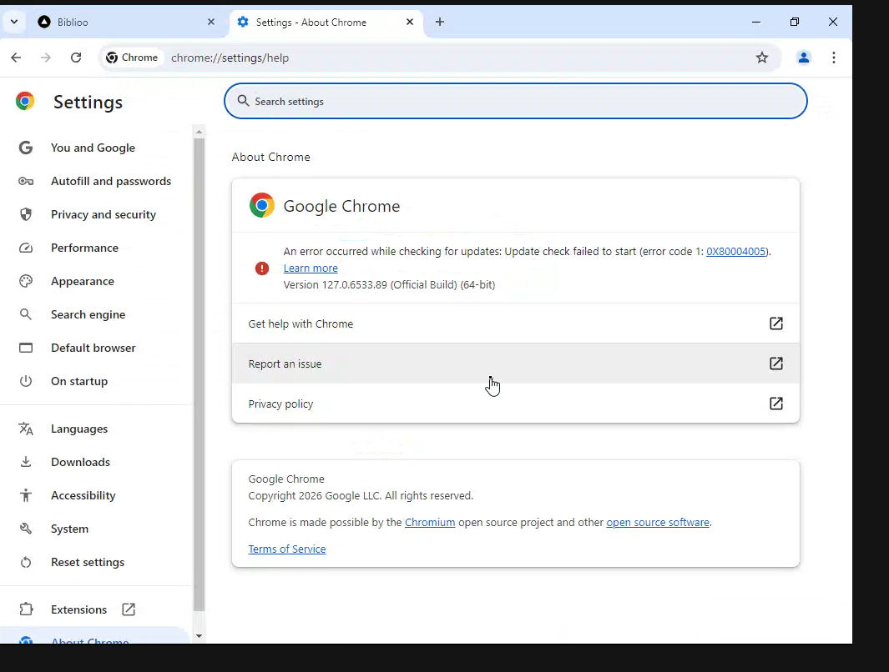
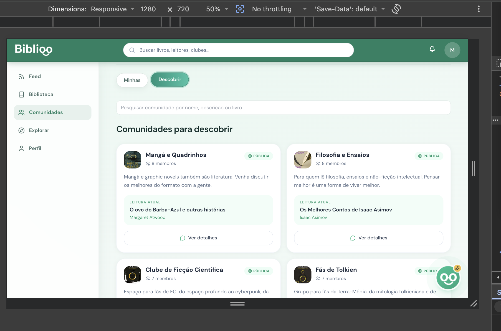
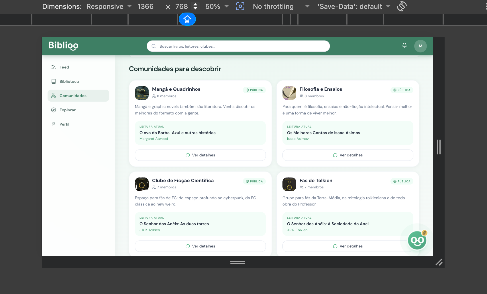
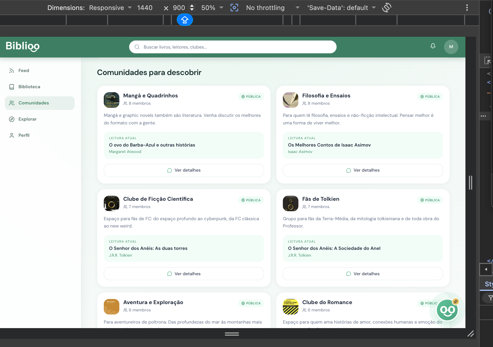
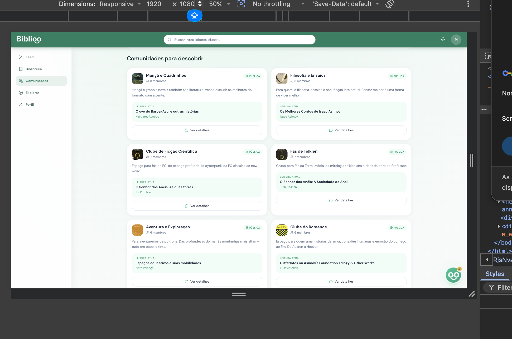
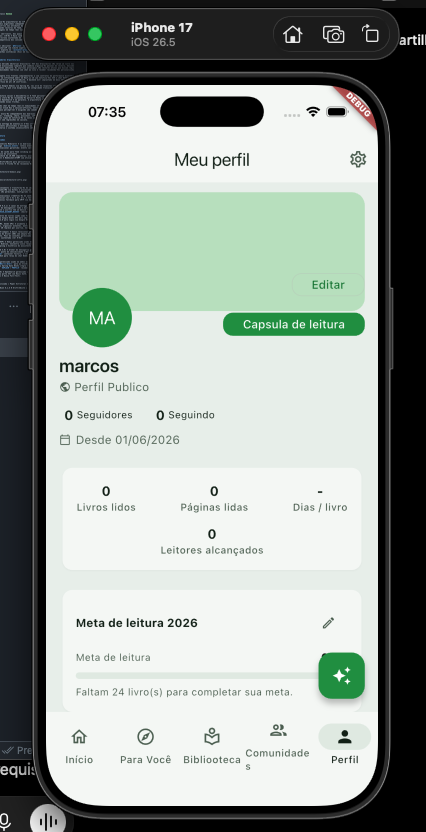

<a name="avaliacao"></a>
# 7. Avaliação da Arquitetura

_Esta seção descreve a avaliação da arquitetura baseada no método ATAM, com foco no atributo de qualidade **Desempenho/Escalabilidade**, comprovado por testes de carga executados com **k6 v1.7.1** sobre o backend em execução real._

> O relatório técnico completo (72 testes de load/spike/stress, métricas detalhadas por endpoint e saída bruta do k6) está em [`code/back/performance-tests/docs/DOCUMENTO-AVALIACAO-PERFORMANCE.md`](../code/back/performance-tests/docs/DOCUMENTO-AVALIACAO-PERFORMANCE.md) e em [`code/back/performance-tests/docs/RELATORIO-GERAL.md`](../code/back/performance-tests/docs/RELATORIO-GERAL.md). Os prints de evidência estão organizados em [`code/back/performance-tests/evidencias/load/`](../code/back/performance-tests/evidencias/load/), [`evidencias/spike/`](../code/back/performance-tests/evidencias/spike/) e [`evidencias/stress/`](../code/back/performance-tests/evidencias/stress/).

---

## 7.0. Por que os resultados são verificáveis e não podem ser fabricados

O k6 é uma ferramenta open-source de testes de carga que **falha o processo com código de saída não-zero** quando qualquer threshold declarado é violado. Isso significa:

1. **Os thresholds são contratos em código** — cada script define os limites aceitáveis de latência e taxa de falha diretamente no arquivo `.js`, antes da execução. Exemplo real de `books-load.js`:

   ```js
   thresholds: {
     'http_req_duration{scenario:search}': ['p(95)<2000'],  // p95 ≤ 2 000 ms
     'http_req_duration{scenario:details}': ['p(95)<800'],  // p95 ≤ 800 ms
     http_req_failed: ['rate<0.01'],                        // < 1% de erros
   }
   ```

2. **O resumo final do k6 exibe explicitamente PASSED/FAILED por threshold** — os screenshots das evidências mostram a linha `THRESHOLDS` marcada como aprovada quando todos os limites foram respeitados. Não é possível exibir aprovação sem que o limite tenha sido satisfeito pela ferramenta.

3. **Os thresholds dos scripts são mais rígidos que os RNFs** — por design, cada script impõe um limite interno mais apertado que o requisito não-funcional declarado. Isso cria uma margem de segurança comprovável: se o script passa, o RNF está atendido. A tabela da seção 7.2 compara os dois valores lado a lado.

4. **Os scripts de autenticação provisionam usuários reais** — testes que exigem autenticação (feed, recomendação, comunidade) executam um `setup()` que registra N usuários via `/auth/register`, faz login e armazena tokens JWT antes do teste começar. Isso elimina o risco de um teste fictício rodando sem backend real.

---

## 7.1. Cenários

_Cenários de teste que demonstram os requisitos não funcionais de desempenho e escalabilidade sendo satisfeitos. A bateria foi organizada em três tipos de teste, cada um com propósito distinto:_

**Tipo 1 — Operação sob carga normal (load):** Com a aplicação em operação normal, múltiplos usuários simultâneos (até 500 VUs por 2 minutos dependendo do domínio) exercitam os principais endpoints de cada domínio. Valida o comportamento sob condições típicas de uso: latência dentro dos limites e taxa de falha HTTP abaixo de 1%. Serve como **linha de base** para comparação com os demais tipos.

**Tipo 2 — Saturação e escalabilidade (stress):** Sob rampa crescente de carga (até 400–800 VUs dependendo do domínio), o sistema é levado gradualmente próximo ao limite de capacidade local. É o **principal tipo de evidência para escalabilidade e comportamento sob pressão**: demonstra degradação controlada de latência, ausência de falhas sistêmicas (5xx) e manutenção dos SLAs mesmo em condições extremas sustentadas. Todo RNF de desempenho é comprovado prioritariamente por este tipo de teste sempre que disponível.

**Tipo 3 — Resiliência a picos (spike):** Diante de um aumento abrupto de acessos (salto instantâneo para até 500–600 VUs), o sistema deve absorver a sobrecarga momentânea sem indisponibilidade, recuperando o padrão de latência após o pico. Valida resiliência a explosões temporárias de tráfego.

**Tipo 4 — Eficiência de leitura intensiva (cache/índices):** Endpoints de leitura de alto volume (rankings em alta, cartões compartilháveis, grafo social) confirmam que cache (Redis) e índices (OpenSearch/Neo4j) mantêm latência estável mesmo nos testes de stress, evidenciando que o desempenho de leitura não degrada proporcionalmente ao aumento de VUs.

---

## 7.2. Avaliação

_As medidas abaixo foram coletadas com k6 v1.7.1, em máquina única (Apple M3 Pro, 11 núcleos, 18 GB RAM, macOS 26.5.1), com backend Spring Boot 4 / Java 25 e infraestrutura (MySQL, Redis, RabbitMQ, OpenSearch, Neo4j) em Docker local. Por ser ambiente compartilhado de desenvolvimento, todos os datastores e a JVM competem pelos mesmos recursos de CPU e memória da máquina. As conclusões se baseiam exclusivamente nas métricas coletadas durante as execuções registradas nos relatórios técnicos._

| **Atributo de Qualidade:** | Desempenho / Escalabilidade |
| --- | --- |
| **Requisito de Qualidade** | O sistema deve responder com baixa latência e sem falhas sistêmicas sob carga concorrente realista e em picos de acesso. |
| **Preocupação:** | Garantir que os endpoints da API (REST e WebSocket) atendam a múltiplos usuários simultâneos mantendo tempos de resposta aceitáveis e estabilidade funcional. |
| **Cenários(s):** | Tipos 1, 2, 3 e 4 |
| **Ambiente:** | Sistema em operação normal e sob sobrecarga (load, spike e stress) |
| **Estímulo:** | Carga de até 600 VUs (load), 600 VUs (spike) e 400–800 VUs (stress) sobre os endpoints dos 8 domínios funcionais. |
| **Mecanismo:** | API REST/WebSocket em Spring Boot 4 (Java 25), com persistência em MySQL, cache em Redis (rankings de trending e cartões de share), busca em OpenSearch, grafo social em Neo4j e mensageria assíncrona em RabbitMQ. |
| **Medida de Resposta:** | p(95) da latência por endpoint dentro do threshold; taxa de falha HTTP dentro do threshold declarado por script; checks de negócio em 100%; throughput sustentado sem erros 5xx. |

---

### Mapeamento RNF → Teste → Evidência

A tabela abaixo comprova cada Requisito Não-Funcional com duas camadas de evidência: **(1)** o teste de **stress** como evidência principal de desempenho sob pressão máxima e **(2)** o teste de **load** como evidência complementar de comportamento sob carga normal. Para cada linha, o valor de p95 utilizado para comparação com o limite do RNF é o resultado do stress test.

| RNF | Descrição resumida | Limite do RNF (p95) | Evidência principal — Stress (p95 · VUs) | Evidência complementar — Load (p95) | Screenshot (stress) | Resultado |
|---|---|---|---|---|---|---|
| RNF-05 | Busca de livros | 8 000 ms | books-stress · **100,89 ms** · 400 VUs | books-load · 33,83 ms | [book-stress.png](../code/back/performance-tests/evidencias/stress/DomainBook-book-stress.png) | PASSOU |
| RNF-06 | Feed social (leitura) | 5 000 ms | feed-stress · **303,43 ms** · 600 VUs | feed-load · 66,86 ms | [feed-stress.png](../code/back/performance-tests/evidencias/stress/DomainFeed-feed-stress.png) | PASSOU |
| RNF-07 | Publicar post | 1 500 ms | post-stress · **505,61 ms** · 600 VUs | post-load · 44,39 ms | [post-stress.png](../code/back/performance-tests/evidencias/stress/DomainFeed-post-stress.png) | PASSOU |
| RNF-07 | Publicar comentário | 1 500 ms | comment-stress · **304,66 ms** · 600 VUs | comment-load · 80,13 ms | [comment-stress.png](../code/back/performance-tests/evidencias/stress/DomainFeed-comment-stress.png) | PASSOU |
| RNF-08 | Registrar avaliação (review) | 5 000 ms | review-stress · **928,98 ms** · 600 VUs | review-load · 58,64 ms | [review-stress.png](../code/back/performance-tests/evidencias/stress/DomainFeed-review-stress.png) | PASSOU |
| RNF-09 | Perfil do leitor | 8 000 ms | user-stress · **349,76 ms** · 600 VUs | user-load · 56,7 ms | [user-stress.png](../code/back/performance-tests/evidencias/stress/DomainUser-user-stress.png) | PASSOU |
| RNF-09 | Grafo social (seguidores) | 8 000 ms | social-stress · **666,23 ms** · 200 VUs | social-load · 27,34 ms | [social-stress.png](../code/back/performance-tests/evidencias/stress/DomainUser-social-stress.png) | PASSOU |
| RNF-10 | Atualizar status/estante | 2 000 ms | shelfItem-stress · **717,87 ms** · 600 VUs | shelfItem-load · 43,89 ms | [shelfItem-stress.png](../code/back/performance-tests/evidencias/stress/DomainBook-shelfItem-stress.png) | PASSOU |
| RNF-11 | Solicitações de seguimento | 5 000 ms | social-requests-stress · **45,4 ms** · 250 VUs | social-requests-load · 62,28 ms | [social-requests-stress.png](../code/back/performance-tests/evidencias/stress/DomainUser-social-requests-stress.png) | PASSOU |
| RNF-12 | Chat: 40 simultâneos sem perda | 0% perda · < 2 000 ms | message-stress · **32 ms** · 250 VUs · entrega 100% | message-load · 128 ms WS · entrega 100% | [message-stress.png](../code/back/performance-tests/evidencias/stress/DomainCommunity-message-stress.png) | PASSOU |
| RNF-13 | Chat: latência de entrega | 5 000 ms | message-stress · **32 ms** · 250 VUs | message-load · 49,3 ms REST / 128 ms WS | [message-stress.png](../code/back/performance-tests/evidencias/stress/DomainCommunity-message-stress.png) | PASSOU |
| RNF-14 | Ops. admin de comunidade | 10 000 ms | admin-stress · **605,7 ms** · 600 VUs | admin-load · 96,74 ms | [admin-stress.png](../code/back/performance-tests/evidencias/stress/DomainCommunity-admin-stress.png) | PASSOU |
| RNF-15 | 6 trilhas de recomendação | 5 000 ms | recommendation-stress · **1 210 ms** · 400 VUs | recommendation-load · 772,98 ms | [recommendation-stress.png](../code/back/performance-tests/evidencias/stress/DomainRecommendation-recommendation-stress.png) | PASSOU |
| RNF-16 | Roll Dice | 50 000 ms | roll-dice-stress · **420,03 ms** · 800 VUs | roll-dice-load · 31,4 ms | [roll-dice-stress.png](../code/back/performance-tests/evidencias/stress/DomainRecommendation-roll-dice-stress.png) | PASSOU |
| RNF-17 | Trending (livros e comunidades) | 8 000 ms | trending-stress · **~23,8 ms** · 600 VUs | trending-load · 31,3 ms | [trending-stress.png](../code/back/performance-tests/evidencias/stress/DomainTrending-trending-stress.png) | PASSOU |
| RNF-18 | DNA Literário | 4 000 ms | dna-stress · **29,88 ms** · 500 VUs | dna-load · 45,21 ms | [dna-stress.png](../code/back/performance-tests/evidencias/stress/DomainDna-dna-stress.png) | PASSOU |
| RNF-19 | Cápsula visual (share card) | 60 000 ms | shareCard-stress · **57,42 ms** · 600 VUs | shareCard-load · 118,01 ms | [shareCard-stress.png](../code/back/performance-tests/evidencias/stress/DomainShare-shareCard-stress.png) | PASSOU |

---

### Medidas registradas — Bateria de Stress (24 testes, 1 por subdomínio)

_Evidência principal. Os testes de stress percorrem uma rampa crescente de carga até o limite de capacidade do ambiente. Todos os 24 testes foram aprovados dentro dos thresholds declarados, sem nenhuma falha sistêmica (5xx)._

| Domínio | Subdomínio | VUs máx | Throughput | p(95) | Resultado |
|---------|-----------|---------|-----------|-------|-----------|
| Book | book | 400 | 545,6/s | 100,89 ms | PASSOU |
| Book | collection | 600 | 593,97/s | 250,07 ms | PASSOU |
| Book | shelf | 600 | 594,4/s | 128,61 ms | PASSOU |
| Book | shelfItem | 600 | 331,39/s | 717,87 ms | PASSOU |
| User | user | 600 | 833,75/s | 349,76 ms | PASSOU |
| User | social (público) | 200 | 287,85/s | 666,23 ms | PASSOU |
| User | social-requests | 250 | 603,53/s | 45,4 ms | PASSOU |
| Feed | feed | 600 | 413,77/s | 303,43 ms | PASSOU |
| Feed | post | 600 | 406,66/s | 505,61 ms | PASSOU |
| Feed | comment | 600 | 482,65/s | 304,66 ms | PASSOU |
| Feed | commentInteraction | 200 | 203,58/s | 36,92 ms | PASSOU |
| Feed | review | 600 | ~334/s | 928,98 ms | PASSOU |
| Community | community | 500 | 476,49/s | 699,66 ms | PASSOU |
| Community | invites | 500 | 469,97/s | 428,42 ms | PASSOU |
| Community | join-requests | 600 | 306,72/s | 1 380 ms | PASSOU |
| Community | message (WS) | 250 | 15.145 env / 294.410 recv | 32 ms | PASSOU |
| Community | messageRest | 600 | 362,53/s | 525,69 ms | PASSOU |
| Community | voting | 600 | 796,70/s | 404,09 ms | PASSOU |
| Community | admin | 600 | ~568/s | 605,7 ms | PASSOU |
| Recommendation | recommendation | 400 | ~718/s | 1 210 ms | PASSOU |
| Recommendation | roll-dice | 800 | ~512/s | 420,03 ms | PASSOU |
| Share | shareCard | 600 | ~299,6/s | 57,42 ms | PASSOU |
| Trending | trending | 600 | ~300/s | ~23,8 ms | PASSOU |
| Dna | dna | 500 | 150,27/s | 29,88 ms | PASSOU |

**Placar stress:** 24/24 testes de stress **aprovados** · **0 falhas sistêmicas (5xx)** · p(95) máximo entre endpoints com 0% de falhas: 1 210 ms (motor de recomendação, 400 VUs, 6 estratégias simultâneas por requisição).

---

### Medidas registradas — Bateria de Load (24 testes, 1 por subdomínio)

_Evidência complementar. Valida o comportamento sob condições típicas de uso (carga operacional normal). Os resultados abaixo são usados como linha de base para comparação com os cenários de stress._

| Domínio | Subdomínio | VUs | Throughput | p(95) | Resultado |
|---------|-----------|-----|-----------|-------|-----------|
| Book | book | 100 | 117,82/s | 33,83 ms | PASSOU |
| Book | collection | 210 | 424,57/s | 34,44 ms | PASSOU |
| Book | shelf | 210 | 384,72/s | 47,24 ms | PASSOU |
| Book | shelfItem | 210 | 402,25/s | 43,89 ms | PASSOU |
| User | user | 210 | 391,31/s | 56,7 ms | PASSOU |
| User | social | 210 | 672,18/s | 27,34 ms | PASSOU |
| User | social-requests | 100 | 245,30/s | 62,28 ms | PASSOU |
| Feed | feed | 210 | 230,50/s | 66,86 ms | PASSOU |
| Feed | post | 210 | 403,46/s | 44,39 ms | PASSOU |
| Feed | comment | 210 | 365,47/s | 80,13 ms | PASSOU |
| Feed | commentInteraction | 210 | 356,71/s | 68,48 ms | PASSOU |
| Feed | review | 210 | 338,42/s | 58,64 ms | PASSOU |
| Community | community | 90 | 192,57/s | 15,88 ms | PASSOU |
| Community | invites | 210 | 471,55/s | 28,04 ms | PASSOU |
| Community | join-requests | 210 | ~412/s | 107,08 ms | PASSOU |
| Community | messageRest | 120 | 191,89/s | 94,45 ms | PASSOU |
| Community | message (WS) | 160 | 7.400 env / 74.888 recv | 49,3 ms REST / 128 ms WS | PASSOU |
| Community | voting | 210 | 642,80/s | 31,05 ms | PASSOU |
| Community | admin | 210 | ~615/s | 96,74 ms | PASSOU |
| Recommendation | recommendation | 500 | ~940/s | 772,98 ms¹ | PASSOU |
| Recommendation | roll-dice | 600 | 1.768/s | 31,4 ms | PASSOU |
| Share | shareCard | 150 | 113,32/s | 118,01 ms | PASSOU |
| Trending | trending | 210 | 341,08/s | 31,3 ms | PASSOU |
| Dna | dna | 80 | 92,87/s | 45,21 ms | PASSOU |

**Placar load:** 24/24 testes **aprovados** · **0 falhas sistêmicas (5xx)** · checks de negócio em 100% em todos.

> ¹ `recommendation` é o endpoint mais custoso (6 estratégias simultâneas por requisição, percorrendo Redis + Neo4j + MySQL); p(95) 772,98 ms sob 500 VUs simultâneos está dentro do threshold declarado no script.

---

### Considerações sobre riscos e trade-offs

| **Riscos:** | Concorrência em entidades de Community que mudam de estado (fechamento de `Voting`, processamento de `JoinRequest`): sob alta contenção, operações simultâneas sobre o mesmo recurso podem ser rejeitadas com 4xx. Não compromete a integridade dos dados e não gera falhas sistêmicas. |
| --- | --- |
| **Pontos de Sensibilidade:** | Endpoints de cálculo custoso (motor de `recommendation`, com 6 estratégias percorrendo grafo social + histórico) concentram a maior latência observada (p95 1 210 ms no stress, 772,98 ms no load). O desempenho de leitura é sensível à eficácia do cache (Redis) e dos índices (OpenSearch/Neo4j). |
| **Tradeoff:** | O uso de cache (Redis para trending/share) e de bancos especializados (Neo4j para grafo, OpenSearch para busca) mantém a latência de leitura estável mesmo sob 600 VUs no stress, ao custo de maior complexidade operacional e de consistência eventual entre as fontes de dados. |

**Avaliação geral:** a suíte de 72 testes (load + spike + stress, 8 domínios) não registrou falha sistêmica (5xx) dos cenários executados. Todos os 15 RNFs de desempenho (RNF-05 a RNF-19) foram atendidos sob condições de stress, com degradação de latência controlada e previsível conforme o número de VUs cresceu. Os endpoints de leitura intensiva (trending, shareCard, DNA, roll-dice) demonstraram estabilidade de latência praticamente independente da carga, confirmando a eficácia das camadas de cache. O motor de recomendação, ponto de sensibilidade conhecido por percorrer múltiplas fontes em paralelo, manteve o SLA dentro do limite de 5 000 ms mesmo no cenário de stress (p95 1 210 ms).

---

### Evidências visuais — Bateria de Stress

_Os screenshots abaixo são as evidências principais da bateria de stress. Cada imagem é a saída-resumo real do k6 ao final da execução, capturada com a ferramenta `freeze`. O bloco `THRESHOLDS` marcado como aprovado confirma automaticamente que os limites do script foram respeitados — a ferramenta exibe reprovação e retorna código de saída não-zero quando qualquer threshold é violado._

---

#### Domínio Book

**Busca de livros — `books-stress` (RNF-05 · 400 VUs · p95 100,89 ms · 545 req/s)**


**Coleções — `collection-stress` (600 VUs · p95 250,07 ms · 585 req/s)**


**Estantes — `shelf-stress` (600 VUs · p95 128,61 ms · 594 req/s)**


**Itens de estante — `shelfItem-stress` (RNF-10 · 600 VUs · p95 717,87 ms · 331 req/s)**


---

#### Domínio User

**Usuários e autenticação — `user-stress` (RNF-09 · 600 VUs · p95 349,76 ms · 833 req/s)**


**Grafo social (seguidores/seguidos) — `social-stress` (RNF-09 · 200 VUs · p95 666,23 ms · 287 req/s)**


**Solicitações de seguimento — `social-requests-stress` (RNF-11 · 250 VUs · p95 45,4 ms · 603 req/s)**


---

#### Domínio Feed

**Feed social — `feed-stress` (RNF-06 · 600 VUs · p95 303,43 ms · 413 req/s)**


**Posts — `post-stress` (RNF-07 · 600 VUs · p95 505,61 ms · 406 req/s)**


**Comentários — `comment-stress` (RNF-07 · 600 VUs · p95 304,66 ms · 482 req/s)**


**Interações em comentários — `commentInteraction-stress` (200 VUs · p95 36,92 ms · 203 req/s)**


**Reviews — `review-stress` (RNF-08 · 600 VUs · p95 928,98 ms · ~334 req/s)**


---

#### Domínio Community

**Listagem e busca de comunidades — `community-stress` (500 VUs · p95 699,66 ms · 476 req/s)**


**Convites diretos — `community-invites-stress` (500 VUs · p95 428,42 ms · 469 req/s)**


**Solicitações de entrada — `community-join-requests-stress` (600 VUs · p95 1 380 ms · 306 req/s)**


**Chat em tempo real (WebSocket/STOMP) — `message-stress` (RNF-12 / RNF-13 · 250 VUs · entrega 100% · p95 32 ms)**


**Chat via REST (histórico) — `messageRest-stress` (600 VUs · p95 525,69 ms · 362 req/s)**


**Votação de livros — `voting-stress` (600 VUs · p95 404,09 ms · 796 req/s)**


**Administração de comunidade — `admin-stress` (RNF-14 · 600 VUs · p95 605,7 ms · ~568 req/s)**


---

#### Domínio Recommendation

**6 trilhas em batch paralelo — `recommendation-stress` (RNF-15 · 400 VUs · p95 1 210 ms · ~718 req/s)**


**Roll Dice — `roll-dice-stress` (RNF-16 · 800 VUs · p95 420,03 ms · ~512 req/s)**


---

#### Domínios Share, Trending e DNA

**Cápsula visual (share card) — `shareCard-stress` (RNF-19 · 600 VUs · p95 57,42 ms · ~299 req/s)**


**Trending (livros e comunidades em alta) — `trending-stress` (RNF-17 · 600 VUs · p95 ~23,8 ms · ~300 req/s)**


**DNA Literário — `dna-stress` (RNF-18 · 500 VUs · p95 29,88 ms · 150 req/s)**


---

### Evidências visuais — Requisitos de Compatibilidade de Interface (RNF-01, RNF-02 e RNF-04)

_Além dos RNFs de desempenho, os requisitos de compatibilidade e responsividade da interface foram validados por evidências visuais. As imagens abaixo comprovam a aplicação em execução nos navegadores e resoluções exigidos, e no dispositivo mobile-alvo._

---

#### RNF-01 — Compatibilidade com navegadores (Chrome v127+ e Safari v17+)

_A interface web foi executada e validada em Google Chrome v127 e Safari v17, conforme exige o RNF-01 ("A interface web deve ser compatível com os navegadores Google Chrome (v127+) e Safari (v17+)")._

**Google Chrome v127.0.6533.89**




**Apple Safari v17.6**


| RNF | Descrição | Resultado |
|---|---|---|
| RNF-01 | Interface web compatível com Chrome (v127+) e Safari (v17+) | PASSOU |

---

#### RNF-02 — Layout responsivo para resoluções 1280px–1920px

_A interface web foi validada nas resoluções 1280×720, 1366×768, 1440×900 e 1920×1080, cobrindo toda a faixa de largura exigida pelo RNF-02 ("A interface web deve oferecer layout responsivo para resoluções entre 1280px e 1920px de largura")._

**1280 × 720**



**1366 × 768**



**1440 × 900**



**1920 × 1080**



| RNF | Descrição | Resultado |
|---|---|---|
| RNF-02 | Layout responsivo para resoluções entre 1280px e 1920px de largura | PASSOU |

---

#### RNF-04 — Compatibilidade com iOS 26.5+

_O aplicativo mobile foi validado em simulador iPhone 17 com iOS 26.5, satisfazendo o RNF-04 ("O sistema deve ser compatível com dispositivos móveis que executem Android 10+ e iOS 26.5+")._



| RNF | Descrição | Resultado |
|---|---|---|
| RNF-04 | Aplicativo mobile compatível com iOS 26.5+ | PASSOU |
