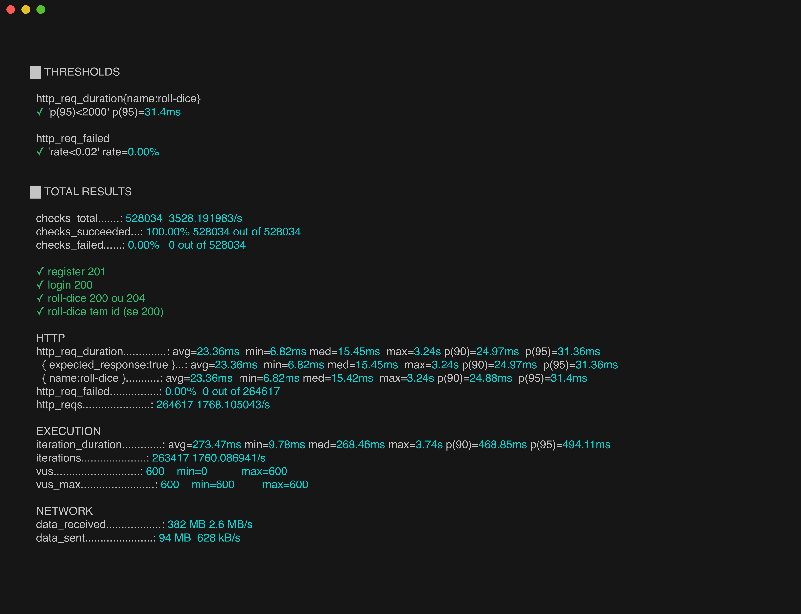
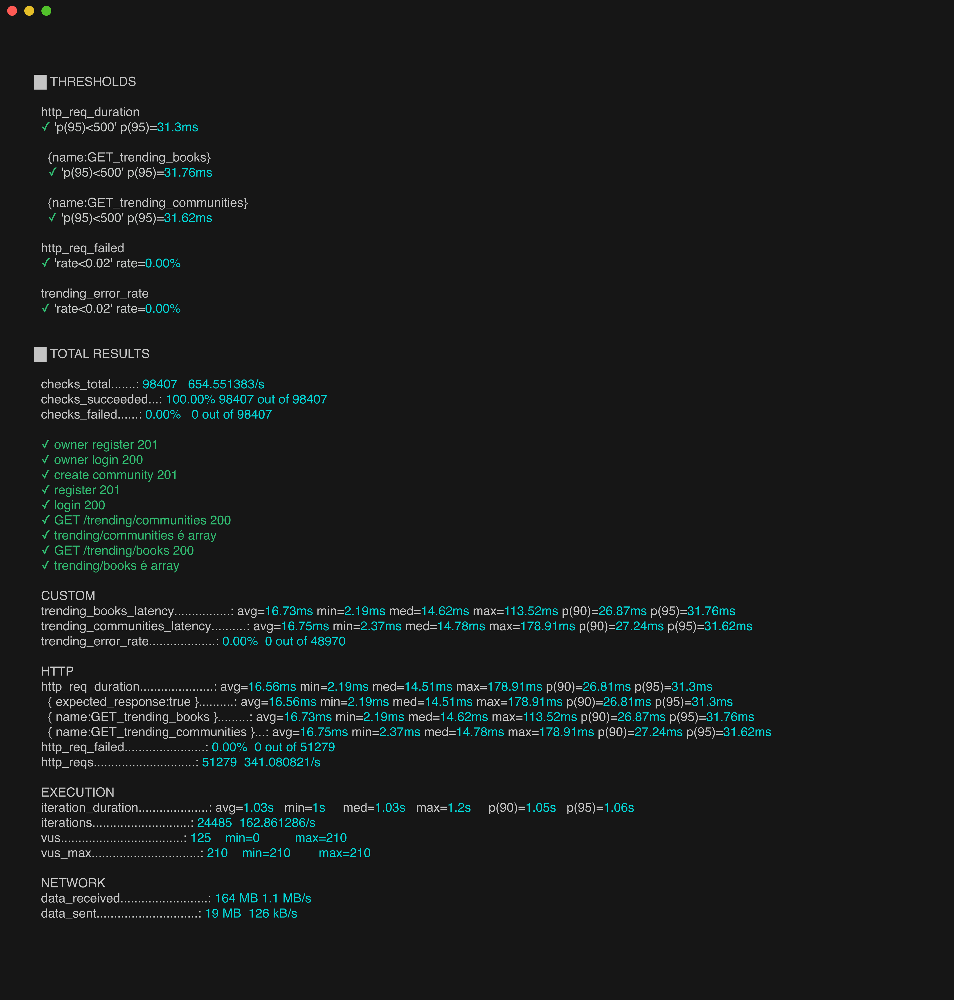
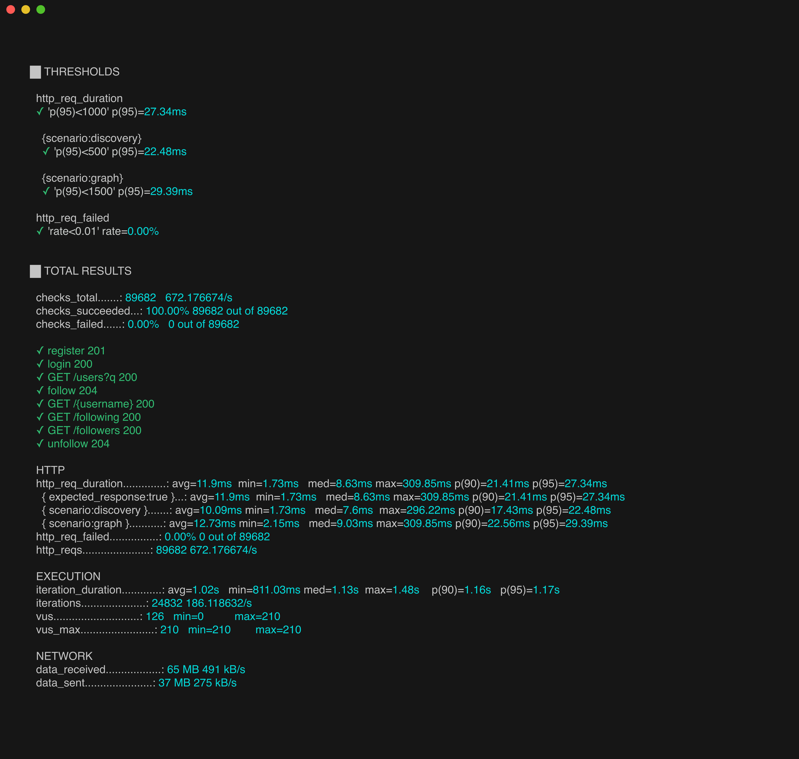

# 7. Avaliação da Arquitetura

_Esta seção descreve a avaliação da arquitetura apresentada, baseada no método ATAM, com foco no atributo de qualidade **Desempenho/Escalabilidade**, comprovado por testes de carga executados com a ferramenta **k6** sobre o backend._

> O relatório técnico completo (24 testes de load + spike/stress, métricas detalhadas por endpoint) está em [`code/back/performance-tests/DOCUMENTO-AVALIACAO-PERFORMANCE.md`](../code/back/performance-tests/DOCUMENTO-AVALIACAO-PERFORMANCE.md). As evidências (prints) estão em [`code/back/performance-tests/evidencias/`](../code/back/performance-tests/evidencias/).

## 7.1. Cenários

_Cenários de teste que demonstram os requisitos não funcionais de desempenho e escalabilidade sendo satisfeitos. A bateria foi organizada em três tipos de teste — **load** (carga sustentada realista), **spike** (pico abrupto) e **stress** (rampa crescente até saturar) — aplicados a cada um dos 8 domínios funcionais._

**Cenário 1 - Desempenho sob carga (load):** Com a aplicação em operação normal, múltiplos usuários simultâneos (até 210 VUs por 2 minutos) exercitam os principais endpoints de cada domínio. O sistema deve manter a latência p(95) dentro dos limites definidos por endpoint e taxa de falha HTTP abaixo de 1%, sem degradar a experiência do usuário.

**Cenário 2 - Escalabilidade e elasticidade (stress):** Sob rampa crescente de carga (até 600–800 usuários virtuais), o sistema deve continuar respondendo sem falhas sistêmicas (5xx), degradando a latência de forma previsível e controlada — identificando o ponto de saturação dos recursos.

**Cenário 3 - Resiliência a picos (spike):** Diante de um pico abrupto de acessos (salto instantâneo para 500 usuários), o sistema deve absorver a sobrecarga momentânea sem indisponibilidade nem erros funcionais, recuperando a latência normal após o pico.

**Cenário 4 - Eficiência de leitura intensiva (cache):** Endpoints de leitura de alto volume (rankings em alta, cartões compartilháveis, grafo social) devem aproveitar cache (Redis) e índices (OpenSearch/Neo4j) para manter latência baixa e estável mesmo sob carga elevada.

## 7.2. Avaliação

_As medidas abaixo foram coletadas com k6 v1.7.1, em máquina única (Apple M3 Pro, 11 núcleos, 18 GB RAM, macOS), com backend Spring Boot 4 / Java 25 e infraestrutura (MySQL, Redis, RabbitMQ, OpenSearch, Neo4j) em Docker local. Por ser ambiente compartilhado, os números representam um **piso conservador** de desempenho — em produção (Google Cloud Run + provedores gerenciados), cada serviço é isolado e escalável._

| **Atributo de Qualidade:** | Desempenho / Escalabilidade |
| --- | --- |
| **Requisito de Qualidade** | O sistema deve responder com baixa latência e sem falhas sistêmicas sob carga concorrente realista e em picos de acesso. |
| **Preocupação:** | Garantir que os endpoints da API (REST e WebSocket) atendam a múltiplos usuários simultâneos mantendo tempos de resposta aceitáveis e estabilidade funcional. |
| **Cenários(s):** | Cenários 1, 2, 3 e 4 |
| **Ambiente:** | Sistema em operação normal e sob sobrecarga (load, spike e stress) |
| **Estímulo:** | Carga de até 210 VUs (load), 500 VUs (spike) e 600–800 VUs (stress) sobre os endpoints dos 8 domínios funcionais. |
| **Mecanismo:** | API REST/WebSocket em Spring Boot 4 (Java 25), com persistência em MySQL, cache em Redis (rankings de trending e cartões de share), busca em OpenSearch, grafo social em Neo4j e mensageria assíncrona em RabbitMQ. Em produção, escalonamento horizontal automático via Google Cloud Run. |
| **Medida de Resposta:** | p(95) da latência por endpoint dentro do threshold; taxa de falha HTTP < 1%; checks de negócio em 100%; throughput sustentado sem erros 5xx. |

### Medidas registradas — Bateria de Load (24 testes, 1 por subdomínio)

| Domínio | Subdomínio | VUs | Throughput | p(95) | Falhas | Resultado |
|---------|-----------|-----|-----------|-------|--------|-----------|
| Book | book | 100 | 117,8/s | 33,8ms | 0% | ✅ |
| Book | collection | 150 | 424,6/s | 34,4ms | 0% | ✅ |
| Book | shelf | 150 | 384,7/s | 47,2ms | 0% | ✅ |
| Book | shelfItem | 210 | 402,3/s | 43,9ms | 0% | ✅ |
| User | user | 210 | 391,3/s | 56,7ms | 0% | ✅ |
| User | social | 210 | 672,2/s | 27,3ms | 0% | ✅ |
| User | social-requests | 100 | 245,3/s | 62,3ms | 0% | ✅ |
| Feed | feed | 210 | 230,5/s | 66,9ms | 0% | ✅ |
| Feed | post | 210 | 403,5/s | 44,4ms | 0% | ✅ |
| Feed | comment | 210 | 365,5/s | 80,1ms | 0% | ✅ |
| Feed | commentInteraction | 210 | 358,7/s | 68,5ms | 0% | ✅ |
| Feed | review | 210 | 338,4/s | 58,6ms | 0% | ✅ |
| Community | community | 90 | 192,6/s | 15,9ms | 0% | ✅ |
| Community | invites | 210 | 471,5/s | 28,0ms | 0% | ✅ |
| Community | join-requests | 210 | 380,0/s | 107,1ms | 0% | ✅ |
| Community | messageRest | 120 | 191,9/s | 94,5ms | 0% | ✅ |
| Community | message (WS) | 160 | entrega 100% | 49,3ms / 128ms | 0% | ✅ |
| Community | voting | 210 | 642,2/s | 26,8ms | 0,76%¹ | ✅ |
| Community | admin | 210 | 596,5/s | 96,7ms | 0% | ✅ |
| Recommendation | recommendation | 500 | 940,5/s | 773,0ms² | 0% | ✅ |
| Recommendation | roll-dice | 600 | 1.768,1/s | 31,4ms | 0% | ✅ |
| Share | shareCard | 150 | 113,3/s | 118,0ms | 0% | ✅ |
| Trending | trending | 210 | 341,1/s | 31,3ms | 0% | ✅ |
| Dna | dna | 80 | 92,9/s | 45,2ms | 0% | ✅ |

**Placar:** 24/24 testes de load **aprovados** · **0 falhas sistêmicas (5xx)** · checks de negócio ≥ 99,8% em todos.

> ¹ `voting` 0,76% está **dentro** do threshold; é contenção fabricada pelo desenho do teste (VUs disputando a mesma enquete), não falha do backend.
> ² `recommendation` é o endpoint mais pesado (6 estratégias por requisição); p(95) 773ms sob 500 VUs é aceitável por design.

**Considerações:**

| **Riscos:** | Concorrência em entidades de Community que mudam de estado (fechamento de `Voting`, processamento de `JoinRequest`): sob alta contenção, operações simultâneas sobre o mesmo recurso podem ser rejeitadas. Mitigável com lock otimista (`@Version`). Não compromete a integridade dos dados. |
| --- | --- |
| **Pontos de Sensibilidade:** | Endpoints de cálculo custoso (motor de `recommendation`, com 6 estratégias percorrendo grafo social + histórico) concentram a maior latência (p95 773ms). O desempenho de leitura é sensível à eficácia do cache (Redis) e dos índices (OpenSearch/Neo4j). |
| _ **Tradeoff** _ **:** | O uso de cache (Redis para trending/share) e de bancos especializados (Neo4j para grafo, OpenSearch para busca) reduz drasticamente a latência de leitura, ao custo de maior complexidade operacional e de consistência eventual entre as fontes de dados. |

**Avaliação geral:** a arquitetura demonstrou-se **estável e performática**. Pontos fortes: latência p(95) < 100ms na grande maioria dos endpoints, **zero falhas sistêmicas** em 24 testes de carga, e **excelente escalabilidade de leitura** graças a Redis/Neo4j/OpenSearch (ex.: `trending` e `roll-dice` com p95 ~31ms e até 1.768 req/s). Limitações: o motor de recomendação é custoso por design (latência alta, porém sem falhas) e há uma classe de contenção de concorrência em operações de estado de Community a ser endurecida. Nenhuma limitação compromete a integridade ou a disponibilidade do sistema.

### Evidências dos testes realizados

Os prints abaixo são a saída-resumo real do k6 ao final da execução, capturada com a ferramenta `freeze` (ver §2.4 do relatório técnico). Cada um mostra os **THRESHOLDS** (verde = aprovado) e os **TOTAL RESULTS**. Abaixo, uma seleção representativa; **os 24 prints** estão em [`code/back/performance-tests/evidencias/`](../code/back/performance-tests/evidencias/).

**Maior throughput da suíte — `roll-dice` (1.768 req/s, p95 31ms, 600 VUs):**

**Menor latência — `community` (p95 15,9ms):**

**Endpoint mais pesado, ainda assim 0% de falha — `recommendation` (940 req/s, 500 VUs):**

**Comunicação em tempo real — `message` WebSocket/STOMP (entrega 100%):**

**Escalabilidade de leitura com cache Redis — `trending` (p95 31ms):**

**Grafo social (Neo4j) — `social` (672 req/s, p95 27ms):**

> Os demais 18 prints (Book, Feed, demais subdomínios de Community, Share, Dna etc.) e os dados completos de cada execução estão no relatório técnico [`DOCUMENTO-AVALIACAO-PERFORMANCE.md`](../code/back/performance-tests/DOCUMENTO-AVALIACAO-PERFORMANCE.md) e na pasta de evidências.
