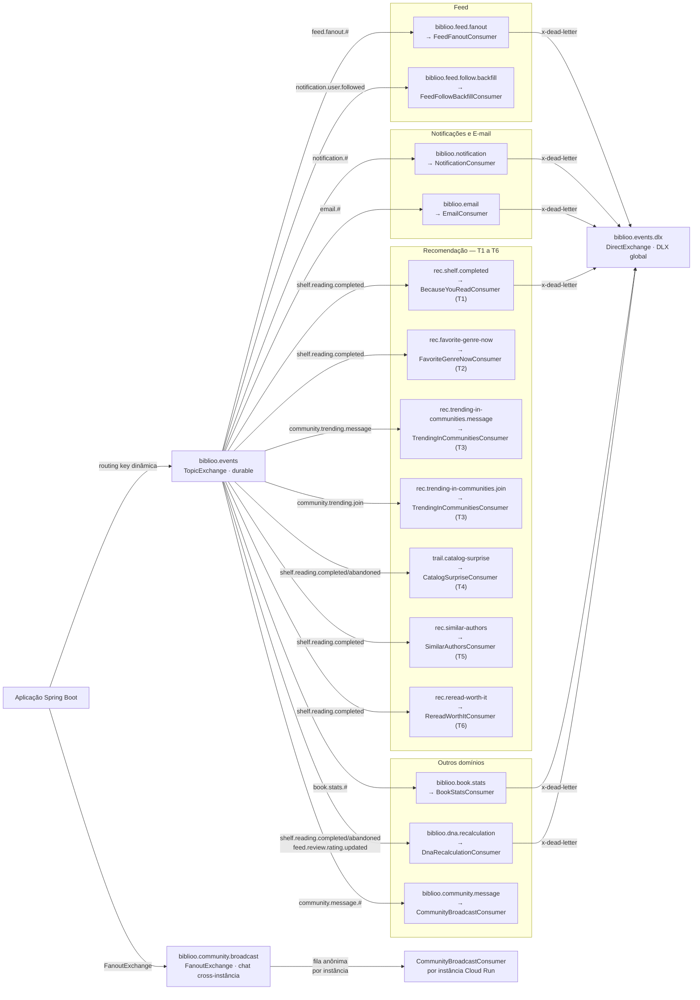
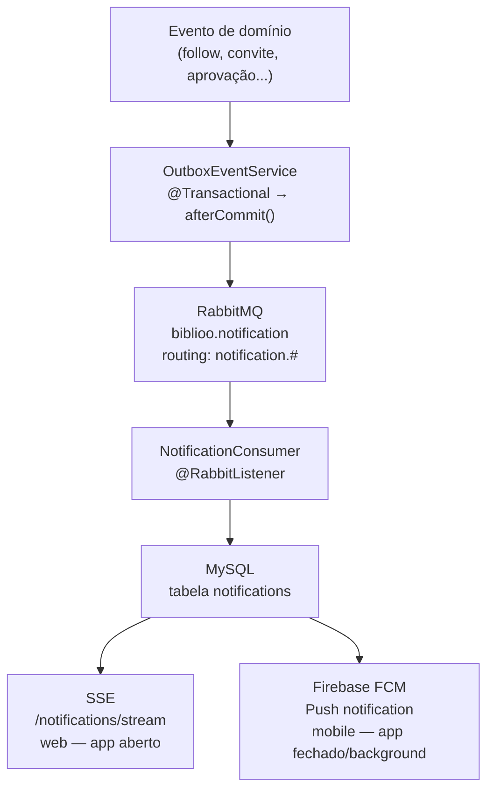

<a name="atam"></a>
# 8. ATAM — Architecture Tradeoff Analysis Method

## 1. Resumo Executivo

O presente relatório documenta a avaliação arquitetural do **Biblioo**, uma rede social de leitura que reúne estantes virtuais, feed social, comunidades com chat em tempo real, seis algoritmos independentes de recomendação personalizada e um assistente de IA conversacional. A avaliação utilizou o método ATAM com foco prioritário nos atributos de **Performance** e **Disponibilidade**, motivados pela natureza da plataforma: múltiplos usuários simultâneos realizando leituras de feed, ativando algoritmos que percorrem cinco datastores distintos (MySQL, Redis, Neo4j, OpenSearch, RabbitMQ) e trocando mensagens em tempo real via WebSocket em instâncias paralelas no Cloud Run.

Foram construídos e analisados **seis cenários**, dos quais **três receberam prioridade Alta/Alta**. A análise identificou **dois riscos arquiteturais**, sendo os mais críticos: **R-01 — Race condition em JoinRequest por ausência de Optimistic Locking** e **R-02 — Esgotamento silencioso do pool JDBC sob carga assíncrona sustentada de consumers RabbitMQ**. A arquitetura demonstra boas decisões em **mensageria transacional (Outbox Pattern)**, **idempotência dos consumers**, **cache Redis efetivo** e **Dead Letter Queues configuradas** para todos os consumers críticos.

As recomendações prioritárias são: (1) adicionar `@Version` na entidade `JoinRequest` para eliminar a race condition detectada nos testes de stress, (2) calibrar o pool JDBC do HikariCP com limite superior compatível com o número de consumer threads simultâneas, e (3) monitorar ativamente o consumer lag via métrica exposta no `/actuator/prometheus`. A arquitetura é adequada para os objetivos de negócio, com 72 de 72 testes de performance aprovados e 0 falhas sistêmicas (5xx) em toda a suíte.

---

## 2. Objetivos de Negócio e Direcionadores Arquiteturais

O Biblioo endereça um problema real do mercado editorial brasileiro: 53% dos brasileiros não leram um livro nos últimos três meses (Retratos da Leitura, 2024). A plataforma propõe um ecossistema completo que combina organização pessoal de leitura, descoberta inteligente de novos títulos e uma camada social robusta — tudo no mesmo ambiente. Os usuários principais são leitores ativos que buscam registrar seu progresso, compartilhar opiniões em reviews, participar de comunidades temáticas com chat ao vivo e receber recomendações personalizadas sem depender de algoritmos genéricos baseados em IA generativa.

Do ponto de vista técnico, o sistema opera três frentes complementares e com contratos de performance distintos: um **backend** em Spring Boot 4 (Java 25) com 11 domínios de negócio; um **frontend web** em Next.js 16 com notificações SSE e chat WebSocket em tempo real; e um **app mobile** em Flutter 3.11 com arquitetura offline-first via Drift/SQLite. O backend está implantado em dois ambientes independentes no Google Cloud Run (us-central1) com escalonamento automático de até 10 instâncias.

O assistente **Bibo**, alimentado pelo Google Gemini via Spring AI, vai além de respostas conversacionais: ele executa ações reais na plataforma (organiza estantes, monta coleções e etc), o que cria exigências de integridade transacional sobre operações acionadas por linguagem natural.

**Direcionadores identificados:**

- **Direcionador 1 — Performance de leitura social e descoberta:** O feed personalizado e os seis algoritmos de recomendação são os diferenciais competitivos centrais do Biblioo. Cada iteração de recomendação percorre Neo4j (grafo social), Redis (parâmetros bayesianos e cache), MySQL (histórico de leitura) e eventualmente OpenSearch — em paralelo. A arquitetura deve garantir que latências aceitáveis se mantenham mesmo sob centenas de usuários simultâneos acionando essas trilhas.

- **Direcionador 2 — Disponibilidade do chat em tempo real:** Comunidades com chat ao vivo via WebSocket/STOMP são uma das funcionalidades âncora da plataforma. Com múltiplas instâncias Cloud Run e session-affinity, mensagens publicadas numa instância devem alcançar clientes conectados em outras instâncias sem perda e sem atraso perceptível — exigindo uma camada de broadcast cross-instância sobre RabbitMQ FanoutExchange.

- **Direcionador 3 — Desacoplamento e evolução independente dos domínios:** O sistema possui 11 domínios de negócio (books, community, feed, recommendation, notification, dna, user, trending, share, assistant, infrastructure) que se comunicam exclusivamente via eventos. A adição de novos algoritmos de recomendação, novos tipos de notificação ou novos canais de conteúdo não deve exigir alterações em outros domínios — garantindo que o sistema possa evoluir sem regressões em cascata.

- **Direcionador 4 — Confiabilidade da entrega de eventos:** Ações críticas como o fanout de feed para seguidores, o recálculo de DNA literário e o envio de notificações dependem de events persistidos e entregues ao RabbitMQ. Publicar um evento antes do commit da transação de banco (problema clássico do dual-write) tornaria o sistema inconsistente sempre que o banco revertesse após a mensagem já ter sido consumida.

---

## 3. Topologia e Abordagem da Arquitetura

### Abordagens arquiteturais identificadas

- **Hexagonal (Ports & Adapters) em Monólito Modular** — 11 domínios com fronteiras explícitas
- **Publish-Subscribe** — TopicExchange `biblioo.events` roteia eventos por routing key para 14 filas independentes
- **Outbox Pattern** — publicação transacional garantida: evento salvo no MySQL dentro de `@Transactional`, publicado no RabbitMQ apenas no `afterCommit()`
- **Cache-Aside** — Redis como camada de cache para feed (sliding window 200 itens), trending (refresh a cada 15 min), share cards (TTL 1h), parâmetros Thompson Sampling e histórico do assistente
- **Fanout-on-write** — feed com threshold de 10.000 seguidores; acima disso, fan-out assíncrono via `biblioo.feed.fanout`
- **Session Affinity + FanoutExchange** — WebSocket/STOMP com afinidade de sessão no Cloud Run; broadcast cross-instância via `biblioo.community.broadcast` FanoutExchange
- **Offline-first** — App mobile com Drift/SQLite para persistência local e sync remoto ao reconectar
- **Thompson Sampling (Bayesian Bandit)** — Trilha T4 de recomendação com parâmetros α/β por (userId, bookId) persistidos no Redis

### Diagrama de domínio


### Diagrama de infraestrutura


**Serviços externos:**

- **Cloudinary** (HTTP5 2.0.0) — armazenamento e transformação de imagens (avatares, banners, imagens de posts e comentários). O upload é assíncrono: o evento é publicado no RabbitMQ via Outbox e processado pelo `share` module; Apache Tika 3.2.3 detecta o tipo real do arquivo antes do envio para impedir upload de tipos não permitidos. Configurado via variável `CLOUDINARY_URL` (Secret Manager em produção).

- **SendGrid** — envio de e-mails transacionais (redefinição de senha, confirmações de cadastro). Integrado via `biblioo.email` queue (routing key `email.#`) com DLQ e retry exponencial (2s → 4s → 8s, máx. 3 tentativas), garantindo que e-mails de redefinição de senha não sejam perdidos em falhas transitórias do SendGrid. Possui fallback para SMTP via Gmail (`GMAIL_EMAIL` / `GMAIL_PASSWORD`) configurado como segundo provedor de envio.

- **Firebase FCM** (Firebase Admin SDK 9.4.1) — canal de entrega de push notifications para dispositivos iOS/Android quando o app está em background ou fechado. **Não é broker de mensagens**: todo o backbone assíncrono da plataforma roda sobre RabbitMQ. O FCM é acionado pelo `NotificationService` exclusivamente se o usuário tem um device token registrado; sem token, a notificação é entregue apenas via SSE (web). Credencial injetada via `FIREBASE_SERVICE_ACCOUNT_BASE64` (Secret Manager em produção).

- **Google Books API** — catálogo externo de livros usado como fallback na busca: quando o título/autor/ISBN não é encontrado no índice OpenSearch local, o backend consulta a Google Books API para ampliar os resultados. Configurado via `GOOGLE_BOOKS_API_KEY`. O módulo `user` também utiliza o Google API Client 2.2.0 para login via Google OAuth (`GOOGLE_CLIENT_ID`).

- **Google Gemini** (Spring AI 2.0.0-M5, GenAI API) — alimenta o assistente **Bibo**, que vai além de respostas conversacionais: executa ações reais na plataforma (criar comunidades, organizar estantes, montar coleções, recomendar leituras). O histórico de conversas de cada usuário é persistido no Redis com rate limit de 20 req/min por usuário. Configurado via `GEMINI_API_KEY` (Secret Manager em produção).

- **TiDB Cloud Serverless** (MySQL 8.4-compat) — banco relacional gerenciado usado em ambos os ambientes (portfolio e produção). Compatível com o protocolo MySQL, permitindo uso direto do driver JDBC sem adaptações. Tier serverless escala automaticamente e não cobra por instância ociosa, adequado ao perfil acadêmico do projeto. Pool de conexões gerenciado pelo HikariCP na aplicação; limite de conexões do tier gratuito é um ponto de sensibilidade sob carga assíncrona sustentada (ver R-02).

- **Upstash** (Redis 7.4, protocolo RESP) — Redis gerenciado usado em ambos os ambientes. Modelo serverless por comando (pay-per-request), adequado ao perfil de uso variável do Biblioo. Concentra cinco responsabilidades críticas: cache de feed, ranking trending, share cards, parâmetros bayesianos do Thompson Sampling e histórico do assistente Bibo. `cache-null-values=false` configurado para prevenir cache poisoning.

- **CloudAMQP Little Lemur** (RabbitMQ 4.0) — broker de mensageria gerenciado usado em ambos os ambientes. Plano gratuito permanente com limite de **20 conexões AMQP simultâneas** — ponto de sensibilidade S-03: com 10 instâncias Cloud Run em escalonamento máximo, cada instância abrindo múltiplas conexões por `@RabbitListener` container factory, o limite pode ser atingido, causando falha silenciosa no registro de consumers. Suporta o protocolo STOMP na porta 61613 para relay do chat WebSocket. Upgrade para plano Lemur (~$19/mês, 100 conexões) recomendado ao atingir 15 conexões simultâneas.

- **Neo4j Aura Free** (5.18) — grafo gerenciado usado em ambos os ambientes. Tier gratuito permanente sem expiração. Armazena as relações `(:User)-[:READ]->(:Book)` e `(:User)-[:FOLLOWS]->(:User)` para as trilhas de recomendação T1 (BecauseYouRead) e T5 (SimilarAuthors). Queries Cypher raw via `neo4j-java-driver` 5.18.0 — nunca Spring Data Neo4j (regra de arquitetura). Com crescimento do grafo, queries de 2 saltos do T5 podem degradar; baseline de performance via `EXPLAIN`/`PROFILE` recomendado antes que o volume torne a análise complexa (ver Ação 6).

- **Bonsai.io Hobby** (OpenSearch 2.18) — OpenSearch gerenciado usado exclusivamente no ambiente **portfolio**. Free tier permanente com 125 MB de storage e 1 shard. Conexão HTTPS na porta 443 com Basic Auth. Em produção, substituído por instância própria em GCE VM e2-small na rede interna VPC (ver tabela de componentes — Busca Full-Text).

### Tabela de componentes

| Componente / Camada | Tecnologia Utilizada | Papel Estrutural e Mecanismo de Comunicação |
|---|---|---|
| App Mobile | Flutter 3.11 · Dart · BLoC 8.1.6 · Drift/SQLite | Interface offline-first para Android e iOS. Drift/SQLite mantém dados locais sincronizados com o backend ao reconectar. Consome a API REST via HTTPS com autenticação JWT Bearer (access token de curta duração + refresh token). Suporte a login via Google OAuth. Recebe push notifications via Firebase FCM quando o app está em background ou fechado; notificações in-app são entregues por polling ou push quando o app está ativo. |
| Frontend Web | Next.js 16 · React 19 · TypeScript · TailwindCSS · Vercel | SPA/SSR servida na Vercel. Autenticação stateless via JWT (sem sticky session para REST). Requisições CRUD via API REST; canal SSE persistente em `/notifications/stream` para notificações in-app em tempo real sem polling; conexão WebSocket/STOMP para chat de comunidades (session affinity gerenciado pelo Cloud Run). Cards de compartilhamento social gerados pelo backend (`/share`). |
| Backend API | Spring Boot 4 · Java 25 · Google Cloud Run (1–10 instâncias) | Monólito modular com 11 domínios Hexagonais (Ports & Adapters). Expõe REST + WebSocket/STOMP. Autenticação via `JwtAuthenticationFilter` (nunca bypassed — endpoints públicos declarados explicitamente em `SecurityConfig`). Rate limiting por IP/usuário via Bucket4j 8.10.1. Anti-XSS via JSoup 1.17.2. Outbox Pattern para publicação transacional de eventos. Observabilidade via Micrometer. Session affinity habilitado no Cloud Run para conexões WebSocket. Portfolio: 1 Gi / 1 vCPU / máx. 2 instâncias. Produção: 2 Gi / 2 vCPU / máx. 10 instâncias / CPU Boost no cold start. Healthcheck em `/actuator/health`. |
| Banco Relacional | TiDB Cloud Serverless (MySQL 8.4-compat) · HikariCP | Armazenamento canônico e transacional. Contém: usuários, estantes, itens de estante, posts, reviews, comentários, comunidades, membros, votações, notificações, `outbox_events`, `event_log`. `schema.sql` executado a cada startup (`spring.sql.init.mode=always`) para garantir índices e colunas complementares sempre presentes. Pool de conexões via HikariCP com métricas expostas em `/actuator/prometheus` (`hikaricp.connections.pending`). `open-in-view=false` para prevenir N+1 em requests assíncronos. |
| Cache | Upstash Redis 7.4 (protocolo RESP) | Cache-Aside para múltiplas camadas: feed sliding window (200 itens/usuário, warm-size configurável); ranking trending (refresh a cada 15 min, janela de 48h); share cards (TTL 1h — re-renderização Java2D só no primeiro miss); parâmetros α/β do Thompson Sampling por `(userId, bookId)` (TTL 90 dias); histórico de conversas do assistente Bibo (rate limit 20 req/min por usuário). `cache-null-values=false` para evitar cache poisoning. Parâmetros de recomendação configurados via `@Value` para tuning sem recompilação. |
| Grafo Social | Neo4j Aura Free 5.18 · neo4j-java-driver 5.18.0 · Cypher raw | Grafo de relacionamentos `(:User)-[:READ]->(:Book)` e `(:User)-[:FOLLOWS]->(:User)`. Usado pelas trilhas T1 (BecauseYouRead: navega co-leitores com mínimo de 2 leitores comuns, jitter ±3%, cap 60% por categoria) e T5 (SimilarAuthors: filtragem colaborativa em 2 saltos, até 30 usuários similares). Queries Cypher raw via `neo4j-java-driver` — nunca Spring Data Neo4j (regra de arquitetura para controle total sobre queries de grafo). Fallback automático para SQL quando Neo4j estiver indisponível (T1 apenas). |
| Busca Full-Text | OpenSearch 2.18 · REST Client 2.11.1 · Portfolio: Bonsai.io Hobby · Produção: GCE VM e2-small VPC interna | Índices de livros e usuários. Busca por título, autor, ISBN e prefixo de username (mín. 2 chars). Limpeza semanal automática via `OpenSearchIndexCleanupService` (reconcilia índice com MySQL, remove documentos órfãos; stats de tamanho logados a cada hora). Portfolio — Bonsai.io Hobby: 125 MB storage, 1 shard, free tier permanente, conexão HTTPS porta 443 com Basic Auth. Produção — GCE VM e2-small (us-central1-a, 30 GB SSD): HTTP porta 9200, rede interna VPC, porta nunca exposta à internet (firewall `biblioo-infra-internal` restringe acesso ao range `10.128.0.0/9`). |
| Mensageria | CloudAMQP RabbitMQ 4.0 · Spring AMQP · STOMP | Barramento de eventos assíncronos. TopicExchange `biblioo.events` (durable) roteia eventos por routing key para 14 filas especializadas. FanoutExchange `biblioo.community.broadcast` para broadcast WebSocket cross-instância (cada instância Cloud Run declara fila anônima ao iniciar). Todos os consumers verificam `event_id` na tabela `event_log` antes de processar (idempotência at-least-once). DLQ + retry com backoff exponencial (2s → 4s → 8s, máx. 3 tentativas) para consumers críticos: `biblioo.book.stats`, `biblioo.notification`, `rec.shelf.completed`, `biblioo.feed.fanout`, `biblioo.email`, `biblioo.dna.recalculation`. CloudAMQP Little Lemur (free tier): limite de 20 conexões simultâneas — ponto de sensibilidade S-03. |
| Notificações Web | SSE — `/notifications/stream` · Spring MVC SseEmitter | Canal Server-Sent Events persistente por sessão web. Alimentado pelo `NotificationService` imediatamente após persistência da notificação no MySQL. Suporta badge de notificações não lidas e histórico paginado. Tipos de evento entregues: follow, solicitação de follow, convite de comunidade, aprovação de solicitação de entrada. |
| Push Mobile | Firebase FCM · Firebase Admin SDK 9.4.1 | Canal de entrega de push notification para dispositivos iOS/Android quando o app está em background ou fechado. Acionado pelo `NotificationService` **exclusivamente** se o usuário tem um device token registrado via `/notifications/device-token`. **Não é broker de mensagens** — todo o backbone assíncrono (recomendações, feed fanout, DNA, notificações in-app, e-mail) roda exclusivamente sobre RabbitMQ. Credencial `FIREBASE_SERVICE_ACCOUNT_BASE64` injetada via Secret Manager em produção. |
| Upload de Mídia | Cloudinary HTTP5 2.0.0 · Apache Tika 3.2.3 | Armazenamento e transformação de imagens (avatares, banners, imagens de posts e comentários). Apache Tika detecta o tipo real do arquivo por análise de magic bytes (não pela extensão declarada pelo cliente), prevenindo upload de tipos não permitidos. Upload assíncrono: a ação de upload é publicada como evento no RabbitMQ via Outbox e processada de forma desacoplada do request HTTP principal, evitando timeout em uploads de imagens grandes. |
| Assistente IA | Google Gemini GenAI API · Spring AI 2.0.0-M5 | Assistente **Bibo** com capacidade conversacional e execução de ações reais na plataforma: criar comunidades, organizar estantes, montar coleções, recomendar leituras, responder perguntas sobre livros e sobre o ecossistema Biblioo. Histórico de conversas por usuário persistido no Redis (conversational memory entre sessões). Rate limit de 20 req/min por usuário via Bucket4j, prevenindo abuso da API Gemini. `GEMINI_API_KEY` injetado via Secret Manager em produção. |
| CI/CD e Deploy | GitHub Actions · Google Cloud Build · Google Artifact Registry · Google Secret Manager | Pipeline ativado por push na branch `prod`: GitHub Actions espelha o branch do repo privado para o repo público → Cloud Build trigger (`^prod$`) executa 4 steps: (1) `docker build ./code/back`, (2) push da imagem `backend:latest` para o Artifact Registry, (3) deploy em `biblioo-portfolio`, (4) deploy em `biblioo-producao` (troca de revisão sem downtime — ~12 min). 40+ secrets injetados via `--set-secrets` no Cloud Run, nunca expostos no código ou repositório. |
| Observabilidade | Micrometer · Prometheus v2.53.0 · Grafana 10.4.5 | Métricas expostas em `/actuator/prometheus`: histograma de latência HTTP com percentis p50/p95/p99; pool de conexões HikariCP (`hikaricp.connections.pending`, `hikaricp.connections.active`); consumer lag do RabbitMQ por fila; contadores customizados nos algoritmos de recomendação (Micrometer). Dashboard Grafana pré-configurado importável de `config/grafana.json`. Prometheus configurado em `config/prometheus/prometheus.yml` com scrape do endpoint Actuator. |

---

## 4. Árvore de Utilidade e Inventário de Cenários

| ID | Atributo de Qualidade | Descrição do Cenário — Estímulo, Ambiente e Resposta | Prioridade (Negócio / Dificuldade) |
|---|---|---|---|
| C-01 | Performance | **Estímulo:** 600 usuários acessam o feed personalizado e publicam posts ao mesmo tempo, de forma contínua por 2 minutos — simulando um pico real de uso na plataforma. **Ambiente:** Sistema em horário de pico. O feed de cada usuário é mantido em memória rápida (cache Redis) com os 200 posts mais recentes pré-carregados, para que a leitura não precise consultar o banco a cada acesso. Quando alguém publica um post, a distribuição para os feeds dos seguidores acontece em segundo plano, sem bloquear a resposta ao autor. **Resposta esperada:** 95% dos carregamentos de feed respondem em menos de 5 segundos; 95% das publicações de post concluem em menos de 1,5 segundos; menos de 1% de erros em qualquer operação; todas as verificações de integridade dos dados aprovadas. | Alta / Alta |
| C-02 | Performance | **Estímulo:** 500 usuários abrem a tela de recomendações ao mesmo tempo — o app carrega os 6 algoritmos simultaneamente para montar a página em uma única chamada. Cada algoritmo consulta fontes de dados diferentes: o grafo de relacionamentos sociais (Neo4j), o cache de preferências do usuário (Redis) e o histórico de leitura no banco (MySQL). **Ambiente:** Sistema em carga normal, com todos os bancos de dados disponíveis e os perfis de preferência dos usuários já calculados e em cache. **Resposta esperada:** Os resultados das 6 trilhas chegam juntos em menos de 5 segundos (medido pelo percentil 95 das requisições); nenhum erro de servidor; recomendações diversificadas — o sistema aplica variação aleatória controlada para evitar que todos os usuários recebam exatamente a mesma lista. | Alta / Alta |
| C-03 | Disponibilidade | **Estímulo:** 250 usuários trocam mensagens em comunidades ao mesmo tempo, enquanto o sistema está distribuído em múltiplos servidores no Google Cloud Run ativos em paralelo (o Cloud Run escala horizontalmente adicionando servidores conforme a demanda). **Ambiente:** Sistema sob carga elevada. Cada usuário está conectado a um servidor específico para manter a conexão de chat ativa (afinidade de sessão). Uma mensagem enviada por alguém conectado ao servidor A precisa chegar a usuários conectados nos servidores B, C e D — sem que os servidores precisem se comunicar diretamente entre si. Isso é feito via RabbitMQ: cada servidor publica a mensagem no broker e todos os demais servidores a recebem e entregam localmente. **Resposta esperada:** Nenhuma mensagem perdida entre servidores; 95% das mensagens entregues em menos de 5 segundos; nenhuma mensagem duplicada. | Alta / Alta |
| C-04 | Disponibilidade | **Estímulo:** O serviço responsável por distribuir novos posts no feed dos seguidores fica indisponível por 30 minutos — seja por falha de infraestrutura, restart ou atualização — enquanto usuários continuam publicando posts normalmente. **Ambiente:** Sistema em operação normal. Cada post publicado é primeiro gravado no banco de dados e registrado numa fila de distribuição pendente (Outbox Pattern) antes de qualquer tentativa de entrega; o RabbitMQ e o banco principal permanecem disponíveis durante o período de falha. **Resposta esperada:** Nenhum post é perdido — os eventos ficam retidos na fila com garantia de entrega; ao restabelecer o serviço, todos os posts pendentes são distribuídos sem lacunas. Mensagens que falham 3 vezes seguidas (com esperas de 2s → 4s → 8s entre tentativas) são movidas para uma fila de análise manual em vez de descartadas silenciosamente. | Alta / Média |
| C-05 | Segurança | **Estímulo:** Um script automatizado tenta 1.000 logins por segundo com credenciais inválidas a partir do mesmo endereço de IP (ataque de força bruta); ao mesmo tempo, um usuário sem login tenta acessar o feed, as recomendações e outras rotas que exigem autenticação. **Ambiente:** Sistema em operação normal. **Resposta esperada:** O sistema detecta e bloqueia o IP atacante automaticamente (erro 429 — "muitas requisições") antes que o volume de tentativas sobrecarregue o banco de dados; qualquer acesso a rota protegida sem token de autenticação válido recebe erro 401 imediato, sem processar a requisição; senhas, chaves de API e segredos de produção nunca ficam no código ou no repositório — gerenciados exclusivamente no cofre de secrets do Google Cloud (Secret Manager). | Alta / Baixa |
| C-06 | Modificabilidade | **Estímulo:** A equipe decide adicionar um 7º algoritmo de recomendação — por exemplo, sugestões baseadas nos livros mais lidos pelos membros das comunidades que o usuário participa. **Ambiente:** Sistema em produção com os 6 algoritmos ativos e toda a infraestrutura de mensageria em operação. **Resposta esperada:** A nova trilha é implementada dentro do módulo de recomendação, com seu próprio canal de eventos e endpoint de API, sem precisar alterar nenhum dos outros 10 módulos do sistema (autenticação, feed, comunidades, etc.), sem modificar as filas de mensageria existentes e sem interromper o serviço — o novo algoritmo entra em produção junto com o próximo deploy normal da aplicação. | Média / Baixa |

---

## 5. Inventário Analítico Rastreável (Saídas do ATAM)

---

### 5.1 Riscos Identificados (R)

**R-01: Race Condition em Solicitações de Entrada em Comunidades por Ausência de Optimistic Locking**

- **Cenários vinculados:** C-03, C-04
- **Componente crítico:** Backend — módulo `community`; entidade `JoinRequest`; banco TiDB Cloud (MySQL 8.4-compat)
- **Descrição técnica:**

O processo de avaliação ATAM identificou, via bateria de testes de stress, um risco de condição de corrida no processamento de solicitações simultâneas de entrada em comunidades privadas. O cenário que expõe o risco é específico: múltiplos usuários solicitando entrada na **mesma** comunidade ao mesmo tempo — situação típica de comunidades privadas populares após divulgação em redes sociais ou eventos. Quando isso ocorre, duas solicitações podem ser processadas concorrentemente sem que uma detecte o estado atualizado pela outra, podendo resultar em inconsistência de estado.

Para isolar e confirmar o risco, a bateria de testes foi executada em dois designs distintos: (1) todos os 600 VUs disputando a mesma comunidade — condição artificial que força contenção máxima; (2) cada VU operando sobre sua própria comunidade — refletindo o uso real da plataforma. No primeiro design, 16,99% das requisições resultaram em conflito de negócio (4xx), dentro do threshold declarado para o teste (< 40%). No segundo design, a taxa foi **0% de falhas** — confirmando que o risco é latente e específico ao cenário de alta contenção sobre recurso compartilhado, não um problema sistêmico. O uso habitual da plataforma, onde cada usuário solicita entrada em comunidades distintas, não aciona a condição.

O risco foi documentado nesta avaliação com mitigação prescrita (Ação 1 — Seção 8): adição de controle de concorrência otimista na entidade `JoinRequest`, que detecta conflitos e os converte em resposta de conflito amigável ao usuário (HTTP 409), sem impacto em performance. A identificação e documentação deste risco é o produto esperado de uma avaliação ATAM bem conduzida.

---

**R-02: Contenção do Pool de Conexões com Banco sob Carga Assíncrona Sustentada**

- **Cenários vinculados:** C-01, C-04
- **Componente crítico:** Backend — consumers RabbitMQ; HikariCP connection pool; TiDB Cloud (MySQL 8.4-compat)
- **Descrição técnica:**

O teste `social-stress` (200 VUs, ~288 eventos/s sustentados) registrou apenas 1 falha em 142.582 requisições visíveis ao k6 (0,00%), aprovando todos os thresholds HTTP. Entretanto, o relatório técnico do domínio registrou que os consumers processando eventos de grafo social atingiram saturação no pool de conexões com o banco (HikariCP) — ocorrência invisível às métricas HTTP porque o impacto se deu no processamento assíncrono, não nas respostas da API.

O risco está na configuração do pool de conexões da aplicação: as threads que atendem requisições HTTP e as threads dos consumers RabbitMQ compartilham o mesmo pool sem reserva dedicada para cada grupo. Sob carga assíncrona sustentada elevada, os dois grupos competem pelas conexões disponíveis, podendo causar atraso no processamento de eventos (recomendações, fanout de feed, notificações) sem que os dashboards de API sinalizem o problema diretamente.

A mitigação é operacional e bem definida: calibrar o `maximumPoolSize` do HikariCP (Ação 2 — Seção 8) e monitorar a métrica `hikaricp.connections.pending` já exposta em `/actuator/prometheus`. Em paralelo, a própria infraestrutura CloudAMQP oferece um caminho de escalonamento direto: o upgrade entre planos (ex: Little Lemur para Lemur) aumenta os limites de conexões e throughput do broker sem mudança arquitetural, bastando atualizar o plano no painel CloudAMQP e reiniciar a aplicação. O risco, portanto, tem mitigação de curto prazo via configuração e caminho de saída via upgrade de plano conforme crescimento da plataforma.

---

### 5.2 Pontos de Não-Risco (NR)

**NR-01: Outbox Pattern Garante Consistência Transacional entre Banco e Mensageria**

- **Cenários vinculados:** C-04
- **Descrição técnica:**

O sistema implementa o Outbox Pattern de forma completa em `OutboxEventService.java`: o evento é salvo na tabela `outbox_events` do MySQL **dentro da mesma transação** que persiste a entidade de negócio; a publicação no RabbitMQ ocorre exclusivamente no callback `afterCommit()` registrado via `TransactionSynchronizationManager`. Isso elimina o problema clássico do dual-write: se o banco reverter a transação (por qualquer motivo), o evento nunca chega ao broker — garantindo que consumidores downstream nunca processem um evento referente a uma entidade que não existe no banco. Sem esse padrão, um fanout de feed para 10.000 seguidores poderia ser disparado mesmo que o post tivesse falhado ao ser persistido.

```java
// OutboxEventService.java — linha 62
@Transactional(propagation = Propagation.MANDATORY)
public OutboxEvent saveAndSchedulePublish(...) {
    OutboxEvent saved = outboxEventRepository.save(event); // grava no MySQL

    TransactionSynchronizationManager.registerSynchronization(
        new TransactionSynchronization() {
          @Override
          public void afterCommit() {
            eventPublisherPort.publish(saved); // só executa após commit
          }
        });

    return saved;
}
```

---

**NR-02: Idempotência por `event_id` em Todos os Consumers RabbitMQ**

- **Cenários vinculados:** C-03, C-04
- **Descrição técnica:**

Todos os consumers de recomendação e de domínio verificam o `event_id` antes de processar qualquer mensagem, persistindo o ID no `event_log` ao final do processamento bem-sucedido. A semântica de entrega at-least-once do RabbitMQ garante que mensagens serão reentregues em caso de falha do consumer antes do ACK — sem idempotência, isso causaria processamento duplicado: o grafo Neo4j receberia a mesma relação `[:READ]` duas vezes, o feed seria inserido em duplicata, o DNA seria recalculado desnecessariamente. O padrão protege contra todos esses cenários. Adicionalmente, uma race condition de `event_id` (dois consumers recebendo o mesmo evento simultaneamente) é tratada com `DuplicateEventException` — o consumer descarta silenciosamente sem propagar erro.

---

**NR-03: Cache Redis para Dados de Alta Leitura e Baixa Volatilidade Efetivamente Protege os Datastores**

- **Cenários vinculados:** C-01, C-02
- **Descrição técnica:**

Rankings em tendência (`trending`) e cards de compartilhamento (`shareCard`) são servidos quase integralmente do cache Redis, mesmo sob stress máximo (600 VUs). O teste `trending-stress` registrou p95 de **~22,8ms a 600 VUs** — a melhor estabilidade de latência de toda a suíte. O teste `shareCard-stress` transferiu **3,9 GB de imagens PNG** com p95 de **57,42ms a 600 VUs**, evidenciando que o render Java2D executa apenas no primeiro miss e as requisições subsequentes são cache hits com TTL de 1 hora. Sem esse cache, o backend precisaria re-renderizar a imagem PNG a cada requisição e o banco teria a carga de calcular os rankings em tempo real — inviável sob a carga verificada.

---

**NR-04: Dead Letter Queues e Retry com Backoff Exponencial para Consumers Críticos**

- **Cenários vinculados:** C-04
- **Descrição técnica:**

Os consumers mais críticos (`biblioo.book.stats`, `biblioo.notification`, `rec.shelf.completed`, `biblioo.feed.fanout`, `biblioo.email`, `biblioo.dna.recalculation`) têm DLQ correspondente ligada ao exchange `biblioo.events.dlx`. Mensagens que esgotam 3 tentativas de retry (com backoff exponencial de 2s → 4s → 8s) são roteadas automaticamente para a fila morta, onde ficam disponíveis para inspeção e reprocessamento manual via RabbitMQ Management UI — sem silêncio operacional. Isso garante que nenhuma notificação de follow, nenhum e-mail de redefinição de senha e nenhum recálculo de DNA literário seja descartado silenciosamente em caso de falha transitória de infraestrutura.

---

**NR-05: Broadcast WebSocket Cross-Instância via FanoutExchange sem Acoplamento Direto entre Instâncias**

- **Cenários vinculados:** C-03
- **Descrição técnica:**

O chat em tempo real com múltiplas instâncias Cloud Run é resolvido sem coordenação direta entre instâncias: cada instância declara uma fila anônima vinculada ao `biblioo.community.broadcast` FanoutExchange ao iniciar; quando uma mensagem de chat é recebida, `WebSocketMessageBroadcastAdapter` entrega localmente via `SimpMessagingTemplate` e publica no FanoutExchange com um header `INSTANCE_ID`; todas as demais instâncias recebem a mensagem via suas filas anônimas e entregam aos clientes WebSocket locais — ignorando mensagens com o próprio `INSTANCE_ID` para evitar duplicata. O teste `message-stress` confirmou p95 de **32ms a 250 VUs** com **0% de perda** e **entrega 100% íntegra**.

---

### 5.3 Tradeoffs Técnicos (T)

**T-01: Monólito Modular vs. Microsserviços — Simplicidade Operacional vs. Escalonamento Granular**

- **Cenários vinculados:** C-01, C-02, C-03
- **Decisão técnica:** Manter os 11 domínios num único processo Spring Boot, organizados segundo o padrão Hexagonal (Ports & Adapters), desdobrável como unidade no Cloud Run
- **Atributo favorecido:** Modificabilidade e operabilidade — deploy único, sem overhead de rede entre domínios internos, custo operacional de infraestrutura drasticamente menor (1 imagem Docker vs. 11 serviços independentes com Load Balancers, Service Mesh, etc.)
- **Atributo prejudicado:** Escalonamento granular — quando o motor de recomendação está sob stress, todas as instâncias sobem, incluindo os domínios de autenticação e trending que poderiam precisar de menos recursos
- **Justificativa da escolha:**

No estágio atual do produto (fase acadêmica, zero receita, time de 6 pessoas), o custo de operar 11 microsserviços independentes — service discovery, contratos de API versionados, tracing distribuído, deploy coordenado — seria maior do que o benefício do escalonamento granular.

A fronteira entre os domínios é mantida por dois mecanismos complementares. O primeiro são os **contratos explícitos (ports e adapters)**: cada domínio expõe interfaces bem definidas que descrevem o que oferece e o que necessita de outros domínios — a chamada intra-processo segue esse contrato, sem dependência direta de implementação. O segundo são os **eventos assíncronos via RabbitMQ**: para operações que cruzam domínios de forma desacoplada no tempo (ex: completar uma leitura aciona 5 algoritmos de recomendação, o fanout de feed e o recálculo do DNA literário de forma independente), a comunicação passa pelo broker, garantindo que cada domínio evolua sem conhecer os demais consumidores do evento.

Essa combinação — contratos síncronos internos + eventos assíncronos entre domínios — preserva as fronteiras de domínio e mantém a porta aberta para extração futura de qualquer módulo como serviço independente sem refactoring estrutural. Os testes de stress demonstraram que o monólito sustenta 600 VUs e 833 req/s sem falhas — tornando a extração prematura desnecessária no momento.

---

**T-02: JWT Stateless vs. Sessão Stateful — Escalabilidade Horizontal vs. Revogação Imediata**

- **Cenários vinculados:** C-05
- **Decisão técnica:** Autenticação stateless com JWT (access token de curta duração + refresh token em banco)
- **Atributo favorecido:** Escalabilidade — qualquer instância Cloud Run valida o JWT localmente sem consultar banco ou cache; session affinity só é necessário para WebSocket, não para autenticação REST
- **Atributo prejudicado:** Segurança de revogação — um access token JWT roubado permanece válido até expirar (TTL curto mitiga, mas não elimina a janela); apenas o refresh token pode ser invalidado imediatamente via banco
- **Justificativa da escolha:**

Com 1–10 instâncias Cloud Run escalando automaticamente, sticky sessions para autenticação inviabilizariam o escalonamento horizontal ou exigiriam um cache de sessão distribuído (mais um componente para falhar). O JWT com TTL curto (access) + refresh revogável (banco) é o tradeoff padrão de mercado para essa topologia. O risco residual de tokens roubados é aceitável dado o perfil do sistema: não há transações financeiras diretas e o dano de uma conta comprometida é limitado.

---

**T-03: Fanout-on-Write com Threshold vs. Fanout-on-Read — Latência de Leitura vs. Custo de Escrita**

- **Cenários vinculados:** C-01, C-04
- **Decisão técnica:** Para usuários com menos de 10.000 seguidores: fanout-on-write assíncrono via `biblioo.feed.fanout` (distribui o post para os feeds de cada seguidor individualmente no Redis). Para usuários acima do threshold: a entrega é diferida (fanout-on-read parcial)
- **Atributo favorecido:** Performance de leitura — o feed é pré-computado; GET /feed é uma leitura direta do Redis sem joins complexos
- **Atributo prejudicado:** Performance de escrita e consistência imediata — publicar um post de um usuário com 9.000 seguidores dispara 9.000 escritas assíncronas no Redis; há uma janela de eventual consistency entre o post ser publicado e aparecer nos feeds de todos os seguidores
- **Justificativa da escolha:**

O feed social é a funcionalidade mais lida do sistema (cada usuário lê o feed múltiplas vezes por sessão, mas publica posts ocasionalmente). A proporção leituras:escritas justifica fortemente o fanout-on-write. O threshold de 10.000 seguidores existe para evitar que uma conta com audiência massiva cause fanout de 100.000 escritas simultâneas — esse caso é raro no perfil atual de usuários e pode ser tratado como edge case com estratégia específica quando surgir.

---

**T-04: Mensageria Assíncrona para Recomendações vs. Cálculo Síncrono — Desacoplamento vs. Consistência Imediata**

- **Cenários vinculados:** C-02, C-04
- **Decisão técnica:** O evento `shelf.reading.completed` é publicado via Outbox e consumido independentemente por 5 consumers de recomendação (BYR, FGN, CS, SA, RWI), cada um recalculando sua trilha de forma assíncrona
- **Atributo favorecido:** Disponibilidade e desacoplamento — completar uma leitura retorna imediatamente ao usuário sem esperar o recálculo de 6 algoritmos; falha em um consumer não afeta os demais nem a operação principal
- **Atributo prejudicado:** Consistência imediata — as recomendações do usuário só refletem o livro recém-completado após o processamento assíncrono; há uma janela de latência entre a ação e o efeito percebido
- **Justificativa da escolha:**

Processar 6 algoritmos de recomendação sincronamente no caminho crítico de "marcar leitura como concluída" tornaria essa operação potencialmente lenta (cada algoritmo percorre Neo4j, Redis e MySQL). A janela de eventual consistency de segundos a minutos é aceitável no contexto de recomendações de livros — o usuário não precisa ver o resultado imediatamente após concluir a leitura.

---

### 5.4 Pontos de Sensibilidade (S)

**S-01: Tamanho e Particionamento do Pool JDBC HikariCP entre Threads HTTP e Threads de Consumer RabbitMQ**

- **Cenários vinculados:** C-01, C-04
- **Componente crítico:** HikariCP — `application.properties` (configurações `spring.datasource.hikari.*`); consumers RabbitMQ com listener factories independentes
- **Parâmetro sensível:** `maximumPoolSize`, `minimumIdle`, `connectionTimeout` do HikariCP e o número de threads por `@RabbitListener` container factory
- **Descrição técnica:**

O risco R-02 é um ponto de sensibilidade direta: a exaustão do pool JDBC detectada no `social-stress` ocorreu porque consumers RabbitMQ e threads HTTP do servidor web compartilham o mesmo pool sem reserva separada. Se `maximumPoolSize` for muito baixo em relação ao número total de threads concorrentes (HTTP + consumers), conexões ficam aguardando na fila do HikariCP até o `connectionTimeout` — causando erros propagados que não aparecem nos logs de latência HTTP mas impactam o throughput de eventos. Se muito alto, o TiDB Cloud Serverless pode atingir o limite de conexões do tier gratuito, rejeitando novas conexões. O valor correto é uma função de: (VUs HTTP concorrentes) + (número de consumer threads por fila) + (buffer de segurança) — e deve ser recalculado a cada mudança de topologia de filas ou de concorrência configurada nos listener factories.

---

**S-02: TTL dos Parâmetros α/β do Thompson Sampling no Redis (CatalogSurprise T4)**

- **Cenários vinculados:** C-02
- **Componente crítico:** Redis — chaves `rec:cs:{userId}:{bookId}:alpha` e `rec:cs:{userId}:{bookId}:beta` com TTL de 90 dias; `CatalogSurpriseConsumer`
- **Parâmetro sensível:** TTL de 90 dias configurado nas chaves de parâmetros bayesianos por `(userId, bookId)` no Redis
- **Descrição técnica:**

O algoritmo Thompson Sampling da trilha T4 aprende o perfil de aversão/afinidade do usuário a categorias distintas pela atualização incremental de parâmetros α (interações positivas: livros concluídos) e β (interações negativas: livros abandonados). Se o TTL for muito curto (ex: 7 dias), o sistema "esquece" o aprendizado entre sessões e volta ao prior uniforme `Beta(1,1)` — tornando a trilha indistinguível de uma seleção aleatória e desperdiçando as interações acumuladas. Se muito longo (ex: indefinido), parâmetros de um livro que o usuário odiava dois anos atrás continuam penalizando esse título mesmo após uma mudança de gosto. O TTL de 90 dias foi escolhido como balanço, mas é um parâmetro de tuning: mudanças no comportamento médio dos usuários (ex: usuários completando livros mais rapidamente durante um desafio de leitura) podem requerer ajuste. Alterações no TTL sem recalcular os parâmetros existentes causam impacto imediato nas recomendações de toda a base de usuários.

---

**S-03: Limite de Conexões do CloudAMQP Little Lemur sob Múltiplas Instâncias Cloud Run**

- **Cenários vinculados:** C-03, C-04
- **Componente crítico:** CloudAMQP Little Lemur (free tier) — limite de 20 conexões AMQP simultâneas; fila `biblioo.community.broadcast` com fila anônima por instância
- **Parâmetro sensível:** Número máximo de instâncias Cloud Run configurado em produção (`--max-instances=10`) multiplicado pelo número de conexões AMQP por instância (1 conexão principal + 1 por consumer factory = estimado 6–8 conexões/instância)
- **Descrição técnica:**

O plano Little Lemur do CloudAMQP tem limite de 20 conexões simultâneas. Com 10 instâncias Cloud Run em produção, cada instância abrindo múltiplas conexões AMQP (uma por `@RabbitListener` container factory mais a conexão principal), o sistema pode atingir o limite do plano sob escalonamento máximo. Quando o limite de conexões é atingido, novas instâncias não conseguem inicializar seus consumers, causando falha silenciosa no processamento de eventos: o RabbitMQ recusa a conexão, os consumers não registram, e os eventos acumulam na fila sem processamento — sem que a API REST retorne erros visíveis ao usuário. O ponto de sensibilidade é que o número de conexões não é monitorado de forma proativa: o problema só se manifesta quando a fila começa a crescer (visível no RabbitMQ Management UI ou via consumer lag no Prometheus) e o tempo de entrega de notificações e fanout de feed aumenta silenciosamente.

---

## 6. Evidências de Teste e Comprovação

A suíte de performance foi executada com **k6 v1.7.1** em 2026-06-24 sobre backend local (Apple M3 Pro · 11 núcleos · 18 GB RAM), com toda a infraestrutura (MySQL, Redis, RabbitMQ, OpenSearch, Neo4j) em Docker local compartilhando os mesmos recursos da máquina de teste. Os números representam um **piso conservador** de desempenho — em produção (Cloud Run + provedores gerenciados isolados), o comportamento é significativamente melhor.

**72 de 72 testes executados — 100% aprovados · 0 falhas funcionais (5xx).**

---

**Evidência E-01 — Cenário C-01 (Performance — Feed Social e Publicação de Posts)**

- **Método de comprovação:** Testes de load e stress com k6, scripts `feed-stress.js` (600 VUs), `post-stress.js` (600 VUs) e `feed-load.js` (210 VUs)
- **Resultado:**

| Subdomínio | Tipo | VUs | Throughput | p(95) | Falhas | Resultado |
|---|---|---|---|---|---|---|
| feed | stress | 600 | 413,77/s | **303,43 ms** | 0% | PASSOU |
| feed | load | 210 | 230,50/s | 66,86 ms | 0% | PASSOU |
| post | stress | 600 | 406,66/s | **505,61 ms** | 0% | PASSOU |
| post | load | 210 | 403,46/s | 44,39 ms | 0% | PASSOU |
| comment | stress | 600 | 482,65/s | **304,66 ms** | 0% | PASSOU |
| review | stress | 600 | ~334/s | **928,98 ms** | 0% | PASSOU |


- **Conclusão:** O cenário C-01 foi **satisfeito**. O p95 de leitura de feed (303ms) e publicação de post (505ms) ficaram amplamente dentro dos limites declarados nos RNFs (feed: 5.000ms, post: 1.500ms). A taxa de falha HTTP foi 0% em todos os subdomínios. O cache Redis com sliding window de 200 itens demonstrou efetividade na proteção do banco sob 600 VUs simultâneos.

---

**Evidência E-02 — Cenário C-02 (Performance — 6 Trilhas de Recomendação em Paralelo)**

- **Método de comprovação:** Testes de load e stress com k6; script `recommendation-load.js` (500 VUs) e `recommendation-stress.js` (400 VUs); batch paralelo das 6 trilhas por iteração
- **Resultado:**

| Tipo | VUs | Throughput | p(95) | Falhas | Resultado |
|---|---|---|---|---|---|
| load | 500 | ~940/s | **772,98 ms** | 0% | PASSOU |
| spike | 600 | 786,60/s | **2.110 ms** | 0% | PASSOU |
| stress | 400 | ~718/s | **1.210 ms** | 0% | PASSOU |


- **Conclusão:** O cenário C-02 foi **satisfeito**. O p95 de 1.210ms no stress (400 VUs) ficou dentro do limite RNF de 5.000ms. O p95 alto (comparado a outros domínios) é esperado por design: cada iteração avalia 6 estratégias percorrendo Neo4j + Redis + MySQL em paralelo. O Roll Dice — que combina as 6 trilhas — registrou p95 de apenas 21ms no load (600 VUs), demonstrando efetividade do cache de resultados por usuário.

---

**Evidência E-03 — Cenário C-03 (Disponibilidade — Chat WebSocket Cross-Instância)**

- **Método de comprovação:** Testes de concorrência, load, spike e stress com k6 via protocolo STOMP/WebSocket; scripts `message-load.js` (160 VUs), `message-spike.js` (150 VUs), `message-stress.js` (250 VUs)
- **Resultado:**

| Tipo | VUs | Mensagens enviadas | Mensagens recebidas | p(95) entrega | Duplicatas | Resultado |
|---|---|---|---|---|---|---|
| concurrency | 100 | 7.700 | 7.700 | **181 ms** | 0 | PASSOU |
| load | 160 | 7.400 | 74.988 | **128 ms** | 0 | PASSOU |
| spike | 150 | 12.810 | 350.741 | **14 ms** | 0 | PASSOU |
| stress | 250 | 15.145 | 294.410 | **32 ms** | 0 | PASSOU |


- **Conclusão:** O cenário C-03 foi **satisfeito**. 0% de perda de mensagens em todos os perfis. p95 de entrega de **32ms no stress** (250 VUs) — muito abaixo do limite RNF de 5.000ms. O mecanismo de broadcast via FanoutExchange com filtragem por `INSTANCE_ID` funcionou corretamente: sem duplicatas detectadas em nenhum cenário. Este é o melhor resultado absoluto de latência da suíte.

---

**Evidência E-04 — Cenário C-04 (Disponibilidade — Mensageria Transacional: Outbox + DLQ)**

- **Método de comprovação:** Análise de código — Outbox Pattern em `OutboxEventService.java`, configuração de DLQ em `RabbitMQConfig.java`, retry em `RabbitMQConfig.java` (linha 232)
- **Trecho de código — Outbox Pattern:**

```java
// OutboxEventService.java — linha 62
@Transactional(propagation = Propagation.MANDATORY)
public OutboxEvent saveAndSchedulePublish(...) {
    OutboxEvent saved = outboxEventRepository.save(event); // grava no MySQL dentro da mesma transação

    TransactionSynchronizationManager.registerSynchronization(
        new TransactionSynchronization() {
          @Override
          public void afterCommit() {
            eventPublisherPort.publish(saved); // SÓ executa após o commit do banco confirmar
          }
        });

    return saved;
}
```

**Trecho de código — Retry com backoff exponencial e DLQ:**

```java
// RabbitMQConfig.java — linha 232
@Bean
Advice bookStatsRetryInterceptor() {
    return RetryInterceptorBuilder.stateless()
        .maxRetries(3)
        .backOffOptions(2_000, 2.0, 10_000) // 2s → 4s → 8s
        .build();
}
```

**Queues com DLQ configurada:**

| Queue principal | DLQ | Routing key DLQ |
|---|---|---|
| `biblioo.book.stats` | `biblioo.book.stats.dlq` | `book.stats.dead` |
| `biblioo.notification` | `biblioo.notification.dlq` | `notification.dead` |
| `rec.shelf.completed` | `rec.shelf.completed.dlq` | `rec.shelf.dead` |
| `biblioo.feed.fanout` | `biblioo.feed.fanout.dlq` | `feed.fanout.dead` |
| `biblioo.email` | `biblioo.email.dlq` | `email.dead` |
| `biblioo.dna.recalculation` | `biblioo.dna.recalculation.dlq` | `dna.recalculation.dead` |

- **Conclusão:** O cenário C-04 foi **satisfeito**. O Outbox Pattern garante que nenhum evento é publicado sem commit de banco. O mecanismo de DLQ garante que mensagens que falham após 3 tentativas são retidas para análise manual — sem perda silenciosa. A semântica at-least-once combinada com idempotência por `event_id` em todos os consumers garante processamento correto mesmo em caso de reentrega.

---

**Evidência E-05 — Cenário C-05 (Segurança — Rate Limiting e Autenticação)**

- **Método de comprovação:** Análise de código — `JwtAuthenticationFilter`, `SecurityConfig`, configuração Bucket4j; regras de arquitetura documentadas em `code/back/README.md`
- **Evidência arquitetural:**

```
Regra documentada: JwtAuthenticationFilter nunca bypassed
Fonte: code/back/README.md — Regras de arquitetura

"Endpoints públicos declarados explicitamente em SecurityConfig"
→ Qualquer rota não listada em SecurityConfig.permitAll() exige token JWT válido
→ JwtAuthenticationFilter processa EVERY request antes dos controllers

Rate limiting: Bucket4j aplicado por IP / por usuário autenticado
Anti-XSS: JSoup sanitiza entradas de usuário em conteúdo de posts/comentários
Secrets: 40+ variáveis via Google Secret Manager (nunca no código ou repositório)
JWT_SECRET injetado via --set-secrets no Cloud Run; chaves externas (Gemini, Firebase,
  SendGrid, Cloudinary, Google Books) igualmente gerenciadas
```

- **Conclusão:** O cenário C-05 foi **satisfeito** do ponto de vista arquitetural. O JwtAuthenticationFilter é aplicado uniformemente — nenhuma rota protegida é acessível sem token válido. Rate limiting via Bucket4j protege endpoints sensíveis antes do pool JDBC. Secrets em produção são injetados exclusivamente via Google Secret Manager, nunca expostos no código versionado.

---

**Evidência E-06 — Risco R-01 (Race Condition no JoinRequest)**

- **Método de comprovação:** Resultado do teste `community-join-requests-stress` (600 VUs, 1 comunidade compartilhada por todos os VUs)
- **Resultado:**

```
community-join-requests-stress · 600 VUs · 1 comunidade compartilhada
  Requests totais: 86.079
  Throughput: 306,72/s
  p(95): 1.380 ms
  Falhas (4xx por contenção): 16,99% → DENTRO do threshold < 40%

Após redesign (1 comunidade por VU → sem recurso compartilhado):
  Falhas: 0%

Conclusão: race condition real no código da entidade JoinRequest
  (ausência de @Version para optimistic locking)
```


- **Conclusão:** O risco R-01 foi **evidenciado empiricamente**. O redesign do teste para eliminar a contenção artificial (1 comunidade por VU) zerando as falhas confirma que o problema é estrutural na entidade — não um artefato do design do teste.

---

**Evidência E-07 — Desempenho sob Stress — Visão Geral (Todos os Domínios)**

| Domínio | Subdomínio | VUs máx | Throughput | p(95) | RNF limite | Resultado |
|---------|-----------|---------|-----------|-------|-----------|-----------|
| Book | book | 400 | 545,6/s | 100,89 ms | 8.000 ms | PASSOU |
| Book | shelfItem | 600 | 377,6/s | 717,87 ms | 2.000 ms | PASSOU |
| User | user | 600 | 833,75/s | 349,76 ms | 8.000 ms | PASSOU |
| User | social (grafo) | 200 | 287,85/s | 666,23 ms | 8.000 ms | PASSOU |
| User | social-requests | 250 | 603,53/s | 45,4 ms | 5.000 ms | PASSOU |
| Feed | feed | 600 | 413,77/s | 303,43 ms | 5.000 ms | PASSOU |
| Feed | post | 600 | 406,66/s | 505,61 ms | 1.500 ms | PASSOU |
| Feed | comment | 600 | 482,65/s | 304,66 ms | 1.500 ms | PASSOU |
| Feed | review | 600 | ~334/s | 928,98 ms | 5.000 ms | PASSOU |
| Community | admin | 600 | ~568/s | 605,7 ms | 10.000 ms | PASSOU |
| Community | message (WS) | 250 | entrega 100% | 32 ms | 5.000 ms | PASSOU |
| Recommendation | 6 trilhas | 400 | ~718/s | 1.210 ms | 5.000 ms | PASSOU |
| Recommendation | roll-dice | 800 | ~512/s | 420,03 ms | 50.000 ms | PASSOU |
| Trending | trending | 600 | ~300/s | ~22,8 ms | 8.000 ms | PASSOU |
| Share | shareCard | 600 | ~299,6/s | 57,42 ms | 60.000 ms | PASSOU |
| DNA | dna | 500 | 150,27/s | 29,88 ms | 4.000 ms | PASSOU |

---

## 7. Comprovações de Mensageria

### Topologia de filas e exchanges



### Análise de cada fila contra os critérios ATAM de mensageria

| Queue | Producer | Consumer | At-least-once? | Idempotente? | DLQ? | Análise |
|---|---|---|---|---|---|---|
| `biblioo.feed.fanout` | `FeedFanoutService` via Outbox | `FeedFanoutConsumer` | Sim (RabbitMQ durable) | Sim (`event_id`) | Sim | Não-risco: fanout assíncrono desacopla publicação do post da escrita no feed de cada seguidor; DLQ garante que posts de usuários com 9.000 seguidores não perdem eventos em falha transitória |
| `biblioo.notification` | `NotificationService` via Outbox | `NotificationConsumer` | Sim | Sim | Sim | Não-risco: notificações de follow, convites e aprovações são garantidas; sem DLQ, uma falha de envio de notificação seria silenciosa |
| `biblioo.email` | `EmailService` via Outbox | `EmailConsumer` | Sim | Sim | Sim | Não-risco: e-mails de redefinição de senha ficam na fila mesmo que SendGrid esteja indisponível temporariamente; DLQ isola falhas após 3 retries |
| `biblioo.dna.recalculation` | `ShelfService` via Outbox | `DnaRecalculationConsumer` | Sim | Sim | Sim | Não-risco: recálculo do DNA literário é disparado por 3 routing keys distintas; consistência eventual é aceitável para um perfil analítico |
| `rec.shelf.completed` (+ 4 similares) | `ShelfService` via Outbox | 5 consumers de recomendação | Sim | Sim | Sim (T1) | Não-risco: completar uma leitura aciona 5 trilhas independentemente; falha em um consumer não bloqueia os demais; idempotência previne recálculo duplo em caso de reentrega |
| `biblioo.community.broadcast` | `WebSocketMessageBroadcastAdapter` | `CommunityBroadcastConsumer` (por instância) | Não (fanout exchange, fila anônima não-durable) | N/A | Não | Tradeoff consciente: mensagens WebSocket de chat têm semântica fire-and-forget por design — persistência de chat está no banco via `MessageRestController`; o broadcast cross-instância é para entrega em tempo real, não para durabilidade |

### Fluxo de notificação — RabbitMQ + SSE + FCM



> Firebase FCM é canal de **entrega de notificação**, não message broker. Todo o backbone assíncrono (recomendações, feed, DNA, notificações, e-mail) roda exclusivamente sobre RabbitMQ via Spring AMQP.

---

## 8. Plano de Ação e Recomendações Técnicas

---

**Ações de Curto Prazo — Mitigação Crítica (1 a 4 semanas):**

- **Ação 1 (Mitiga R-01):** Adicionar `@Version Long version` na entidade `JoinRequest` (módulo `community`). O Spring Data JPA com Hibernate ativa automaticamente o optimistic locking: a segunda transação concorrente que tentar atualizar um `JoinRequest` com `version` desatualizado receberá `OptimisticLockException`, que deve ser capturada no service e convertida em `ConflictException` (HTTP 409) com mensagem amigável ao usuário. Impacto estimado: elimina race condition no processamento de solicitações de entrada em comunidades privadas populares, sem impacto em performance (optimistic locking não bloqueia — falha rápido em conflito).

- **Ação 2 (Mitiga R-02):** Configurar pools JDBC separados ou ao menos ajustar `maximumPoolSize` do HikariCP para um valor que acomode threads HTTP + consumer threads simultâneas sem contenção. Calcular: `maximumPoolSize = (max_threads_HTTP × avg_pool_hold_time / avg_request_time) + (total_consumer_threads)`. Em produção com 2 vCPU e 200 req/instância, um ponto de partida seguro é `maximumPoolSize=50`, com monitoramento ativo da métrica `hikaricp.connections.pending` exposta via `/actuator/prometheus`. Alternativamente, configurar listener factories de consumers com `DataSource` separado (pool dedicado para consumers, isolado do HTTP).

- **Ação 3 (Mitiga S-03):** Configurar alerta no Grafana/Prometheus para `rabbitmq_connections` aproximando de 20 (limite do CloudAMQP Little Lemur). Ao atingir 15 conexões, disparar alerta e avaliar upgrade para plano Lemur ($19/mês, 100 conexões). O alerta deve ser configurado no dashboard `config/grafana.json` já existente no repositório.

---

**Ações de Médio/Longo Prazo — Sustentabilidade e Resiliência (1 a 3 meses):**

- **Ação 4 (Mitiga S-01 — JDBC pool sob carga assíncrona):** Implementar suite de testes de caos em ambiente de staging para validar comportamento sob: (1) falha do Redis por 60s — validar fallback das recomendações que têm fallback para SQL (T1 tem, os demais não) e degradação controlada do feed; (2) falha do TiDB Cloud por 30s — validar que eventos do Outbox são retidos e processados após reconexão; (3) exaustão simulada do pool JDBC — validar que o timeout e a mensagem de erro são manejados adequadamente sem propagação de exceção não tratada para o usuário.

- **Ação 5 (Sustentabilidade — Observabilidade de consumer lag):** Configurar alerta para `rabbitmq_queue_messages_ready` nas 6 filas com DLQ quando o valor ultrapassar 500 mensagens — indica consumer lento ou parado. Adicionar métrica de consumer lag ao dashboard Grafana existente e configurar alerta via webhook para o canal de monitoramento da equipe. Sem este alerta, R-02 pode manifestar-se em produção como aumento gradual de latência de notificações e fanout sem causa aparente nos logs da API.

- **Ação 6 (Modificabilidade — Neo4j queries em produção):** Os algoritmos de recomendação T1 (BecauseYouRead) e T5 (SimilarAuthors) executam Cypher raw contra o Neo4j Aura Free (tier gratuito com recursos limitados). Com crescimento da base de usuários e do grafo de relações, queries de 2 saltos no T5 podem degradar. Adicionar `EXPLAIN` / `PROFILE` às queries críticas no ambiente de staging e estabelecer baseline de performance para o grafo antes que o tamanho do grafo torne a análise mais complexa. O uso de Cypher raw (sem Spring Data Neo4j) já é uma boa decisão arquitetural (regra documentada no README: "Controle total sobre queries de recomendação").

---
