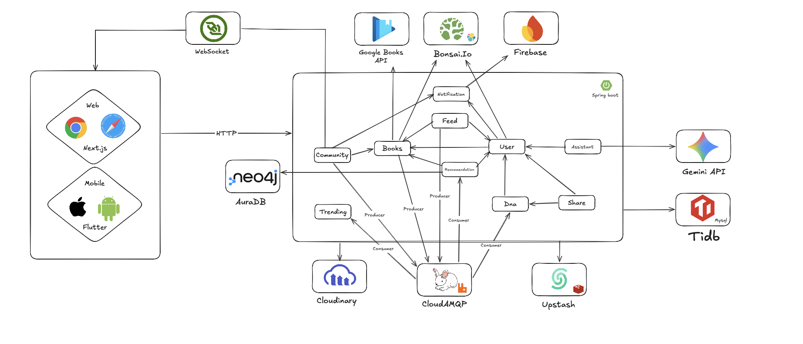

# 8. ATAM — Architecture Tradeoff Analysis Method

_O **Architecture Tradeoff Analysis Method (ATAM)**, desenvolvido pelo SEI da Carnegie Mellon University (KAZMAN; KLEIN; CLEMENTS, 2000), é um método estruturado para avaliar como uma arquitetura de software atende a um conjunto de atributos de qualidade (requisitos não funcionais), revelando **riscos**, **pontos de sensibilidade** e **tradeoffs** entre esses atributos. Esta seção aplica as **9 etapas do ATAM** à arquitetura do Biblioo (descrita na seção [4. Modelagem](4.modelagem.md#modelagem)), complementando a avaliação de Desempenho/Escalabilidade já realizada com dados reais de testes K6 na seção [7. Avaliação da Arquitetura](7.avaliacao.md#avaliacao) com outros atributos de qualidade centrais ao projeto: **Segurança**, **Modificabilidade**, **Disponibilidade/Resiliência** e **Usabilidade**._

---

## 8.1. Etapas 1 e 2 — Apresentação do ATAM e dos Objetivos de Negócio

**Etapa 1 (Apresentar o ATAM):** o método, suas 4 fases (Apresentação, Investigação e Análise, Testes, Relatórios) e o template de cenário utilizado nesta avaliação seguem a referência de KAZMAN, KLEIN e CLEMENTS (2000).

**Etapa 2 (Apresentar os objetivos de negócio):** os objetivos abaixo, extraídos das seções [1. Apresentação](1.apresentacao.md#apresentacao) e [2. Nosso Produto](2.nosso_produto.md#produto), motivam as decisões arquiteturais e foram usados para derivar os atributos de qualidade priorizados.

| Objetivo de Negócio | Descrição | Atributos de Qualidade Relacionados |
| --- | --- | --- |
| Reverter o abandono da leitura | 53% dos brasileiros não leram um livro nos últimos 3 meses (Retratos da Leitura, 2024); o produto precisa engajar e reter o leitor logo após concluir uma obra. | Usabilidade, Desempenho |
| Recomendações realmente personalizadas | Seis trilhas algorítmicas independentes (Neo4j, Thompson Sampling, decay exponencial, repetição espaçada) substituem recomendações genéricas de concorrentes (Skoob, Goodreads). | Desempenho, Modificabilidade |
| Comunidade ativa em tempo real | Chat WebSocket/STOMP, votação democrática de livros e notificações instantâneas substituem grupos de WhatsApp paralelos. | Desempenho, Disponibilidade |
| Plataforma confiável e segura | Autenticação JWT + OAuth Google, proteção contra XSS, dados de usuário e secrets protegidos — requisito de confiança para uma rede social. | Segurança |
| Evolução contínua por 11 domínios independentes | O sistema deve crescer (novas trilhas de recomendação, novos módulos) sem reescrever módulos existentes, sustentando o ritmo de sprints do curso. | Modificabilidade |
| Operação enxuta na nuvem (free tiers + Cloud Run) | Dois ambientes (`portfolio` hibernando e `producao` sempre ativa) compartilhando provedores gerenciados externos, com deploy automatizado em ~12 min. | Disponibilidade, Desempenho |
| App mobile usável em conectividade instável (realidade brasileira) | Offline-first com Drift/Hive garante que o leitor continue usando estantes e feed sem rede. | Usabilidade |

---

## 8.2. Etapa 3 — Apresentação da Arquitetura

A arquitetura do Biblioo segue o estilo **Hexagonal (Ports & Adapters)** em um **monólito modular** com **11 domínios de negócio** (`user`, `books`, `feed`, `community`, `recommendation`, `dna`, `notification`, `assistant`, `share`, `trending`, `infrastructure`), que **nunca se importam entre si** — toda comunicação entre módulos ocorre via **eventos assíncronos no RabbitMQ** (padrão Outbox) ou via interfaces, nunca por chamada direta.

Os diagramas completos (domínio, infraestrutura, classes e componentes) estão na seção [4.2 — Visão Lógica](4.modelagem.md#modelagem). Os padrões de destaque (Outbox, Fanout-on-write, Thompson Sampling, Spaced Repetition, Exponential Decay, Collaborative Filtering, Sliding Window Cache, Idempotência por `event_id`, Offline-first) estão descritos na seção [3.4 — Mecanismos Arquiteturais](3.requisitos.md#requisitos).

---

## 8.3. Etapa 4 — Identificação das Abordagens Arquiteturais

As abordagens abaixo foram identificadas como as decisões de design com maior impacto nos atributos de qualidade do sistema — cada uma será analisada na Etapa 6/8 (seção 8.5).

| Abordagem Arquitetural | Onde se aplica | Atributo de qualidade primariamente impactado |
| --- | --- | --- |
| Monólito modular Hexagonal (Ports & Adapters), 11 domínios isolados | Todo o backend — módulos nunca importam uns aos outros | Modificabilidade |
| Event-Driven Architecture + Outbox Pattern + idempotência por `event_id` | Comunicação entre módulos via RabbitMQ/CloudAMQP | Modificabilidade, Disponibilidade |
| Cache-Aside (Redis/Upstash) + bancos especializados (Neo4j, OpenSearch) | Recomendações, trending, busca, feed | Desempenho |
| Fallback automático para MySQL FULLTEXT e para catálogo já persistido | Módulo `books` quando OpenSearch ou Google Books API falham | Disponibilidade |
| JWT stateless + rotação obrigatória de Refresh Token + OAuth Google | `JwtAuthenticationFilter`, `SecurityConfig` | Segurança |
| Sanitização (JSoup) + detecção de MIME real (Apache Tika) + rate limiting (Bucket4j) | Conteúdo gerado por usuário e uploads | Segurança |
| Session affinity + RabbitMQ FanoutExchange para WebSocket multi-instância | Chat de comunidades em Cloud Run com múltiplas réplicas | Disponibilidade, Desempenho |
| Offline-first (Drift/SQLite + Hive, Repository local-first) | App mobile Flutter | Usabilidade |
| CI/CD automatizado (GitHub Actions → Cloud Build → Cloud Run, ~12 min) | Deploy `biblioo-portfolio` e `biblioo-producao` | Disponibilidade, Modificabilidade |

---

## 8.4. Etapa 5 — Árvore de Utilidade (Utility Tree)

A árvore de utilidade prioriza os cenários por **Importância** para o sucesso do sistema e **Dificuldade/Risco** de implementação (H = Alta, M = Média, L = Baixa), conforme orientado na etapa 5 do ATAM. Os cenários com `(H, H)` ou `(H, M)` foram selecionados para análise detalhada na seção 8.5.

| Atributo de Qualidade | Refinamento (sub-característica) | Cenário (resumo) | Importância | Dificuldade |
| --- | --- | --- | --- | --- |
| **Desempenho/Escalabilidade** | Latência sob carga normal | 24 domínios respondem com p95 dentro do threshold sob até 210 VUs (RNF-05 a RNF-21) | H | M |
| **Desempenho/Escalabilidade** | Resiliência a picos | Salto instantâneo para 500 VUs sem erros 5xx | H | M |
| **Desempenho/Escalabilidade** | Escalabilidade progressiva | Rampa até 600–800 VUs identificando ponto de saturação | M | H |
| **Desempenho/Escalabilidade** | Latência do motor de recomendação | 6 trilhas em paralelo (Neo4j + Redis + MySQL) em até 5000ms p95 (RNF-16) | H | H |
| **Segurança** | Autenticação/Autorização | Requisição sem JWT válido a endpoint protegido retorna 401 | H | L |
| **Segurança** | Proteção contra XSS | Post/comentário/bio com ``; (c) Usuário envia mais de 20 requisições/min ao `/assistant/chat`. |
| **Ambiente:** | Sistema em operação normal e sob tentativa de abuso. |
| **Estímulo:** | (a) Token ausente, expirado ou inválido; (b) payload de texto com markup/script embutido; (c) burst de requisições ao endpoint do assistente Bibo. |
| **Mecanismo:** | Spring Security + `JwtAuthenticationFilter` (Access Token de 1h, Refresh Token de 7 dias com **rotação obrigatória**), com endpoints públicos declarados explicitamente em `SecurityConfig`; handshake WebSocket autenticado via JWT antes de aceitar mensagens; sanitização de todo conteúdo gerado por usuário via **JSoup** antes da persistência; uploads validados com **Apache Tika** (MIME real) e limite de tamanho; rate limiting via **Bucket4j** (20 req/min); secrets injetados via **Google Secret Manager** (`--set-secrets`), nunca em código-fonte, env de texto claro ou logs. |
| **Medida de Resposta:** | (a) `401 Unauthorized` imediato sem processar a requisição; (b) markup/script removido antes de gravar no banco — o conteúdo persistido é seguro para renderização; (c) `429 Too Many Requests` acima do limite, sem impacto nos demais usuários. |

**Considerações sobre a arquitetura:**

| Riscos: | A lista de endpoints públicos em `SecurityConfig` é o único ponto de decisão sobre o que fica exposto — uma declaração incorreta (ex.: marcar um endpoint sensível como público por engano) compromete toda a proteção daquele recurso, sem nenhum outro nível de defesa redundante. |
| --- | --- |
| **Pontos de Sensibilidade:** | A cobertura do JSoup precisa abranger **todos** os campos de entrada livre de texto (posts, comentários, reviews, bio, nome/descrição de comunidade) — um novo campo de texto adicionado por um módulo e não sanitizado reabre a superfície de XSS. A rotação de refresh token depende do `AuthInterceptor` (mobile) e do interceptor equivalente no frontend web persistirem corretamente o novo token a cada renovação. |
| **Tradeoff:** | A rotação obrigatória do Refresh Token aumenta a segurança (reduz a janela de uso de um token roubado) ao custo de chamadas adicionais a `/auth/refresh` e de complexidade no interceptor de autenticação — um bug na persistência do novo token pode deslogar o usuário prematuramente, trocando segurança por disponibilidade de sessão. |

---

### Cenário 3 — Modificabilidade (Monólito Modular Hexagonal)

| Atributo de Qualidade: | Modificabilidade / Manutenibilidade |
| --- | --- |
| **Requisito de Qualidade:** | Módulos de domínio nunca importam nem conhecem outros módulos de domínio; a comunicação ocorre exclusivamente via eventos assíncronos (RabbitMQ) ou interfaces (Restrição Arquitetural, seção 3.3). |
| **Preocupação:** | Permitir que a equipe adicione ou altere funcionalidades — por exemplo, uma nova trilha de recomendação — sem efeitos colaterais nos demais 10 módulos, e sem recompilar para ajustar parâmetros de tuning. |
| **Cenário(s):** | Um desenvolvedor precisa adicionar a trilha **T7** (ex.: recomendações sazonais), que reage a eventos `BOOK_FINISHED` publicados pelo módulo `books`/`shelf` e grava resultados em `recommendation_results` com sua própria chave de trilha. |
| **Ambiente:** | Tempo de desenvolvimento e manutenção (fora do caminho crítico de produção). |
| **Estímulo:** | Requisição de mudança (nova trilha de recomendação) chega à equipe de desenvolvimento. |
| **Mecanismo:** | Arquitetura Hexagonal (Ports & Adapters): o novo módulo implementa um *consumer* RabbitMQ próprio que escuta o evento já publicado via Outbox por `books`/`shelf`, sem alterar o código desses módulos; persiste seu resultado em `recommendation_results` respeitando a unicidade `(userId, trilha)`; parâmetros de tuning expostos via `@Value` (`recommendation.*`) permitem ajuste em produção sem novo deploy. |
| **Medida de Resposta:** | A trilha T7 é implementada como módulo novo e isolado, com seu próprio consumer e verificação de `event_id` para idempotência — **nenhuma linha dos outros 10 módulos é alterada**; parâmetros podem ser ajustados via variável de ambiente/secret sem recompilação. |

**Considerações sobre a arquitetura:**

| Riscos: | O crescimento do número de filas/consumers RabbitMQ por trilha aumenta a complexidade operacional (monitoramento de consumer lag, conforme métricas já expostas via Micrometer); o `schema.sql`, que roda a cada *startup* (`spring.sql.init.mode=always`), cresce a cada nova tabela/índice, podendo alongar o tempo de inicialização. |
| --- | --- |
| **Pontos de Sensibilidade:** | A tabela `recommendation_results` e sua constraint de unicidade por `(userId, trilha)` são o contrato compartilhado que toda nova trilha deve respeitar — uma migração que altere essa constraint impacta as 6 trilhas existentes e qualquer nova trilha simultaneamente. |
| **Tradeoff:** | O desacoplamento via eventos assíncronos favorece a modificabilidade e o isolamento de falhas (um módulo novo com bug não derruba os demais), mas introduz **consistência eventual** — a trilha T7 pode levar segundos para refletir um evento `BOOK_FINISHED` recente — e exige que cada novo consumer implemente corretamente a verificação de `event_id`, repetindo um cuidado que hoje recai sobre cada desenvolvedor individualmente. |

---

### Cenário 4 — Disponibilidade e Resiliência (Fallbacks de Integrações Externas)

| Atributo de Qualidade: | Disponibilidade / Tolerância a Falhas |
| --- | --- |
| **Requisito de Qualidade:** | Em caso de falha do OpenSearch ou da Google Books API, o sistema deve continuar respondendo sem erro `5xx` ao cliente (Restrições Arquiteturais, seção 3.3). |
| **Preocupação:** | A busca de livros (`/books/search`, RNF-05) é central para descoberta de conteúdo — sua indisponibilidade não pode tornar a plataforma inutilizável, mesmo que serviços externos gerenciados (Bonsai.io, GCE OpenSearch, Google Books API) estejam fora do ar. |
| **Cenário(s):** | (a) A instância OpenSearch (Bonsai.io no `portfolio` / GCE VM no `producao`) fica temporariamente indisponível durante um pico de uso; (b) a Google Books API retorna erro/timeout ao tentar enriquecer o catálogo com um título não encontrado localmente. |
| **Ambiente:** | Degradação parcial de infraestrutura — serviços gerenciados externos fora do controle direto da aplicação. |
| **Estímulo:** | Timeout/erro de conexão do módulo `books` ao chamar OpenSearch (a) ou a Google Books API (b) durante `/books/search`. |
| **Mecanismo:** | (a) Fallback automático para busca **FULLTEXT no MySQL/TiDB** — índice derivado reconstruível, mantido sincronizado pelo `OpenSearchIndexCleanupService` (limpeza semanal, reconciliação com MySQL); (b) fallback para os livros **já persistidos** no MySQL, sem nova chamada externa bloqueante. |
| **Medida de Resposta:** | `/books/search` continua retornando `200 OK` com resultados (possivelmente em número reduzido ou sem o ranking de relevância do OpenSearch), sem propagar `5xx` ao cliente em nenhum dos dois cenários. |

**Considerações sobre a arquitetura:**

| Riscos: | Resultados via fallback FULLTEXT podem ser menos relevantes (sem o scoring de relevância do OpenSearch), impactando a experiência de busca durante a janela de indisponibilidade; em produção, o OpenSearch roda em uma **VM GCE própria** (`biblioo-infra`, e2-small) acessada via rede VPC interna — diferente do `portfolio` (Bonsai.io, gerenciado), essa VM é um componente não gerenciado e, portanto, um ponto adicional de operação/risco específico do ambiente de produção. |
| --- | --- |
| **Pontos de Sensibilidade:** | A reconciliação semanal do `OpenSearchIndexCleanupService` é o mecanismo que mantém o índice derivado coerente com o MySQL; se o OpenSearch ficar fora por um período superior ao ciclo de reconciliação, o desvio entre índice e fonte da verdade aumenta, tornando o fallback FULLTEXT cada vez mais a experiência "padrão" até a normalização. |
| **Tradeoff:** | Manter um índice de busca derivado e reconstruível (OpenSearch) com fallback para FULLTEXT garante resiliência e elimina erros 5xx, mas **duplica a lógica de busca** (full-text MySQL além do OpenSearch) e exige que ambas as implementações sejam mantidas e testadas — custo de manutenção em troca de disponibilidade. |

---

### Cenário 5 — Usabilidade (App Mobile Offline-First)

| Atributo de Qualidade: | Usabilidade / Disponibilidade Percebida |
| --- | --- |
| **Requisito de Qualidade:** | O app mobile deve funcionar em modo offline-first: exibir dados do cache local sem conexão e sincronizar automaticamente quando a rede retornar (Restrições Arquiteturais, seção 3.3). |
| **Preocupação:** | Leitores brasileiros frequentemente enfrentam conectividade instável (transporte público, áreas sem cobertura); a experiência de organizar a estante e acompanhar o progresso de leitura não pode depender de conexão constante. |
| **Cenário(s):** | Um leitor sem conexão à internet abre o app e atualiza a página atual de um livro em sua estante (`PATCH /shelves/{shelfId}/items/{itemId}/progress`). |
| **Ambiente:** | App mobile sem conectividade de rede. |
| **Estímulo:** | Usuário interage com a UI (atualiza progresso de leitura) enquanto o dispositivo está offline. |
| **Mecanismo:** | Padrão Repository **sempre tenta o `LocalDatasource` (Drift/SQLite) primeiro** — a alteração é persistida localmente de imediato; ao reconectar, o `RetryInterceptor` (Dio, backoff exponencial) reenvia a alteração pendente ao endpoint remoto via `AuthInterceptor`, que também renova o token JWT (armazenado em `FlutterSecureStorage`) em caso de 401. |
| **Medida de Resposta:** | A UI reflete a atualização imediatamente, sem espera de rede; quando a conectividade retorna, a sincronização com o backend ocorre automaticamente, sem ação manual do usuário. |

**Considerações sobre a arquitetura:**

| Riscos: | Não há resolução de conflito (merge) caso o **mesmo item** seja alterado offline em dois dispositivos do mesmo usuário antes da sincronização — cenário de baixa probabilidade, mas não tratado explicitamente. |
| --- | --- |
| **Pontos de Sensibilidade:** | A sincronização depende de o token JWT em `FlutterSecureStorage` ainda ser válido (ou renovável via Refresh Token) quando a conectividade retornar; se o período offline exceder a validade do Refresh Token (7 dias), a sincronização falha silenciosamente até um novo login — acoplando a Etapa de Usabilidade (offline-first) ao mecanismo de Segurança (Cenário 2). |
| **Tradeoff:** | O offline-first melhora drasticamente a experiência percebida e a resiliência a redes instáveis — alinhado ao objetivo de negócio de reter leitores brasileiros —, mas duplica o estado entre cliente (Drift + Hive) e servidor (MySQL), exigindo lógica de sincronização e cache que não existiria em uma arquitetura puramente *online-only*. |

---

## 8.6. Etapa 7 — Discussão e Priorização de Novos Cenários

Durante a análise, os cenários adicionais abaixo foram levantados pela equipe, mas não atingiram prioridade `(H, H)`/`(H, M)` na árvore de utilidade — ficam registrados para futuras iterações da avaliação:

| Cenário adicional | Atributo | Justificativa da priorização atual |
| --- | --- | --- |
| Mensagem de chat entregue a membros conectados em instâncias Cloud Run diferentes | Disponibilidade | Já mitigado pelo mecanismo de `--session-affinity` + RabbitMQ `FanoutExchange` (`WebSocketMessageBroadcastAdapter` / `CommunityBroadcastConsumer`); validado indiretamente pelo teste `message (WS)` com 100% de entrega (seção 7.2) — risco residual baixo. |
| Falha total do Neo4j Aura durante cálculo da trilha T1 (BecauseYouRead) | Disponibilidade | Mecanismo já prevê **fallback automático para SQL** quando o Neo4j está indisponível (seção `code/back/README.md`, T1); não avaliado em profundidade por já estar coberto por design. |
| Migração de um módulo de domínio para serviço independente | Modificabilidade | O monólito modular foi desenhado para viabilizar essa extração futura, mas não há demanda de negócio atual — fica registrado como cenário de evolução de longo prazo. |
| Rotação/expiração de um dos 40+ secrets em produção sem downtime | Segurança/Disponibilidade | Procedimento documentado (`gcloud secrets versions add` + serviços pegam `:latest` no próximo start), mas depende de reinício do Cloud Run — risco operacional baixo dado o padrão de deploy sem downtime já validado pelo pipeline. |

---

## 8.7. Etapa 9 — Resultados Consolidados

### Riscos, Pontos de Sensibilidade e Tradeoffs

| Categoria | Item | Cenário relacionado |
| --- | --- | --- |
| **Risco** | Contenção de concorrência em `Voting`/`JoinRequest` sob alta carga (mitigável com `@Version`) | 1 — Desempenho |
| **Risco** | Declaração incorreta de endpoint público em `SecurityConfig` compromete toda a proteção daquele recurso | 2 — Segurança |
| **Risco** | Crescimento de consumers RabbitMQ e do `schema.sql` aumenta complexidade operacional a cada novo módulo | 3 — Modificabilidade |
| **Risco** | VM GCE própria do OpenSearch em produção é um ponto de operação não gerenciado | 4 — Disponibilidade |
| **Risco** | Ausência de resolução de conflitos em sincronização offline multi-dispositivo | 5 — Usabilidade |
| **Ponto de Sensibilidade** | Latência do motor de recomendação (6 trilhas, p95 773ms) e eficácia do cache Redis/Neo4j/OpenSearch | 1 — Desempenho |
| **Ponto de Sensibilidade** | Cobertura total do JSoup sobre todos os campos de entrada de usuário | 2 — Segurança |
| **Ponto de Sensibilidade** | Constraint de unicidade `(userId, trilha)` em `recommendation_results` como contrato compartilhado | 3 — Modificabilidade |
| **Ponto de Sensibilidade** | Janela de reconciliação semanal do `OpenSearchIndexCleanupService` | 4 — Disponibilidade |
| **Ponto de Sensibilidade** | Validade do Refresh Token (7 dias) limita o período offline sincronizável | 5 — Usabilidade |
| **Tradeoff** | Cache + bancos especializados → menor latência **vs.** maior complexidade e consistência eventual | 1 — Desempenho |
| **Tradeoff** | Rotação obrigatória de Refresh Token → mais segurança **vs.** mais chamadas de auth e complexidade no interceptor | 2 — Segurança |
| **Tradeoff** | Eventos assíncronos → isolamento de falhas e modificabilidade **vs.** consistência eventual entre módulos | 3 — Modificabilidade |
| **Tradeoff** | Índice derivado + fallback → resiliência sem 5xx **vs.** lógica de busca duplicada (OpenSearch + FULLTEXT) | 4 — Disponibilidade |
| **Tradeoff** | Offline-first → melhor experiência percebida **vs.** estado duplicado cliente/servidor e lógica de sincronização | 5 — Usabilidade |

### Avaliação Geral

A arquitetura do Biblioo — **monólito modular Hexagonal com 11 domínios, comunicação assíncrona via Outbox/RabbitMQ e bancos especializados (MySQL/TiDB, Redis/Upstash, Neo4j Aura, OpenSearch/Bonsai)** — atende de forma consistente aos atributos de qualidade priorizados pelos objetivos de negócio:

- **Desempenho/Escalabilidade**: comprovado empiricamente (24/24 testes K6 aprovados, 0% de falhas sistêmicas, seção 7);
- **Segurança**: camadas de autenticação JWT, sanitização XSS, rate limiting e gestão de secrets cobrem os vetores de ataque mais relevantes para uma rede social com conteúdo gerado por usuário;
- **Modificabilidade**: o isolamento entre os 11 módulos via eventos assíncronos permitiu que o sistema crescesse de 11 RFs (Sprint 3) para 40 RFs (Sprint 6) sem reescrita de módulos existentes;
- **Disponibilidade/Resiliência**: fallbacks explícitos (OpenSearch → MySQL FULLTEXT, Google Books API → catálogo local) eliminam erros 5xx originados por dependências externas;
- **Usabilidade**: o app mobile offline-first endereça diretamente a realidade de conectividade instável do público-alvo.

Os **tradeoffs identificados são predominantemente do tipo "complexidade operacional/consistência eventual em troca de desempenho, modificabilidade e disponibilidade"** — nenhum deles compromete a integridade dos dados ou a disponibilidade geral do sistema, e todos possuem mitigação conhecida (lock otimista, reconciliação periódica, verificação de `event_id`). Essa avaliação confirma que as decisões arquiteturais tomadas estão alinhadas aos objetivos de negócio definidos na seção 8.1.
